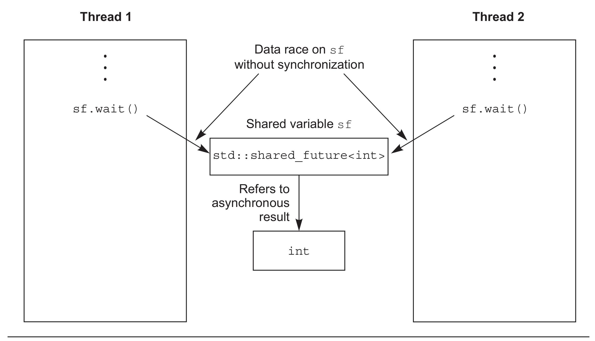
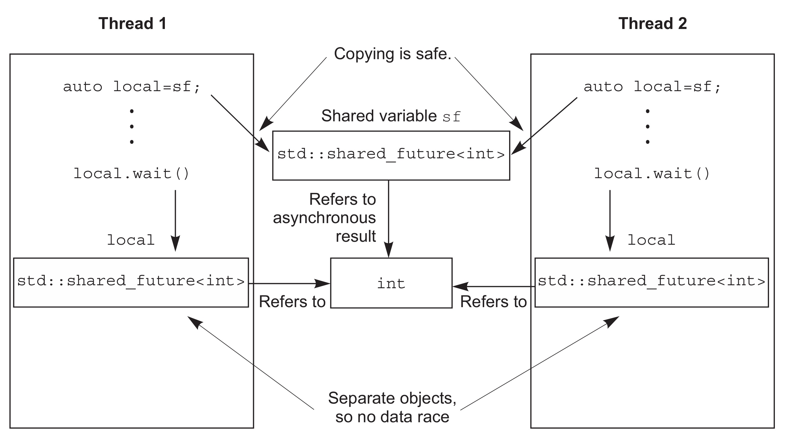
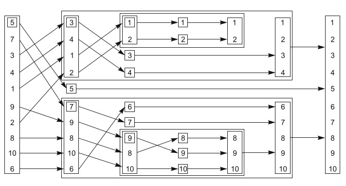

# Chapter4 同步并发操作

## 条件变量

C++标准库对条件变量有两套实现： `std::condition_variable` 和 `std::condition_variable_any` 。两者都需要与一个互斥量一起才能工作(互斥量是为了同步)；前者仅限于与 `std::mutex` 一起工作，而后者可以和任何满足最低标准的互斥量一起工作，从而加上了_any的后缀。因为 `std::condition_variable_any` 更加通用，这就可能产生额外的开销，所以`std::condition_variable` 一般作为首选的类型，当对灵活性有硬性要求时，我们才会去考虑 `std::condition_variable_any` 。

```cpp
std::mutex mut;
std::queue<data_chunk> data_queue;
std::condition_variable data_cond;

void data_preparation_thread() {
    while(more_data_to_prepare()) {
        data_chunk const data = prepare_data();
        std::lock_guard<std::mutex> lk(mut);
        data_queue.push(data);
        data_cond.notify_one();
    }
}
void data_processing_thread() {
    while(true) {
        std::unique_lock<std::mutex> lk(mut);
        data_cond.wait(
            lk, []{return !data_queue.empty();});
        data_chunk data = data_queue.front();
        data_queue.pop();
        lk.unlock();
        process(data);
        if(is_last_chunk(data))
            break;
    }
}
```

## 使用期望值等待一次性事件

> 当线程需要等待特定的一次性事件时，某种程度上来说就需要知道这个事件在未来的期望结果。之后，这个线程会周期性(较短的周期)的等待或检查，事件是否触发；检查期间也会执行其他任务。另外，等待任务期间它可以先执行另外一些任务，直到对应的任务触发，而后等待期望值的状态会变为就绪(ready)。一个期望值可能是数据相关的，也可能不是。当事件发生时(并且期望状态为就绪)，并且这个期望值就不能被重置。


当不着急要任务结果时，可以使用 `std::async` 启动一个异步任务。与 `std::thread` 对象等待的方式不同， `std::async` 会返回一个 `std::future` 对象，这个对象持有最终计算出来的结果。当需要这个值时，只需要调用这个对象的`get()`成员函数；并且会阻塞线程直到期望值状态为就绪为止；之后，返回计算结果。下面清单中代码就是一个简单的例子。

```cpp
int find_the_answer_to_xxx();
void do_other_stuff();
int main() {
    std::future<int> the_answer =
        std::async(find_the_answer_to_xxx);
    do_other_stuff();
    std::cout << "The answer is " << the_answer.get() << std::endl;
}
```

默认情况下，期望值是否等待取决于 `std::async` 是否启动一个线程，或是否有任务正在进行同步。大多数情况下(估计这就是你想要的结果)，也可以在函数调用之前向 `std::async` 传递一个额外参数，这个参数的类型是 `std::launch` ，值可以是 `std::launch::deferred` ，表明函数调用被延迟到`wait()`或`get()`函数调用时才执行， `std::launch::async` 表明函数必须在其所在的独立线程上执行，默认参数为 `std::launch::deferred | std::launch::async` ，表明实现可以选择这两种方式的一种。

```cpp
auto f6 = std::async(std::launch::async, Y(), 1.2); // 在新线程上执行
auto f7 = std::async(std::launch::deferred, baz, std::ref(x)); // 在wait()或get()调用时执行
auto f8 = std::async(
    std::launch::deferred | std::launch::async,
    baz, std::ref(x)); // 实现选择执行方式
auto f9 = std::async(baz, std::ref(x));
f7.wait(); // 调用延迟函数
```

## 任务与期望值关联

`std::packaged_task<>` 对一个函数或可调用对象，绑定一个期望值。当调用 `std::packaged_task<>` 对象时，它就会调用相关函数或可调用对象，将期望状态置为就绪，返回值也会被存储。

`std::packaged_task<>` 的模板参数是一个函数签名。函数签名的返回类型可以用来标识从 `get_future()` 返回的 `std::future<>` 的类型，而函数签名的参数列表，可用来指定 `packaged_task` 的函数调用操作符。

> 模板偏特化 `std::packaged_task<std::string(std::vector<char>*,int)>`
> 
> ```cpp
> template<>
> class packaged_task<std::string(std::vector<char>*,int)> {
> public:
>     template<typename Callable>
>     explicit packaged_task(Callable&& f);
>     std::future<std::string> get_future();
>     void operator()(std::vector<char>*,int);
> };
> ```

```cpp
std::mutex m;
std::deque<std::packaged_task<void()>> tasks;

bool gui_shutdown_message_received();
void get_and_process_gui_message();

void gui_thread() {
    while(!gui_shutdown_message_received()) {
        get_and_process_gui_message();
        std::packaged_task<void()> task;
        {
            std::lock_guard<std::mutex> lk(m);
            if(tasks.empty())
                continue;
            task = std::move(tasks.front());
            tasks.pop_front();
        }
        task();
    }
}

std::thread gui_bg_thread(gui_thread);

template<typename Func>
std::future<void> post_task_for_gui_thread(Func f) {
    std::packaged_task<void()> task(f);
    std::future<void> res = task.get_future();
    std::lock_guard<std::mutex> lk(m);
    tasks.push_back(std::move(task)); 
    return res; 
}
```

## 使用 `std::promise`

`std::promise<T>` 提供设定值的方式(类型为T)，这个类型会和后面看到的 `std::future<T>` 对象相关联。一对 `std::promise`/`std::future` 会为这种方式提供一个可行的机制；期望值可以阻塞等待线程，同时，提供数据的线程可以使用组合中的承诺值来对相关值进行设置，并将期望值的状态置为“就绪”。

可以通过一个给定的 `std::promise` 的`get_future()`成员函数来获取与之相关的 `std::future` 对象。当承诺值已经设置完毕(使用`set_value()`成员函数)，对应期望值的状态变为“就绪”，并且可用于检索已存储的值。当在设置值之前销毁 `std::promise` ，将会存储一个异常。

```cpp
void process_connections(connection_set& connections) {
    while(!done(connections)) {
        for(connection_iterator connection = 
                connections.begin(),end = connections.end();
            connection!=end;
            ++connection) {
            if(connection->has_incoming_data()) {
                data_packet data = connection->incoming();
                std::promise<payload_type>& p =
                    connection->get_promise(data.id);
                p.set_value(data.payload);
            }
            if(connection->has_outgoing_data()) {
                outgoing_packet data =
                    connection->top_of_outgoing_queue();
                connection->send(data.payload);
                data.promise.set_value(true);
            }
        }
    }
}
```

## 将异常存在期望值中

```cpp
extern std::promise<double> some_promise;
try {
    some_promise.set_value(calculate_value());
}
catch(...) {
    some_promise.set_exception(std::current_exception());
}
```

这里使用了 `std::current_exception()` 来检索抛出的异常，可用 `std::copy_exception()` 作为
一个替代方案， `std::copy_exception()` 会直接存储一个新的异常而不抛出：

```cpp
some_promise.set_exception(std::copy_exception(std::logic_error("foo")));
```

另一种向期望值中存储异常的方式是，在没有调用承诺值上的任何设置函数前，或正在调用包装好的任务时，销毁与 `std::promise` 或 `std::packaged_task` 相关的期望值对象。任何情况下，当期望值的状态还不是“就绪”时，调用 `std::promise` 或 `std::packaged_task` 的析构函数，将会存储一个与 `std::future_errc::broken_promise` 错误状态相关的 `std::future_error` 异常；通过创建一个期望值，可以构造一个承诺值为其提供值或异常；可以通过销毁值和异常源，去违背承诺值。

## 多个线程的等待

每一个 `std::shared_future` 的独立对象上，成员函数调用返回的结果还是不同步的，所以为了在多个线程访问一个独立对象时避免数据竞争，必须使用锁来对访问进行保护。优先使用的办法：为了替代只有一个拷贝对象的情况，可以让每个线程都拥有自己对应的拷贝对象。这样，当每个线程都通过自己拥有的 `std::shared_future` 对象获取结果，那么多个线程访问共享同步结果就是安全的。





`std::shared_future` 的实例同步 `std::future` 实例的状态。当 `std::future` 对象没有与其他对象共享同步状态所有权，那么所有权必须使用 `std::move` 将所有权传递到 `std::shared_future`。

```cpp
std::promise<int> p;
std::future<int> f(p.get_future());
assert(f.valid()); // 1 期望值 f 是合法的
std::shared_future<int> sf(std::move(f));
assert(!f.valid()); // 2 期望值 f 现在是不合法的
assert(sf.valid()); // 3 sf 现在是合法的
```

`std::future` 有一个`share()`成员函数，可用来创建新的 `std::shared_future` ，并且可以直接转移期望值的所有权。

```cpp
std::promise< std::map< SomeIndexType, SomeDataType,
            SomeComparator,
            SomeAllocator>::iterator> p;
auto sf = p.get_future().share();
```

这个例子中，sf的类型为 `std::shared_future<std::map<SomeIndexType, SomeDataType, SomeComparator, SomeAllocator>::iterator>` 。

## 限定等待时间

### 时钟

当前时间可以通过调用静态成员函数`now()`从时钟类中获取；例如， `std::chrono::system_clock::now()` 是将返回系统时钟的当前时间。时钟节拍被指定为1/x(x在不同硬件上有不同的值)秒，这是由时间周期所决定——一个时钟一秒有25个节拍，因此一个周期为 `std::ratio<1, 25>` ，当一个时钟的时钟节拍每2.5秒一次，周期就可以表示为 `std::ratio<5, 2>`

当时钟节拍均匀分布(无论是否与周期匹配)，并且不可调整，这种时钟就称为稳定时钟。当`is_steady`静态数据成员为`true`时，表明这个时钟就是稳定的；否则，就是不稳定的。通常情况下， `std::chrono::system_clock` 是不稳定的，因为时钟是可调的，即是这种是完全自动适应本地账户的调节。这种调节可能造成的是，首次调用`now()`返回的时间要早于上次调用`now()`所返回的时间，这就违反了节拍频率的均匀分布。稳定闹钟对于超时的计算很重要，所以C++标准库提供一个稳定时钟 `std::chrono::steady_clock` 。C++标准库提供的其他时钟可表示为 `std::chrono::system_clock`，它代表了系统时钟的“实际时间”，并且提供了函数可将时间点转化为`time_t`类型的值； `std::chrono::high_resolution_clock` 可能是标准库中提供的具有最小节拍周期(因此具有最高的精度)的时钟。它实际上是`typedef`的另一种时钟，这些时钟和其他与时间相关的工具，都被定义在 `<chrono>` 库头文件中。

### 时延

`std::chrono::duration<>` 函数模板能够对时延进行处理(线程库使用到的所有C++时间处理工具，都在 `std::chrono` 命名空间内)。第一个模板参数是一个类型表示(比如，`int`，`long`或`double`)，第二个模板参数是定制部分，表示每一个单元所用秒数。例如，当几分钟的时间要存在`short`类型中时，可以写成 `std::chrono::duration<short, std::ratio<60, 1>>` ，因为60秒是才是1分钟，所以第二个参数写成 `std::ratio<60, 1>` 。当需要将毫秒级计数存在`double`类型中时，可以写成 `std::chrono::duration<double, std::ratio<1,1000>>` ，因为1秒等于1000毫秒。

标准库在 `std::chrono` 命名空间内，为延时变量提供一系列预定义类型：nanoseconds[纳秒] , microseconds[微秒] , milliseconds[毫秒] , seconds[秒] , minutes[分]和hours[时]。

方便起见，C++14中 `std::chrono_literals` 命名空间中，有许多预定义的后缀操作符用来表示时长。下面简单的代码就是使用硬编码的方式赋予具体的时长值：

```cpp
using namespace std::chrono_literals;
auto one_day = 24h;
auto half_an_hou r = 30min;
auto max_time_between_messages = 30ms;
```

当使用整型字面符，这些后缀类似使用了预定义的类型，比如：`15ns`和 `std::chrono::nanoseconds(15)` 就是等价的。不过，当使用浮点字面量时，且未指明表示类型时，数值上会对浮点时长进行适当的缩放。因此，2.5min会被表示为 `std::chrono::duration<some-floating-point-type,std::ratio<60,1>>` 。如果非常关心所选的浮点类型表示的范围或精度，那么需要自己来构造相应的对象来保证表示范围或精度，而不是去苛求字面值来对范围或精度进行期望性的表达。当不要求截断值的情况下(时转换成秒是没问题，但是秒转换成时就不行)时延的转换是隐式的。显示转换可以由 `std::chrono::duration_cast<>` 来完成。

```cpp
std::chrono::milliseconds ms(54802);
std::chrono::seconds s =
    std::chrono::duration_cast<std::chrono::seconds>(ms);
```

这里的结果就是截断的，而不是进行了舍入，所以s最后的值为54。延迟支持四则运算，所以你能够对两个时延变量进行加减，或者是对一个时延变量乘除一个常数(模板的第一个参数)来获得一个新延迟变量。例如，5*seconds(1)与seconds(5)或minutes(1)-seconds(55)一样。在时延中可以通过`count()`成员函数获得单位时间的数量。例
如， `std::chrono::milliseconds(1234).count()` 就是1234。
基于时延的等待可由 `std::chrono::duration<>` 来完成，例如：等待期望值状态变为就绪已经
35毫秒：

```cpp
std::future<int> f = std::async(some_task);
if (f.wait_for(std::chrono::milliseconds(35)) == std::future_status::ready)
    do_something_with(f.get());
```

等待函数会返回一个状态值，表示是等待是超时，还是继续等待。这里可以等待期望值，所以当函数等待超时时，会返回 `std::future_status::timeout` ；当期望值状态改变，函数会返回 `std::future_status::ready` ；当与期望值相关的任务延迟了，函数会返回 `std::future_status::deferred` 。基于时延的等待是使用内部库的稳定时钟来计时的；所以，即使系统时钟在等待时被调整(向前或向后)，35毫秒的时延在这里意味着，的确耗时35毫秒。当然，系统调度的不确定性和不同操作系统的时钟精度都意味着：线程调用和返回的实际时间间隔可能要比35毫秒长。

### 时间点

时间点可以用 `std::chrono::time_point<>` 类型模板来表示，实例的第一个参数用来指定所要使用的时钟，第二个函数参数用来表示时间的计量单位(特化的 `std::chrono::duration<>` )。一个时间点的值就是时间的长度(在指定时间的倍数内)，例如，指定“unix时间戳”(epoch)为一个时间点。时间戳是时钟的一个基本属性，但是不可以直接查询，或在C++标准中已经指定。通常，unix时间戳表示1970年1月1日 00:00，即计算机启动应用程序时。时钟可能共享一个时间戳，或具有独立的时间戳。当两个时钟共享一个时间戳时，其中一个time_point类型可以与另一个时钟类型中的time_point相关联。这里，虽然不知道unix时间戳是什么，但可以通过对指定time_point类型使用 `time_since_epoch()` 来获取时间戳，该成员函数会返回一个时延值，这个时延值是指定时间点与unix时间戳的时间间隔。

你可以通过 `std::chrono::time_point<>` 实例来加/减时延，来获得一个新的时间点，所以 `std::chrono::hight_resolution_clock::now() + std::chrono::nanoseconds(500)` 将得到500纳秒后的时间。这对于计算绝对时间超时是一个好消息，当知道一块代码的最大时延时，在等待时间内进行多次调用等待函数，或非等待函数占用了等待函数时延中的时间。你也可以减去一个时间点(二者需要共享同一个时钟)。结果是两个时间点的时间差。这对于代码块的计时是很有用的，例如：

```cpp
auto start=std::chrono::high_resolution_clock::now();
do_something();
auto stop=std::chrono::high_resolution_clock::now();
std::cout<< "do_something() took "
         << std::chrono::duration<double,std::chrono::seconds>(stop - start).count()
         << " seconds" <<std::endl;
```

`std::chrono::time_point<>` 实例的时钟参数不仅能够指定unix时间戳。当一个等待函数(绝对时间超时的方式)传递时间点时，时间点的时钟参数就被用来测量时间。当时钟变更时，会产生严重的后果，因为等待轨迹随着时钟的改变而改变，并且直到调用`now()`成员函数时，才能返回一个超过超时时间的值。当时钟向前调整，就有可能减少等待时间的长度(与稳定时钟的测量相比)；当时钟向后调整，就有可能增加等待时间的长度。

如你所愿，后缀为`_until`的(等待函数的)变量会使用时间点。通常是使用某些时钟的 `::now()` (程序中一个固定的时间点)作为偏移，虽然时间点与系统时钟有关，可以使用 `std::chrono::system_clock::to_time_point()` 静态成员函数，在用户可视时间点上进行调
度操作。例如，当有一个对多等待500毫秒的，且与条件变量相关的事件，可以参考如下代码：

```cpp
std::condition_variable cv;
bool done;
std::mutex m;
bool wait_loop() {
    auto const timeout = std::chrono::steady_clock::now() +
        std::chrono::milliseconds(500);
    std::unique_lock<std::mutex> lk(m);
    while(!done) {
        if(cv.wait_until(lk, timeout) == std::cv_status::timeout)
            break;
    }
    return done;
}
```

我们推荐种方式，当没有什么可以等待时，就可在一定时限中等待条件变量。这种方式中，循环的整体长度有限。当在循环中使用 `wait_for()` 时，可能在等待了足够长的时间后结束等待(在假唤醒之前)，且下一次等待又开始了。这可能重复很多次，使得等待时间无边无际。

## 具有超时功能的函数

| 类型/命名空间                                                  | 函数                                   | 返回值                                                                         |
| -------------------------------------------------------------- | -------------------------------------- | ------------------------------------------------------------------------------ |
| `std::this_thread` 命名空间                                    | `sleep_for(duration)`                  | N/A                                                                            |
|                                                                | `sleep_until(time_point) `             | <p style="font-weight: bolder; color: #397; font-size: 16px">同上</p>          |
| `std::condition_variable` 或</br>`std::condition_variable_any` | `wait_for(lock, duration)`             | `std::cv_status::time_out` 或</br>`std::cv_status::no_timeout`                 |
|                                                                | `wait_until(lock,time_point)`          | <p style="font-weight: bolder; color: #397; font-size: 16px">同上</p>          |
|                                                                | `wait_for(lock, duration,predicate)`   | `bool` —— 当唤醒时，返回谓词的结果                                             |
|                                                                | `wait_until(lock, duration,predicate)` | <p style="font-weight: bolder; color: #397; font-size: 16px">同上</p>          |
| `std::timed_mutex` 或</br>`std::recursive_timed_mutex`         | `try_lock_for(duration)`               | `bool` —— 获取锁时返回`true`，否则返回`false`                                  |
|                                                                | `try_lock_until(time_point)`           | <p style="font-weight: bolder; color: #397; font-size: 16px">同上</p>          |
| `std::unique_lock<TimedLockable>`                              | `unique_lock(lockable, duration)`      | N/A —— 对新构建的对象调用 `owns_lock()`                                        |
|                                                                | `unique_lock(lockable, time_point)`    | 当获取锁时返回`true`，否则返回`false`                                          |
|                                                                | `try_lock_for(duration)`               | `bool` —— 当获取锁时返回`true`，否则返回`false`                                |
|                                                                | `try_lock_until(time_point)`           | <p style="font-weight: bolder; color: #397; font-size: 16px">同上</p>          |
| `std::future<ValueType>`或</br>`std::shared_future<ValueType>` | `wait_for(duration)`                   | 当等待超时，返回</br>`std::future_status::timeout`                             |
|                                                                | `wait_until(time_point)`               | 当期望值准备就绪时，返回 </br>`std::future_status::ready`                      |
|                                                                |                                        | 当期望值持有一个为启动的</br>延迟函数，返回</br>`std::future_status::deferred` |

## 使用同步操作简化代码

### 使用future的函数式编程

> **functional programming** 是一种编程方式，这种方式中的函数结果只依赖于传入函数的参数，并不依赖外部状态。当函数与数学概念相关时，使用相同的参数调用这个函数两次，两次的结果应该会完全相同。C++标准库中很多与数学相关的函数都有这个特性，例如，`sin`(正弦),`cos`(余弦)和`sqrt`(平方根)；当然，还有基本类型间的简单运算，例如，`3+3`，`6*9`，或`1.3/4.7`。纯粹的函数不会改变任何外部状态，并且这种特性完全限制了函数的返回值。



#### 快速排序——FP模式线程强化版

```cpp
template<typename T>
std::list<T> parallel_quick_sort(std::list<T> input) {
    if(input.empty()) 
        return input;
    
    std::list<T> result;
    result.splice(result.begin(), input, input.begin());
    // 使用splice()将输入的首个元素(中间值)放入结果列表中
    T const& pivot = *result.begin();
    
    auto divide_point = std::partition(input.begin(), input.end(),
        [&](T const& t){ return t < pivot; });  // std::partition() 会对列表进行重置，
                                                // 并返回一个指向首元素(不小于“中间”值)的迭代器

    std::list<T> lower_part;
    lower_part.splice(lower_part.end(), input, input.begin(), divide_point);  
    // 将input列表小于divided_point的值移动到新列表lower_part中，其他数继续留在input列表中
    // void splice( const_iterator pos, list& other, const_iterator first, const_iterator last);
    // 从 other 转移范围 [first, last) 中的元素到 *this。元素被插入到 pos 指向的元素之前。
    std::future<std::list<T>> new_lower(
        std::async(&parallel_quick_sort<T>, std::move(lower_part)));

    auto new_higher(
        parallel_quick_sort(std::move(input)));

    // 将result中的结果以正确的顺序进行拼接
    result.splice(result.end(), new_higher);
    result.splice(result.begin(), new_lower.get());
    return result;
}
```

当前线程不对小于“中间”值部分的列表进行排序，使用 `std::async()` 在另一线程对其进行排序。大于部分列表，如同之前一样，使用递归的方式进行排序。通过递归调用 `parallel_quick_sort()`，就可以利用硬件并发了。

### 使用消息传递的同步操作

> 因避开了共享可变数据，函数化编程可算作是并发编程的范型，并且也是**通讯顺序进程**(CSP，Communicating Sequential Processor[3])的范型，这里的线程理论上是完全分开的，也就是没有共享数据，但是有通讯通道允许信息在不同线程间进行传递。

CSP的概念十分简单：当没有共享数据时，每个线程可以进行独立思考，其行为纯粹基于所接收到的信息。每个线程就都有自己的状态机：当线程收到一条信息，会以某种方式更新状态，并且可能向其他线程发出一条或多条信息，消息的处理机制依赖于线程的初始化状态。这是一种将其形式以有限状态机的模式实现，但是并不是唯一的方案；状态机可以在应用程序中隐式实现。这种方法在任何情况下，都更加依赖于明确的行为要求和编程团队的专业知识。无论选择用哪种方式去实现每个线程，任务都会有独立的处理部分，这样就能消除潜在的混乱(数据共享并发)，这就让编程变的更加简单，且降低错误率。

真正通讯顺序处理没有共享数据，所有消息都是通过消息队列传递，但C++线程共享一块地址空间，所以达不到真正通讯顺序处理的要求。这就需要一些约定来支持：作为应用或是库作者，我们有责任确保在实现中，线程不存在共享数据。当然，为了线程间的通信，消息队列必须共享，具体的细节要包含在库中。

一个并发系统中，这种编程方式可以极大的简化任务的设计，因为每一个线程都完全被独立对待。因此，使用多线程去分离关注点时，需要明确线程之间的任务应该如何分配。