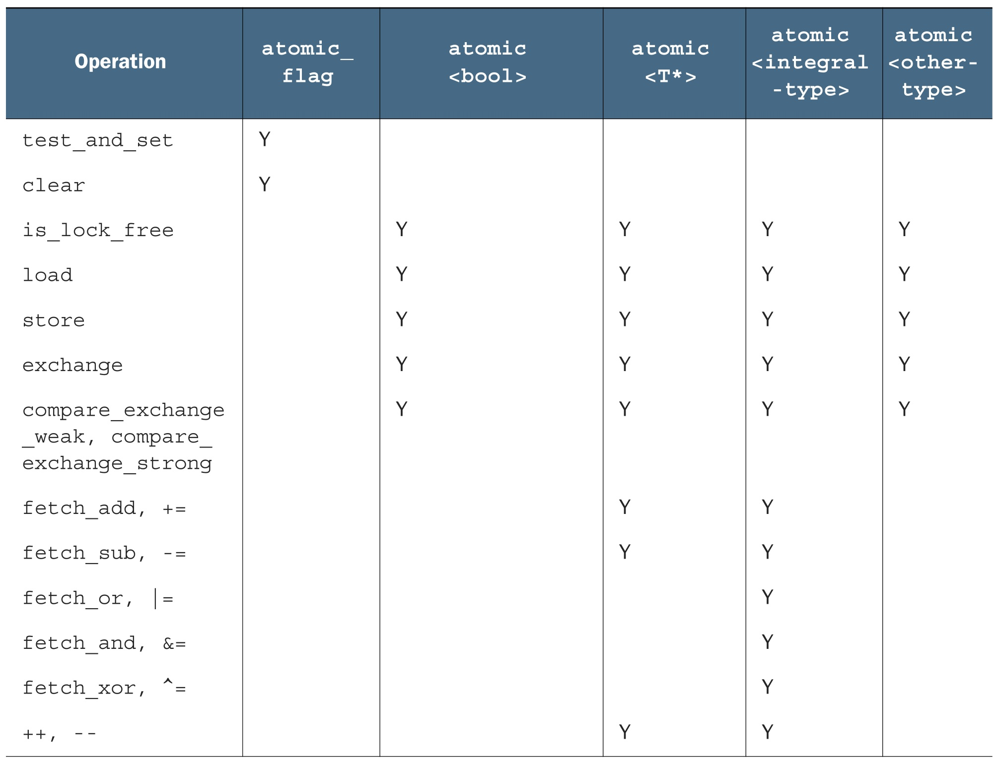
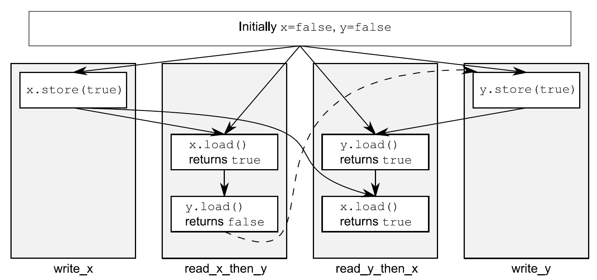

# Chapter5 C++内存模型和原子类型操作

## 内存模型基础

### 对象和内存位置

1. 每一个变量都是一个对象，包括作为其成员变量的对象。
2. 每个对象至少占有一个内存位置。
3. 基本类型都有确定的内存位置(无论类型大小如何，即使他们是相邻的，或是数组的一部分)。
4. 相邻位域是相同内存中的一部分。

### 对象、内存位置和并发

为了避免条件竞争，两个线程就需要一定的执行顺序。第一种方式，如第3章所述，使用互斥量来确定访问的顺序；当同一互斥量在两个线程同时访问前被锁住，那么在同一时间内就只有一个线程能够访问到对应的内存位置，所以后一个访问必须在前一个访问之后。另一种是使用原子操作决定两个线程的访问顺序。当多于两个线程访问同一个内存地址时，对每个访问这都需要定义一个顺序。如果不规定两个不同线程对同一内存地址访问的顺序，那么访问就不是原子的；并且，当两个线程都是“writer”时，就会产生数据竞争和未定义行为。

当程序对同一内存地址中的数据访问存在竞争，可以使用原子操作来避免未定义行为。当然，这不会影响竞争的产生——原子操作并没有指定访问顺序——但原子操作把程序拉回到定义行为的区域内。

### 修改顺序

如果对象不是一个原子类型，必须确保有足够的同步操作，来确定每个线程都遵守了变量的修改顺序。当不同线程在不同序列中访问同一个值时，可能就会遇到数据竞争或未定义行为。如果使用原子操作，编译器就有责任去做必要的同步。

## 原子操作和原子类型

原子类型对象(几乎)都有一个 `is_lock_free()` 成员函数，这个函数可以让用户查询某原子类型的操作是直接用的原子指令( `x.is_lock_free()` 返回 `true` )，还是内部用了一个锁结构( `x.is_lock_free()` 返回 `false` )。只有 `std::atomic_flag` 类型不提供 `is_lock_free()`。该类型是一个简单的布尔标志，并且在这种类型上的操作都是无锁的；当有一个简单无锁的布尔标志时，可以使用该类型实现一个简单的锁，并且可以实现其他基础原子类型。

C++17中，所有原子类型有一个 `static constexpr` 成员变量，如果相应硬件上的原子类型X是无锁类型，那么 `X::is_always_lock_free` 将返回 `true`。

表格：标准原子类型的备选名和与其相关的 `std::atomic<>` 特化类

| 原子类型          | 相关特化类                        |
| ----------------- | --------------------------------- |
| `atomic_bool`     | `std::atomic<bool>`               |
| `atomic_char`     | `std::atomic<char>`               |
| `atomic_schar`    | `std::atomic<signed char>`        |
| `atomic_uchar`    | `std::atomic<unsigned char>`      |
| `atomic_int`      | `std::atomic<int>`                |
| `atomic_uint`     | `std::atomic<unsigned>`           |
| `atomic_short`    | `std::atomic<short>`              |
| `atomic_ushort`   | `std::atomic<unsigned short>`     |
| `atomic_long`     | `std::atomic<long>`               |
| `atomic_ulong`    | `std::atomic<unsigned long>`      |
| `atomic_llong`    | `std::atomic<long long>`          |
| `atomic_ullong`   | `std::atomic<unsigned long long>` |
| `atomic_char16_t` | `std::atomic<char16_t>`           |
| `atomic_char32_t` | `std::atomic<char32_t>`           |
| `atomic_wchar_t`  | `std::atomic<wchar_t>`            |

通常，标准原子类型是不能进行拷贝和赋值的，它们没有拷贝构造函数和拷贝赋值操作符。但是，可以隐式转化成对应的内置类型，所以这些类型依旧支持赋值，可以使用`load()`和`store()`、`exchange()`、`compare_exchange_weak()`和`compare_exchange_strong()`。它们都支持复合赋值符：`+=`, `-=`, `*=`, `|=` 等等。并且使用整型和指针的特化类型还支持`++`和`--`操作。当然，这些操作也有功能相同的成员函数所对应：`fetch_add()`, `fetch_or()`等等。赋值操作和成员函数的返回值，要么是被存储的值(赋值操作)，要么是操作前的值(命名函数)，这就能避免赋值操作符返回引用。

`std::atomic<>` 类模板不仅仅是一套可特化的类型，作为一个原发模板也可以使用用户定义类型创建对应的原子变量。因为，它是一个通用类模板，操作被限制为`load()`，`store()`(赋值和转换为用户类型)，`exchange()`，`compare_exchange_weak()`和`compare_exchange_strong()`。每种函数类型的操作都有一个内存序参数，这个参数可以用来指定存储的顺序。操作分为三类：

1. Store操作，可选如下顺序：`memory_order_relaxed`, `memory_order_release`, `memory_order_seq_cst`。
2. Load操作，可选如下顺序：`memory_order_relaxed`, `memory_order_consume`, `memory_order_acquire`, `memory_order_seq_cst`。
3. Read-modify-write(读-改-写)操作，可选如下顺序：`memory_order_relaxed`, `memory_order_consume`, `memory_order_acquire`, `memory_order_release`, `memory_order_acq_rel`, `memory_order_seq_cst`。

### `std::atomic_flag`

它表示了一个布尔标志。这个类型的对象可以在两个状态间切换：设置和清除。就是这么简单，只作为一个构建块存在。

`std::atomic_flag` 类型的对象必须被`ATOMIC_FLAG_INIT`初始化。初始化标志位是“清除”状态。

```cpp
std::atomic_flag f = ATOMIC_FLAG_INIT;
```

当标志对象已初始化，那么只能做三件事情：销毁，清除或设置(查询之前的值)。这些操作对应的函数分别是：`clear()` 成员函数和 `test_and_set()` 成员函数。`clear()` 是一个存储操作，所以不能有 `memory_order_acquire` 或  `memory_order_acq_rel` 语义，但是 `test_and_set()` 是一个“读-改-写”操作，可以应用于任何内存序。每一个原子操作，默认的内存序都是 `memory_order_seq_cst`。

```cpp
f.clear(std::memory_order_release);
bool x = f.test_and_set();
```

`std::atomic_flag` 非常适合于作自旋互斥锁。初始化标志是“清除”，并且互斥量处于解锁状态。为了锁上互斥量，循环运行 `test_and_set()` 直到旧值为 `false`，就意味着这个线程已经被设置为 `true` 了。解锁互斥量是一件很简单的事情，将标志清除即可。

```cpp
class spinlock_mutex {
    std::atomic_flag flag;
public:
    spinlock_mutex() :
        flag(ATOMIC_FLAG_INIT) {}
    void lock() {
        while(flag.test_and_set(std::memory_order_acquire));
    }
    void unlock() {
        flag.clear(std::memory_order_release);
    }
};
```

### `std::atomic<bool>`

可以被初始化为`true`或`false`，并且可以从非原子`bool`变量赋值给 `std::atomic<bool>`：

```cpp
std::atomic<bool> b(true);
b = false;
```

使用`store()`去写入好于 `std::atomic_flag` 中限制性很强的`clear()`。同样，`test_and_set()`函数也可以被更加通用的`exchange()`成员函数所替换，`exchange()`成员函数允许使用新选的值替换已存储的值，并且会自动检索原始值。 `std::atomic<bool>` 也支持对值的查找，其会将对象隐式的转换为一个普通的`bool`值，或显示的调用`load()`来完成。如你预期，`store()`是一个存储操作，而`load()`是一个加载操作。`exchange()`是一个“读-改-写”操作，当内存中的值与预期的变量原值一致时，存储新值：

```cpp
std::atomic<bool> b;
bool x = b.load(std::memory_order_acquire);
b.store(true);
x = b.exchange(false, std::memory_order_acq_rel);
```

### CAS

`exchange()` 存储一个新值(或旧值)取决于当前值这种新型操作叫做 **“比较/交换”（CAS, Compare And Swap）**，它的形式表现为 `compare_exchange_weak()` 和 `compare_exchange_strong()` 成员函数。

> ```cpp
> bool compare_exchange_weak( T& expected, T desired,
>                             std::memory_order order =
>                                 std::memory_order_seq_cst ) noexcept;
> ```
> ```cpp
> bool compare_exchange_strong( T& expected, T desired,
>                               std::memory_order order =
>                                   std::memory_order_seq_cst ) noexcept;
> ```
>
> 原子地比较 `*this` 和 `expected` 的对象表示，而若它们逐位相等，则以 `desired` 替换前者（进行读修改写操作）。否则，将 `*this` 中的实际值加载进 `expected` （进行加载操作）。
>
> CAS函数返回一个 `bool` 变量，若成功更改底层原子值则为 `true` ，否则为 `false`。

对于 `compare_exchange_weak()` 函数，**当原始值与预期值一致时，存储也可能会不成功**；此时内存中的值不会发生改变，并且`compare_exchange_weak()` 的返回是 `false`。这可能发生在缺少单条CAS操作(“比较-交换”指令)的机器上，当处理器不能保证这个操作能够自动的完成——可能因为线程的操作将指令队列从中间关闭，并且另一个线程安排的指令将会被操作系统所替换(这里线程数多于处理器数量)，被称为 **“伪失败”(spurious failure)**，因为造成这种情况的原因是时间，而不是变量值。

因为 `compare_exchange_weak()` 可能伪失败，所以通常使用一个循环。循环中 `expected` 为 `false`，则表示 `compare_exchange_weak()` 会莫名的失败：

```cpp
bool expected = false;
extern atomic<bool> b; // do something
while(!b.compare_exchange_weak(expected, true) && !expected);
```

当实际值与期望值不符，`compare_exchange_strong()` （对于伪失败使用循环）就能保证只返回 `false`。这就能消除对循环的需要，知道是否成功改变了一个变量，或已让另一个线程完成。

如果想要改变变量值，更新后的期望值将会更有用；经历每次循环的时候，期望值都会重新加载，所以当没有其他线程同时修改期望时，循环中对 `compare_exchange_weak()` 或 `compare_exchange_strong()` 的调用都会在下一次(第二次)成功。如果值很容易存储，那么使用`compare_exchange_weak()`能更好的避免一个双重循环的执行，即使可能会“伪失败”；如果值的存储本身是耗时的，那么当期望值不变时，使用`compare_exchange_strong()`可以避免对值的重复计算。对于 `std::atomic<bool>` 这些都不重要——毕竟只可能有两种值——但是对于其他的原子类型影响就比较大了。

CAS函数很少对拥有两个内存序的参数进行操作，这就允许内存序语义在成功和失败的例子中有所不同；可能是对`memory_order_acq_rel`成功调用，而对`memory_order_relaxed`语义的失败调用。失败的CAS将不会进行存储，所以CAS操作不能拥有`memory_order_release`或`memory_order_acq_rel`语义。因此，不保证这些值能作为失败的顺序，也不能提供比成功顺序更加严格的失败内存序，当`memory_order_acquire`或`memory_order_seq_cst`作为失败序时，必须要如同“指定成功语序”那样去做。如果没有指定失败语序，那就假设和成功的顺序一样，除了release部分的顺序：`memory_order_release`变成`memory_order_relaxed`，并且`memory_order_acq_rel`变成`memory_order_acquire`。如果都不指定，默认顺序将为`memory_order_seq_cst`，这个顺序提供了对成功和失败的全排序。下面对`compare_exchange_weak()`的两次调用是等价的：

```cpp
std::atomic<bool> b;
bool expected;
b.compare_exchange_weak(expected, true, std::memory_order_acq_rel, std::memory_order_acquire);
b.compare_exchange_weak(expected, true, std::memory_order_acq_rel);
```

### 原子指针类型 `std::atomic<T*>`

`std::atomic<T*>` 也有 `load()`, `store()`, `exchange()`, `compare_exchange_weak()` 和 `compare_exchange_strong()` 成员函数，与 `std::atomic<bool>` 的语义相同，获取与返回的类型都是 `T*`，而不是 `bool`。

`std::atomic<T*>` 为指针运算提供新的操作。基本操作有 `fetch_add()` 和 `fetch_sub()` 提供，它们在存储地址上做原子加法和减法，为`+=,` `-=`, `++`和`--`提供简易的封装。

```cpp
class Foo{};
Foo some_array[5];
std::atomic<Foo*> p(some_array);
Foo* x = p.fetch_add(2); // p加2，并返回原始值
assert(x == some_array);
assert(p.load() == &some_array[2]);
x = (p -= 1); // p减1，并返回原始值
assert(x == &some_array[1]);
assert(p.load() == &some_array[1]);
```

函数也允许内存序语义作为给定函数的参数：

```cpp
p.fetch_add(3, std::memory_order_release);
```

因为`fetch_add()`和`fetch_sub()`都是“读-改-写”操作，可以拥有任意的内存序标签，以及加入到一个释放序列中。指定的语序不可能是操作符的形式，因为没办法提供必要的信息：这些形式都具有`memory_order_seq_cst`语义。

### 标准的原子整型

在 `std::atomic<int>` 和 `std::atomic<unsigned long long>` 也是有一套完整的操作可以供使用：`fetch_add()`, `fetch_sub()`, `fetch_and()`, `fetch_or()`, `fetch_xor()`，还有复合赋值方式(`+=`, `-=`, `&=`, `|=`和`^=`)，以及`++`和`--`。

### `std::atomic<>` 类模板

为了使用 `std::atomic<UDT>` (UDT是用户定义类型)，这个类型必须有拷贝赋值运算符。这就意味着这个类型不能有任何虚函数或虚基类，以及必须使用编译器创建的拷贝赋值操作。自定义类型中所有的基类和非静态数据成员也都需要支持拷贝赋值操作。

CAS操作就类似于memcmp使用位比较，而非为UDT类定义一个比较操作符。如果UDT类型具有对于不同语义的比较操作，或者是这个类型有不参与比较的填充位，那么即使两个对象的值是相等的，也可能导致比较-交换操作失败。

> 注意，使用 `std::atomic<float>` 或 `std::atomic<double>` 虽然满足按位比较的语义，但是CAS函数的表现可能不符合预期，这是因为浮点数的二进制表示涉及精度问题。

如果UDT类型的大小如同(或小于)一个 `int` 或 `void*` 类型时，大多数平台将会对 `std::atomic<UDT>` 使用原子指令。有些平台可能会对用户自定义类型(两倍于 `int` 或 `void*` 的大小)特化的 `std::atomic<>` 使用原子指令。这些平台通常支持所谓的“双字节比较和交换”(double-word-compare-and-swap，DWCAS)指令，这个指令与 `compare_exchange_xxx` 相关联。

以上的限制也意味着有些事情不能做，比如：创建一个 `std::atomic<std::vector<int>>` 类型。不能使用包含有计数器，标志指针和简单数组的类型，作为特化类型。虽然这不会导致任何问题，但是越是复杂的数据结构，就有越多的操作，而非只有赋值和比较。更推荐使用 `std::mutex` 保护数据。

当使用用户定义类型T进行实例化时， `std::atomic<T>` 的可用接口就只有: `load()`, `store()`, `exchange()`, `compare_exchange_weak()`, `compare_exchange_strong()`和赋值操作，以及向类型`T`转换的操作。



### 原子操作的释放函数

不同的原子类型中也有等价的非成员函数存在。它们以“ `atomic_` ”作为前缀(比如， `std::atomic_load()` )。这些函数都会被不同的原子类型所重载，指定一个内存列标签时会分成两种：一种没有标签，另一种将“ `_explicit` ”作为后缀，并且需要一个额外的参数，或将内存序作为标签。

C++标准库也对在一个原子类型中的 `std::shared_ptr<>` 智能指针类型提供释放函数。这打破了“只有原子类型，才能提供原子操作”的原则。 `std::shared_ptr<>` 肯定不是原子类型，但是C++标准委员会认为对此提供额外的函数很重要。可使用的原子操作有：load, store, exchange和compare/exchange，这些操作重载了标准原子类型的操作，并且可获取 `std::shared_ptr<>*` 作为第一个参数：

```cpp
std::shared_ptr<my_data> p;
void process_global_data() {
    std::shared_ptr<my_data> local = std::atomic_load(&p);
    process_data(local);
}
void update_global_data() {
    std::shared_ptr<my_data> local(new my_data);
    std::atomic_store(&p, local);
}
```

## 同步操作

### 同步发生

“同步发生”只能在原子类型之间进行。例如：操作一个数据结构(对互斥量上锁)，如果数据结构包含有原子类型，并且操作内部执行了一定的原子操作，那么这些操作就是“同步发生”关系。从根本上说，这种关系只能来源于对原子类型的操作。

“同步发生”的基本想法：原子写操作W对变量x进行标记，同步与对x进行原子读操作，读取的是W操作写入的内容；或是W之后，同一线程上的原子写操作对x写入的值；亦或是任意线程对x的一系列原子读-改-写操作(例如，`fetch_add()` 或 `compare_exchange_weak()`)。这里，第一个线程所读取到的值为W操作写入的内容。C++内存模型允许为原子类型提供各种约束顺序。

### 先行发生

“先行发生”关系是一个程序中，基本构建块的操作顺序：它指定了某个操作去影响另一个操作。对于单线程来说：当一个操作排在另一个之后，那么这个操作就是先行发生的。如果源码中操作A发生在操作B之前，那么A就先行于B发生。

线程间的先行比较简单，并且依赖与同步关系：如果操作A在一个线程上，与另一个线程上的操作B同步，那么A就线程间先行于B。这同样是一个传递关系：如果A线程间先行于B，并且B线程间先行于C，那么A就线程间先行于C。

强先行发生关系会有一些不同。上面的两个规则同样适用于强先行发生：如果操作A与操作B同步，或操作A的顺序在操作B之前，那么A就是强先行于B。也适用于顺序传递：如果A强先行于B，并且B强先行于C，那么A就肯定强先行于C。

## 内存序

在编译器优化后和CPU的执行时，代码的执行顺序并不一定保证按照代码的顺序先行发生或同步发生，如下面的代码：

```cpp
int func(int x) {
    // segment 1
    int a = x + 32; // line 1
    int b = x + a;  // line 2
    int c = a + b;  // line 3

    // segment 2
    int y = x + 54; // line 4
    int z = y + 64; // line 5
    int w = y + z;  // line 6
}
```

在上面的这段代码中，实际上前后两段代码1和2。执行顺序可以乱序。先执行代码`{4,5,6}`，然后再执行`{1,2,3}`达到的效果是一样的。但是在`{4,5,6}`内部就是不能够乱序的。同理在`{1,2,3}`之间也是不能够乱序的。所以，执行顺序甚至可以是`1,4,2,5,3,6`这样执行。

多线程中，使用内存序保证代码的先行发生和同步发生关系。所谓内存序就是说，多个线程之间对代码执行顺序做一种约定。换句话说，就是线程之间达成一种协议或者约定，我这边保证什么？以及如何做这种保证。

有六个内存序列选项可应用于对原子类型的操作，它们仅代表三种内存模型：

- 排序一致序列
  - `memory_order_seq_cst`
- 获取-释放序列
  - `memory_order_consume`
  - `memory_order_acquire`
  - `memory_order_release`
  - `memory_order_acq_rel`
- 松散序列
  - `memory_order_relaxed`

### 排序一致队列

从同步的角度看，对于同一变量的存储操作同步于载入操作。这就提供了一种对两个(以上)线程操作的排序约束，但排序一致的功能要比排序约束大的多。对于使用排序一致的原子操作，都会 **在对值进行存储后进行加载**。

`std::memory_order_seq_cst`表示最强约束。所有关于`std::atomic`的使用，如果不带函数。比如`x.store or x.load`，而是`std::atomic<int> a; a = 1`这样，那么就是强一制性的。即在这条语句的时候，所有这条指令前面的语句不能放到后面，所有这条语句后面的语句不能放到前面来执行。

```cpp
std::atomic<bool> x, y;
std::atomic<int> z;

void write_x() {
    x.store(true, std::memory_order_seq_cst); // 1
}
void write_y() {
    y.store(true, std::memory_order_seq_cst); // 2
}
void read_x_then_y() {
    while(!x.load(std::memory_order_seq_cst));
    if(y.load(std::memory_order_seq_cst)) // 3
        ++z;
}
void read_y_then_x() {
    while(!y.load(std::memory_order_seq_cst));
    if(x.load(std::memory_order_seq_cst)) // 4
        ++z;
}
int main() {
    x = false;
    y = false;
    z = 0;
    std::thread a(write_x);
    std::thread b(write_y);
    std::thread c(read_x_then_y);
    std::thread d(read_y_then_x);
    a.join();
    b.join();
    c.join();
    d.join();
    assert(z.load() != 0); // 5
}
```

`assert`⑤永远会断言成功，因为③或④至少有一个为真，然后执行 `++z`。

讨论在程序首先看见x为true，y为false的情况下，那么顺序一致性保证 `x.store -> x.load -> y.load -> y.store-> y.load`。代码执行如下图：



> 顺序一致性模型 **保证写必须在读之前发生**
>
> 对于每一步，随机选择一个线程，然后执行该线程执行的下一步（即程序或编译顺序）。 重复这个过程，直到整个程序终止。 这实际上等效于按（程序或编译）顺序执行所有线程的所有步骤，并以某种方式交错它们，从而产生所有步骤的单一总顺序。
>
> 不允许重新排序线程的步骤。因此，无论何时访问对象，都会检索按此顺序存储在对象中的最后一个值。可以理解为这种交织的执行被称为顺序一致。

### 松散序列

> 原子类型上的操作以松散序列执行，没有任何同步关系。同一线程中对于同一变量的操作还是服从先发执行的关系，但是不同线程几乎不需要相对的顺序。唯一的要求是在访问同一线程中的单个原子变量不能重排序，当给定线程看到原子变量的特定值时，随后线程的读操作就不会去检索变量较早的那个值。当使用`memory_order_relaxed`，就不需要任何额外的同步，对于每个变量的修改顺序只是线程间共享的事情。

#### 无承诺的保证
`std::memory_order_relax`就是一种无承诺的保证。使用这种模式与没有使用这种模式达到的效果是一样的。

```cpp
std::atomic<int> a;
std::atomic<int> b;

int var_a = 0;
int var_b = 0;

int func_relax(void) {
    a.store(1, std::memory_order_relaxed);
    b.store(13, std::memory_order_relaxed);
}

int func_normal(void) {
    var_a = 1;
    var_b = 13;
}
```

在这里，由于使用了`std::memory_order_relaxed`,那么`func_normal`与`func_relax`达到的效果是一样的。

### 获取-释放序列

这种序列模型中，原子加载就是获取(acquire)操作(memory_order_acquire)，原子存储就是释放(memory_order_release)操作，原子读-改-写操作(例如fetch_add()或exchange())在这里，不是“获取”，就是“释放”，或者两者兼有的操作(memory_order_acq_rel)。这里，同步在线程释放和获取间是成对的(pairwise)。释放操作与获取操作同步，这样就能读取已写入的值。

#### 写顺序保证

```cpp
std::atomic<bool> has_release;

void release_software(int *data) {
    if (!data) {
        data = new int[100];                            // line 1
    }
    has_release.store(true, std::memory_order_release); // line 2

    //.... do something other.
}
```

`std::memory_order_release`：在本行代码之前，如果有任何写内存的操作，都是不能放到本行语句之后的。简单地说，就是写不后。即，写语句不能调到本条语句之后。以这种形式通知编译器/CPU保证真正执行的时候，写语句不会放到 `has_release.store(true, std::memory_order_release)`之后。简单地记为 **写不后**。

```cpp
std::atomic<bool> has_release;

void release_software(int *data) {
    int a = 100;                // line 1
    int c = 200;                // line 2
    if (!data) {
        data = new int[100];    // line 3
    }

    has_release.store(true, std::memory_order_release); // line 4
}
```

尽管要求`{1,2,3}`代码的执行不能放到`4`的后面，但是`{1,2,3}`本身是可以被乱序的。比如按照`{3,2,1,4}`的顺序执行也是可以的。

#### 读顺序保证

考虑下面的代码：

```cpp
std::atomic<bool> has_release;
int *data = nullptr;

// thread_1
void release_software() {
    if (!data) {
        data = new int[100];                            // line 1
    }
    has_release.store(true, std::memory_order_release); // line 2

    //.... do something other.
}

// thread_use
void use_software() {
    // 检查是否已经发布了
    while (!has_release.load(std::memory_order_relaxed));
    // 即然已经发布，那么就从里面取值
    int x = *data;
}
```

编译器和cpu在执行的时候，可能会针对`thread_use`进行代码的优化或者执行流程的变化。比如完全全有可能会被弄成：

```cpp
void use_software() {
    int x = *data;
    while (!has_release.load(std::memory_order_relax));
}
```

到这个时候，`thread_use`看到的顺序却完全不是`thread_1`想呈现出来的顺序。这个时候，需要改进一下`thread_use -> thread_2`。

```cpp
void acquire_software(void) {
    while (!has_release.load(std::memory_order_acquire));
    int x = *data;
}
```

`std::memory_order_acquire`：后续的读操作都不能放到这条指令之前。简单地可以写成 **读不前**。

#### 读顺序的削弱

```cpp
std::atomic<int> net_con{0};
std::atomic<int> has_alloc{0};
char buffer[1024];
char file_content[1024];

void release_thread(void) {
    sprintf(buffer, "%s", "something_to_read_to_buffer");

    // 这两个是与buffer完全无关的代码
    // net_con表示接收到的链接
    net_con.store(1, std::memory_order_release);
    // 标记alloc memory for connection
    has_alloc.store(1, std::memory_order_release);
}

void acquire_thread(void) {
    // 这个是与两个原子变量完全无关的操作
    if (strstr(file_content, "auth_key =")) {
        // fetch user and password
    }

    while (!has_alloc.load(std::memory_order_acquire));
    bool v = has_alloc.load(std::memory_order_acquire);
    if (v) {
         net_con.load(std::memory_order_relaxed);
    }
}
```

`buffer`与`file_content`的使用，与两个原子变量就目前的这段简短的代码而言是没有任何联系的。按理说，这两部分的代码是可以放到任何位置执行的。但是，由于使用了`release-acquire`，那么会导致的情况就是，`buffer`和`file_content`的访问都被波及。

`std::memory_order_consume` 的含义是说，所有后续对本原子类型的操作，必须在本操作完成之后才可以执行。简单点就是 **不得前**。但是这个操作只能用来对读者进行优化。也就是说`release`线程是不能使用这个的。也就是说，只能对读依赖的一方进行优化。

`std::memory_order_acquire`与`std::memory_order_consume`的区别在于：

- `std::memory_order_acquire`是要求后面所有的读都不得提前。
- `std::memory_order_consume`是要求后面依赖于本次形成读则不能乱序。 一个是针对所有的读，容易形成误伤。而consume只是要求依赖于consume这条语句的读写不得乱序。

```cpp
// consume example
std::atomic<int*> global_addr{nullptr};

void func(int *data) {
    int *addr = global_addr.load(std::memory_order_consume);
    int d = *data;
    int f = *(data+1);
    if (addr) {
        int x = *addr;
    }
}
```

由于`global_addr`, `addr`, `x`形成了读依赖，那么这时候，这几个变量是不能乱序的。但是`d`,`f`是可以放到`int *addr = global_addr.load(std::memory_order_consume);`前面的。

而`std::memory_order_acquire`则要求`d,f`都不能放到`int *addr = global_addr.load(std::memory_order_consume);`的前面。这就是`acquire`与`consume`的区别。

#### 读写加强

假设我们需要响应一个硬件上的中断。硬件上的中断需要进行如下步骤。

```
- a.读寄存器地址1，取出数据checksum
- b.写寄存器地址2，表示对中断进行响应
- c.写flag，标记中断处理完成
```

由于`读寄存器地址1`与`写flag,标记中断处理完成`这两者之间的关系是读写关系。并不能被`std::memory_order_release`约束。所以需要更强的约束来处理。

这里可以使用`std::memory_order_acq_rel`，即对本条语句的读写进行约束。即表示写不后，读不前同时生效。 那么就可以保证`a, b, c`三个操作不会乱序。即`std::memory_order_acq_rel`可以同时表示 **写不后 && 读不前**。