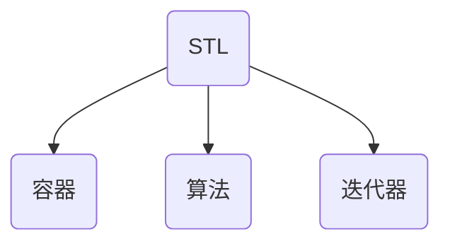

# Lesson18 STL初识

---
- [Lesson18 STL初识](#lesson18-stl初识)
  - [1. STL的基本概念](#1-stl的基本概念)
  - [2. STL六大组件](#2-stl六大组件)
    - [容器](#容器)
    - [算法](#算法)
    - [迭代器](#迭代器)
  - [3. 常用算法迭代器初识](#3-常用算法迭代器初识)
    - [内置数据类型](#内置数据类型)
    - [自定义数据类型](#自定义数据类型)
    - [容器嵌套容器](#容器嵌套容器)

---
>长久以来，软件界一直希望建立一种重复可利用的东西。大多数情况下，数据结构和算法都未能有一套标准，导致被迫从事大量重复工作。为了建立数据结构和算法的一套标准，诞生了STL。

---
## 1. STL的基本概念

* **标准模板库 STL *(Standard Template Library)*** 
* STL从广义上分为 **容器 *(container)*** ，**算法 *(algorithm)*** ，**迭代器 *(iterator)***
* **容器** 和 **算法** 之间通过 **迭代器** 无缝连接  
* STL几乎所有的代码都采用了模板类或模板函数

---
## 2. STL六大组件
分别是： 容器，算法，迭代器，仿函数，适配器（配接器），空间配置器

### 容器
STL容器就是将运用最广泛的一些数据结构实现出来  
常用的数据结构：数组，连别哦啊，树，栈，队列，集合，映射表等  
这些容器分为序列式容器和关联式容器两种

* **序列式容器**：强调值的排序，每个元素均有固定的位置
* **关联式容器**：二叉树结构，各元素之间没有严格的物理上的顺序关系

### 算法
算法分为质变算法和非质变算法

* **质变算法**：运算过程中会更改区间内元素的内容，如拷贝，替换，删除等
* **非质变算法**：运算过程中不会更改去年内的元素内容，如查找，计数，遍历，寻找极值等

### 迭代器
容器和算法的粘合剂

提供一种方法，是指能够依序寻访某个容器所含的各个元素，而又无需暴露该容器的内部表示方式，每个容器都有自己专属的迭代器。  
迭代器的使用非常类似于指针。

| 种类     | 功能                 | 支持运算               |
| -------- | -------------------- | ---------------------- |
| 输入     | 只读                 | ++,==,!=               |
| 输出     | 只写                 | ++                     |
| 前向     | 读写，向前访问       | ++,==,!=               |
| 双向     | 读写，向前或向后访问 | ++,--                  |
| 随机访问 | 读写，可跳跃访问     | ++,==,[n],-n,<,>,<=,>= |

常用容器中迭代器种类为双向迭代器和随机访问迭代器

---
## 3. 常用算法迭代器初识
我们先来简单了解一下我们最常使用的容器 `std::vector`

### 内置数据类型
```cpp
#include <iostream>
#include <algorithm>
#include <vector>

void myPrint(int val) {
   std::cout << val << std::endl;
}

int main() {
   // 创建数组
   std::vector<int> v;

   // 插入数据
   v.push_back(10);
   v.push_back(20);
   v.push_back(30);
   v.push_back(40);

   // 通过迭代器访问容器中的数据
   std::vector<int>::iterator itBegin = v.begin();
   std::vector<int>::iterator itEnd = v.end();

   // 遍历容器
   // 1.
   while (itBegin != itEnd) {
      std::cout << *itBegin << std::endl;
      itBegin++;
   }

   // 2.
   for (std::vector<int>::iterator it = v.begin(); it != v.end(); it++) {
      std::cout << *it << std::endl;
   }

   // 3. std::for_each算法
   std::for_each(v.begin(), v.end(), myPrint);
}
```
### 自定义数据类型
```cpp
#include <iostream>
#include <vector>

class AA {
  public:
   int _n;
   int _m;
};

int main() {
   // 创建数组
   std::vector<AA> v;

   AA a1(1, 2);
   AA a2(2, 2);
   AA a3(3, 2);
   AA a4(4, 2);

   // 插入数据
   v.push_back(a1);
   v.push_back(a2);
   v.push_back(a3);
   v.push_back(a4);

   // 通过迭代器访问容器中的数据
   // 遍历容器
   for (std::vector<AA>::iterator it = v.begin(); it != v.end(); it++) {
      std::cout << it->_m << it->_n << std::endl;
   }
}
```
### 容器嵌套容器
```cpp
// 创建数组
std::vector<std::vector<int>> v;
// 在C++11前，必须写成"> >"防止被编译器认为是右移运算符

std::vector<int> v1;
std::vector<int> v2;
std::vector<int> v3;
std::vector<int> v4;

// 向小容器中插入数据
for (int i = 0; i < 4; i++) {
   v1.push_back(i + 1);
   v2.push_back(i + 2);
   v3.push_back(i + 3);
   v4.push_back(i + 4);
}

// 将小容器插入到大容器中
v.push_back((v1));
v.push_back((v2));
v.push_back((v3));
v.push_back((v4));

// 通过迭代器访问容器中的数据
// 遍历容器
for(std::vector<std::vector<int>>::iterator it = v.begin(); it != v.end(); it++) {
   for (std::vector<int>::iterator vit (*it).begin(); vit != (*it).end(); vit++) {
      std::cout << *vit << " ";
   }
   std::cout << std::endl;
}
```

---
**edit** Serein
