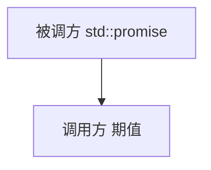
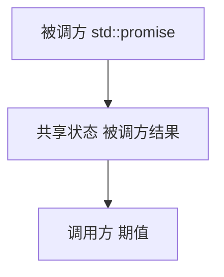

# 条款38：对变化多端的线程句柄析构函数行为保持关注



箭头代表着从被调方向调用方的信息流。

被调方的结果存储在双方之外的某个位置，这个位置被称为共享状态。共享状态通常使用堆上的对象来表示，但其具体实现标准并未指定。标准库作者可以自由实现共享状态。

可以把三者的关系用下图表示，箭头仍然表示信息流：



期值析构函数的行为是由与其关联的共享状态决定的。具体来说就是：

- **指涉到经由 `std::async` 启动的未推迟任务的共享状态的最后一个期值会保持阻塞，直到该任务结束。** 本质上，这样一个期值的析构函数是对底层异步执行任务的线程实施了一次隐式 `join`。
- **其他所有期值对象的析构函数仅仅将期值对象析构就结束了。** 对底层异步运行的任务，这样做类似于对线程实施一次隐式 `detach` ，对于那些被推迟的任务而言，如果这一期值是最后一个，也就意味着被推迟的任务将不会有机会运行了。

第二个是常规行为，而第一个只有在期值满足以下全部条件时才会发挥作用：

- **期值所指涉的共享状态是由于调用了 `std::async` 才创建的。**
- **该任务的启动策略是 `std::launch::async` 。** 
- **该期值是指涉到该共享状态的最后一个期值。** 对于 `std::future` 对象而言，这一点总是成立，而对于 `std::shared_future` 对象而言，在析构时如果不是最后一个指涉到共享状态的期值，则它会遵循常规行为准则（即析构其成员变量）。

只有所有条件都满足，期值的析构函数才会表现出特别行为。从效果来看，这相当于对正在运行的 `std::async` 创建的任务的线程实施了一次隐式 `join`。

粗略的表述为：**来自 `std::async` 的期值会在其析构函数中被阻塞。**

期值的API没有提供任何方法判断其指涉的共享状态是否诞生于 `std::async` 的调用，所以给定任意期值对象的前提下，它不可能直到之际是否会在析构函数中阻塞到异步任务执行结束：

```cpp
std::vector<std::future<void>> futs;

class Widget {
public:
    ...
private:
    std::shared_future<double> fut;
};
```

当然，如果有办法判定给定的期值不满足触发特殊析构行为的条件，即可判定该期值不会阻塞在其析构函数中。例如，只有因 `std::async` 调用而出现的共享状态才可以展示特别行为，但还有其他方法可以创建共享状态。其中一个方法就是运用 `std::packaged_task`，它会准备一个函数以供异步执行，手法是将它加上一层封装，把其结果置入共享状态。而指涉到该共享状态的期值可以经由 `std::packaged_task` 的 `get_future` 函数得到：

```cpp
int calcValue();

std::packaged_task<int()>
    pt(calcValue);

auto fut = pt.get_future();
```

此刻，我们已知期值对象 `fut` 没有指涉到由 `std::async` 调用产生的共享状态，所以它的析构函数将表现出常规行为。

`std::packaged_task` 类型对象 `pt` 一经创建，就会运行在线程之上。`std::packaged_task` 不能复制，所以将 `pt` 传递给 `std::thread` 构造函数就要将其移动：

```cpp
std::thread t(std::move(pt));
```

此后对 `t` 执行的操作决定了线程终止、联结或是分离。当你的期值所对应的共享状态是由 `std::packaged_task` 产生的，则通常无需采用特别析构策略。