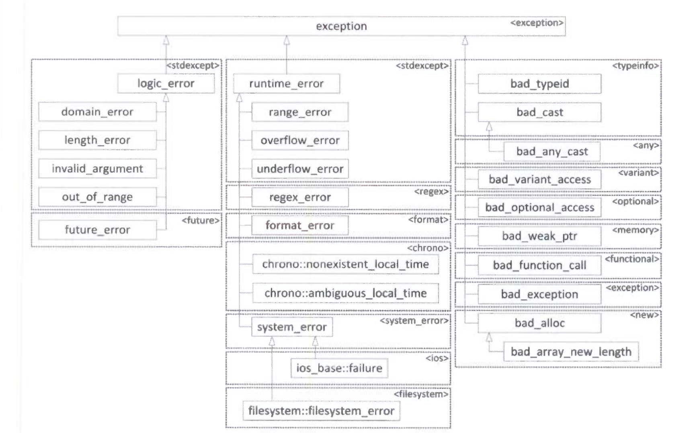

# Modern C++ 异常

> C++程序不可避免地会遇到错误。例如，程序可能无法打开某个文件，网络连接可能断开，或者用户可能输入不正确的值。C++语言提供了“异常”的特性，用来处理这些不正常但能预料的情况。
>
> 在C++中，并不强制异常处理。在Java中是强制的，没有给出可能抛出异常列表的函数不允许抛出任何异常。在C++中，函数可抛出它想抛出的任何异常，除非指定不会抛出任何异常（使用 `noexcept` 关键字）。

- [Modern C++ 异常](#modern-c-异常)
  - [异常机制](#异常机制)
    - [抛出和捕获异常](#抛出和捕获异常)
    - [异常类型](#异常类型)
    - [按 `const` 引用捕获异常对象](#按-const-引用捕获异常对象)
    - [抛出并捕获多个异常](#抛出并捕获多个异常)
      - [1. 匹配和 `const`](#1-匹配和-const)
      - [2. 匹配所有异常](#2-匹配所有异常)
    - [未捕获的异常](#未捕获的异常)
    - [`noexcept` 说明符](#noexcept-说明符)
    - [`noexcept(expression)` 说明符](#noexceptexpression-说明符)
    - [`noexcept(expression)` 运算符](#noexceptexpression-运算符)
    - [抛出列表](#抛出列表)
  - [异常与多态性](#异常与多态性)
    - [标准异常层次结构](#标准异常层次结构)
    - [在类层次结构中捕获异常](#在类层次结构中捕获异常)
    - [编写自己的异常类](#编写自己的异常类)
    - [源码位置](#源码位置)
    - [日志记录的源码位置](#日志记录的源码位置)
    - [异常的源码位置](#异常的源码位置)
    - [嵌套异常](#嵌套异常)
  - [重新抛出异常](#重新抛出异常)
  - [堆栈的释放和清理](#堆栈的释放和清理)
    - [使用智能指针](#使用智能指针)
    - [捕获、清理并重新抛出](#捕获清理并重新抛出)
  - [常见的错误处理问题](#常见的错误处理问题)
    - [内存分配错误](#内存分配错误)
      - [1. 不抛出异常的 `new`](#1-不抛出异常的-new)
      - [2. 定制内存分配失败的行为](#2-定制内存分配失败的行为)
    - [构造函数中的错误](#构造函数中的错误)
    - [构造函数的function-try-blocks](#构造函数的function-try-blocks)
    - [析构函数中的错误](#析构函数中的错误)


## 异常机制

在文件的输入输出中经常发生异常情况。下面的函数打开一个文件，从这个文件中读取整数列表，然后将整数存储在 `std::vector` 中。其中缺少错误处理代码：

```cpp
std::vector<int> readIntegerFile(std::string_view filename) {
  std::ifstream inputStream { filename.data() };
  std::vector<int> integers;
  int temp;
  while (inputStream >> temp) {
    integers.push_back(temp);
  }
  return integers;
}
```

下面的代码从 `ifstream` 持续地读取，一直到文件地结尾或发生错误为止。

```cpp
while (inputStream >> temp)
```

如果 `<<` 运算符发生错误，就会设置 `ifstream` 对象的错误位。在此情况下，`bool()` 转换运算符将返回 `false` ，while循环将终止。

可以这样使用 `readIntegerFile()`：

```cpp
const std::string filename { "Integer.txt" };
std::vector<int> myInt { readIntegerFile(filename) };
for (const auto& element : myInt) {
  std::cout << element << " ";
}
std::cout << std::endl;
```

### 抛出和捕获异常

为了使用异常，要在程序中包括两部分：处理异常的try/catch结构和抛出异常的throw语句。二者都必须以某种形式出现，以进行异常处理。

try/catch结构如下所示：

```cpp
try {
  // ... code with may result in an exception being thrown
} catch (exception_type1 exception_name) {
  // ... code with response to the exception of type1
} catch (exception_type2 exception_name) {
  // ... code with response to the exception of type2
}
// ... remaining code
```

导致抛出异常的代码可能直接包含 `throw` 语句，也可能调用一个函数，这个函数可能直接抛出异常，也可能经过多层调用后抛出，每层调用一个抛出异常的函数。

如果没有抛出异常，`catch` 语句之后或者在抛出异常的函数后的代码不会执行，根据抛出的异常的类型，控制会立刻转移到对应的catch块。

如果 `catch` 块没有执行控制转移（例如从函数中返回，抛出新的异常或者重新抛出异常），那么会执行 `catch` 块最后语句之后的代码。

演示异常处理的最简单的示例是避免除0。这个示例抛出一个 `std::invalid_argument` 类型的异常，它定义在 `<stdexcept>` 中。

```cpp
double safeDivide(double num, double den) {
  if (den == 0) 
    throw std::invalid_argument("denominator is zero");
  return num / den;
}

int main() {
  try {
    std::cout << safeDivide(5, 2) << std::endl;
    std::cout << safeDivide(5, 0) << std::endl;
    std::cout << safeDivide(3, 3) << std::endl;
  } catch (const std::invalid_argument& e) {
    std::cout << "exception: " << e.what() << std::endl;
  }
  return 0;
}
```

输出如下所示：

```
2.5
exception: denominator is zero
```

`throw` 是C++关键字，这是抛出异常的唯一方法。在前面的代码片段中，抛出了一个 `std::invalid_argument` 的新对象。这是C++标准库提供的标准异常。标准库中的所有异常构成了一个层次结构，详见之后的内容。该结构中每个类都支持 `what()` 方法，该方法返回一个描述异常的 `const char*` 字符串。该字符串在异常的构造函数中提供。

回到 `readInteger()` 函数，最容易发生的问题就是打开文件失败。这正是需要抛出异常的情况，代码抛出一个 `std::exception` 类型的异常，这种异常类型定义在 `<exception>` 中。如果文件打开失败：

```cpp
std::vector<int> readIntegerFile(std::string_view filename) {
  std::ifstream inputStream { filename.data() };
  if (inputStream.fail()) {
    throw exception {};
  }

  std::vector<int> integers;
  int temp;
  while (inputStream >> temp) {
    integers.push_back(temp);
  }
  return integers;
}
```

> **注意**
>
> 始终在代码文档中记录函数可能抛出的异常，因为函数的用户需要了解可能抛出哪些异常，从而加以适当处理。

如果函数打开文件失败并执行了 `throw exception {}` 语句，那么函数的其余部分将被跳过，把控制转交给最近的异常处理程序。

如果还编写了处理异常的代码，这种情况下抛出异常效果最好。异常处理是这样一种方法：try执行一块代码，并用另一块代码处理可能发生的任何错误。在下面的 `main()` 函数中， `catch` 语句捕获任何被 `try` 块抛出的 `exception` 类型异常，并输出错误消息。如果 `try` 块结束时没有抛出异常，`catch` 块将被忽略。

```cpp
int main() {
  const std::string filename { "IntegerFile.txt" };
  std::vector<int> myInt;
  try {
    myInt = readIntegerFile(filename);
  } catch (const exception& e) {
    std::cerr <<"Unable to open file " << filename << std::endl;
    return 1;
  }
  for (const auto& element : myInt) {
    std::cout << element <<  " ";
  }
  std::cout << std::endl;
}
```

### 异常类型

可抛出任何类型的异常。可以抛出一个 `std::exception` 类型的对象，但异常未必是对象，也可以抛出一个简单的int值，如下所示：

```cpp
std::vector<int> readIntegerFile(std::string_view filename) {
  std::ifstream inputStream { filename.data() };
  if (inputStream.fail()) {
    throw 5;
  }
  //...
}
```

此后必须修改 `catch` 语句：

```cpp
try {
  myInt = readIntegerFile(filename);
} catch (const int e) {
  std::cerr << std::format("Unable to open file {} (Error Code {})", filename, e) << std::endl;
  return 1;
}
```

另外，也可以抛出一个C风格的 `const char*` 字符串。这项技术有时有用，因为字符串可包含与异常相关的信息。

```cpp
std::vector<int> readIntegerFile(std::string_view filename) {
  std::ifstream inputStream { filename.data() };
  if (inputStream.fail()) {
    throw "Unable to open file";
  }
  //...
}
```

当捕获 `const char*` 异常时，可输出结果：

```cpp
try {
  myInt = readIntegerFile(filename);
} catch (const char* e) {
  std::cerr << e << std::endl;
  return 1;
}
```

尽管前面有这样的示例，但通常应将对象作为异常抛出，原因有以下两点：

- 对象的类名可传递信息。
- 对象可存储信息，包括描述异常的字符串。

C++标准库在类层次结构中定义了许多预定义的异常类，也可编写自己的异常类，并将它们放入标准层次结构中。在之后会就此详细讨论。

### 按 `const` 引用捕获异常对象

在前面的示例中，`readIntegerFile()` 抛出了一个 `std::exception` 类型的对象。`catch` 处理如下所示：

```cpp
} catch (const std::exception& e) {
```

然而，再次并没有要求按 `const` 引用捕获对象。可以按值捕获对象，如下所示：

```cpp
} catch (std::exception e) {
```

此外，也可按非 `const` 引用捕获对象：

```cpp
} catch (std::exception& e) {
```

另外，如 `const char*` 示例所示，只要指向异常的指针被抛出，就可以捕获他。

> **注意**
>
> 建议按 `const` 引用捕获对象，可避免按值捕获时可能出现的对象截断。

### 抛出并捕获多个异常

打开文件失败不是 `readIntegerFile()` 遇到的唯一问题。如果格式不正确，读取文件中的数据也会导致错误。下面是 `readIntegerFile()` 的一个实现，如果无法打开文件，或者无法正确读取数据，就会抛出异常。这里使用从 `std::exception` 派生的 `std::runtime_error`，它允许你在构造函数中指定描述字符串。我们在 `<stdexcept>` 中定义 `std::runtime_error` 异常。

```cpp
std::vector<int> readIntegerFile(std::string_view filename) {
  std::ifstream inputStream { filename.data() };
  if (inputStream.fail()) {
    throw std::runtime_error { "Unable to open file" };
  }

  std::vector<int> integers;
  int temp;
  while (inputStream >> temp) {
    integer.push_back(temp);
  }

  if (!inputStream.eof()) {
    throw std::runtime_error { "Unable to read file" };
  }

  return integers;
}
```

`std::invalid_argument` 和 `std::runtime_error` 类没有公共的默认构造函数，只有以字符串作为参数的构造函数。

现在 `main()` 可调用两个 `catch` 语句捕获 `std::invalid_argument` 和 `std::runtime_error` 异常：

```cpp
try {
  myInt = readIntegerFile(filename);
} catch (const std::invalid_argument& e) {
  std::cerr << e.what() << std::endl;
  return 1;
} catch (const std::runtime_error& e) {
  std::cerr << e.what() << std::endl;
  return 2;
}
```

如果异常在 `try` 块内部抛出，编译器将使用恰当的 `catch` 处理程序与异常类型匹配。因此，如果 `readIntegerFile()` 无法打开文件并抛出 `std::invalid_argument` 异常，第一个 `catch` 语句将捕获这个异常。如果 `readIntegerFile()` 无法正确文件并抛出 `std::runtime_error` 异常，第二个 `catch` 语句将捕获这个异常。

#### 1. 匹配和 `const` 

对于想要捕获的异常类型而言，增加 `const` 属性不会影响匹配的目的。也就是说，这一行可以与 `std::runtime_error` 类型的任何异常匹配：

```cpp
} catch (const std::runtime_error& e) {
```

下面这行也可以与 `std::runtime_error` 类型的任何异常匹配：

```cpp
} catch (std::runtime_error& e) {
```

#### 2. 匹配所有异常

可用特定语法编写与所有异常匹配的 `catch` 语句：

```cpp
try {
  myInt = readIntegerFile(filename);
} catch (...) {
  std::cerr << "Error reading or opening file" << std::endl;
  return 1;
}
```

这三个点并非省略符，而是与所有异常类型匹配的通配符。当调用缺乏文档的代码时，可以用这一语法确保捕获所有可能的异常。然而，如果有被抛出的一组异常的完整信息，这种技术并不理想，因为它将所有异常都同等对待。

与所有异常匹配的catch块可以用做默认的catch处理程序。当异常抛出时，会按在代码中显示顺序查找 `catch` 处理程序。下例用 `catch` 处理程序显式处理 `std::invalid_argument` 和 `std::runtime_error` 异常，并用默认的catch处理程序处理其他异常：

```cpp
try {
  // code that can throw exceptions
} catch (const std::invalid_argument& e) {
  // handle invalid_argument exception
} catch (const std::runtime_error& e) {
  // handle runtime_error exception
} catch (...) {
  // handle all other exceptions
}
```

### 未捕获的异常

如果程序抛出的异常没有捕获，程序将终止。可对 `main()` 函数使用try/catch结构，以捕获所有未经处理的异常，如下所示：

```cpp
try {
  main(argc, argv);
} catch (...) {
  // issue error message and terminate program
}
// normal terminal code
```

然而，这一行为通常并非我们希望的。异常的作用在于给程序一个机会，以处理和修正不希望看到的或不曾预期的情况。

> 捕获并处理程序中可能抛出的所有异常

如果存在未捕获异常，程序行为也可能发生变化。当程序遇到未捕获的异常时，会调用内建的 `terminate()` 函数，这个函数调用 `<cstdlib>` 中的 `abort()` 函数来终止程序。可调用 `set_terminate()` 函数来设置自己的 `terminate_handler()`，这个函数采用指向回调函数（既没有参数，也没有返回值）的指针作为参数。 以上三个函数都在 `<exception>` 中声明。下面的代码展示了它们的用法：

```cpp
try {
  main(argc, argv);
} catch (...) {
  if (std::terminate_handler != nullptr)
    std::terminate_handler();
  else
    std::terminate();
}
// normal termination code
```

回调函数必须终止程序（使用 `abort()` 或 `_Exit()` 函数），错误时无法忽略的。还有个 `exit()` 函数，它会接收返回给操作系统的参数，并调用析构函数来清理资源，但不建议在 `std::terminate_handler` 中调用 `exit()` 函数。

在退出之前可使用 `std::terminate_handler` 打印有用的错误消息。下例中，回调答应错误消息并用 `_Exit()` 函数退出程序：

```cpp
[[noreturn]] void myTerminate() {
  std::cout << "Uncaught exception!" << std::endl;
  _Exit(1); 
}

int main() {
  std::set_terminate(myTerminate);

  const std::string filename { "IntegerFile.txt" };
  std::vector<int> myInt;

  for (const auto& element : myInt) {
    std::cout << element << " ";
  }
  std::cout << std::endl;
}
```

当设置新的 `terminate_handler()` 时，`set_terminate()` 返回旧的 `terminate_handler()`。`terminate_handler()` 被应用于整个程序，因此最好保存旧的 `terminate_handler()`。上面的示例中不需要重新保存，因为整个程序都需要新的 `terminate_handler()` 。

使用 `terminate_handler()` 并不是一种非常有效的处理异常的办法。建议分别捕获并处理每个异常，以提供更精确的错误处理。

### `noexcept` 说明符

默认情况下函数可以抛出任何异常。但可使用 `noexcept` 关键字标记函数，指出它不抛出任何异常。例如，为下面的函数标记了 `noexcept` ，即不允许它抛出任何异常：

```cpp
void printValues(const std::vector<int>& values) noexcept;
```

> **注意**
>
> 带有 `noexcept` 标记的函数不应该抛出任何异常。

如果一个函数带有 `noexcept` 标记，却以某种方式抛出了异常，C++将调用`terminate()` 来终止应用程序。

在派生类中重写虚方法时，可将重写的虚方法标记为 `noexcept`（即使基类中的版本不是noexcept）。若基类方法是noexcept，则重写的虚方法不应该抛出任何异常。

### `noexcept(expression)` 说明符

当且仅当给定的表达式返回true时，`noexcept(expression)` 说明符才会将函数标记为noexcept。换句话说，`noexcept` 等同于 `noexcept(true)`，而 `noexcept(false)` 则相反。也就是说，标记为 `noexcept(false)` 的方法可以抛出任何异常。

### `noexcept(expression)` 运算符

如果给定的表达式标记为 `noexcept` ，那么 `noexcept(expression)` 运算符将返回true，要么使用 `noexcept` 说明符，要么使用 `noexcept(expression)` 说明符。这会在编译期求值。

看下例：

```cpp
void f1() noexcept {}
void f2() noexcept(false) {}
void f3() noexcept(noexcept(f1())) {}
void f4() noexcept(noexcept(f2())) {}
int main() {
  std::cout << noexcept(f1())
            << noexcept(f2())
            << noexcept(f3())
            << noexcept(f4());
}
```


输出为 `1010`。

- `noexcept(f1())` 值为true：因为 `f1()` 被noexcept说明符显式地标记。
- `noexcept(f2())` 值为false：因为 `f2()` 被noexcept(expression)说明符显式地标记。
- `noexcept(f3())` 值为false：因为只有在 `f1()` 被标记为noexcept时，`f3()` 才被标记为noexcept。
- `noexcept(f4())` 值为false：因为只有在 `f2()` 被标记为noexcept时，`f4()` 才被标记为noexcept。

### 抛出列表

C++旧版本允许指定函数或方法可抛出的异常，这种规范称为 **抛出列表(throw list)** 或 **异常规范(exception specification)**。

> **警告**
>
> 自C++11之后，已不赞成使用异常规范；自C++17之后，已不再支持异常规范。C++20则完全不支持 `throw()`。

## 异常与多态性

可抛出任何类型的异常，然而，类时最有用的异常类型。异常类通常具有层次结构，因此在捕获异常时可使用多态性。

### 标准异常层次结构

下图显示了所有标准异常，包括标准库抛出的标准异常；后续章节将介绍这些异常。

C++标准库中抛出的所有异常都是这个层次结构中的对象。这个层次结构中的每个类都支持 `what()` 方法，这个方法返回一个描述异常的 `const char*` 字符串。可在错误信息中使用这个字符串。



有些异常类要求在构造函数中设置 `what()` 返回的字符串。这就必须在 `runtime_error` 和 `invalid_argument` 构造函数中指定字符串的原因。下面是 `readIntegerFile()` 的另一个版本，它也在错误消息中包含文件名：

```cpp
std::vector<int> readIntegerFile(std::string_view filename) {
  std::ifstream inputStream { filename.data() };
  if (inputStream.fail()) {
    const std::string error { std::format("Unable to open file {}.", filename.data()) };
    throw std::invalid_argument(error);
  }

  std::vector<int> integers;
  int temp;
  while (inputStream >> temp) {
    integers.push_back(temp);
  }

  if(!inputStream.eof()) {
    const std::string error { std::format("Unable to read file {}.", filename.data()) };
    throw std::runtime_error(error);
  }

  return integers;
}
```

### 在类层次结构中捕获异常

异常层次结构的一个特性是可利用多态性捕获异常。例如，如果观察下面这两条 `catch` 语句，就可以发现这两条语句除了处理异常类不同之外没有区别：

```cpp
try {
  myInt = readIntegerFile(filename);
} catch (const std::invalid_argument& e) {
  std::cerr << e.what() << std::endl;
  return 1;
} catch (const std::runtime_error& e) {
  std::cerr << e.what() << std::endl;
  return 1;
}
```

`invalid_argument` 和 `runtime_error` 都是 `exception` 的派生类，因此可使用 `exception` 类的一条catch语句替换这两条catch语句：

```cpp
try {
  myInt = readIntegerFile(filename);
} catch (const std::exception& e) {
  std::cerr << e.what() << std::endl;
  return 1;
}
```

`exception` 引用的catch语句可与 `exception` 的任何派生类匹配，包括 `invalid_error` 和 `runtime_error`。
注意捕获的异常在异常层次结构中的层次越高，错误处理就越不具有针对性。通常应该尽可能有针对地捕获异常。

> **警告**
>
> 当利用多态捕获异常时，一定要按引用捕获。如果按值捕获异常，就可能发生截断，再次情况下将丢失对象的信息。

catch子句应按限制最多到限制最少的顺序出现。例如，假定要显式捕获 `readIntegerFile()` 的 `invalid_argument` ，就应该让一般的异常与其他类型的异常匹配。正确的做法如下所示：

```cpp
try {
  myInt = readIntegerFile(filename);
} catch (const std::invalid_argument& e) {
  // take some special action for invalid filenames.
} catch (const std::runtime_error& e) {
  std::cerr << e.what() << std::endl;
  return 1;
}
```

第一条catch子句捕获 `invalid_argument` 异常，第二条catch子句捕获其他异常。

### 编写自己的异常类

建议自己编写的异常类从标准的 `exception` 类直接或简洁继承。如果项目中的所有人都遵循这条规则，就可确定程序中的所有异常都是 `exception` 的派生类。

例如，在 `readIntegerFile()` 中，`invalid_argument` 和 `runtime_error` 不能很好地捕获文件打开和读取错误。可为文件错误定义自己类，从泛型类FileError开始：

```cpp
class FileError : public std::exception {
public:
  FileError(std::string& filename) : m_filename {std::move(filename) } {}
  const char* what() const noexcept override { return m_filename; }
protected:
  virtual void setMessage(std::string& message) { m_massage = std::move(message); }
private:
  std::string m_filename;
  std::string m_massage;
};
```

编写exception的派生类时，需要重写 `what()` 方法。

`readIntegerFile()` 中的第一种异常情况是无法打开文件。因此，下面编写FileError的派生类FileOpenError：

```cpp
class FileOpenError : public FileError {
public:
  FileOpenError(std::string& filename) : FileError { std::move(filename) } {
    setMessage(std::format("Unable to open file {}", getFilename()));
  }
};
```

`readIntegerFile()` 中的第二种异常情况是无法正确读取文件。对于这一一场，或许应该包含文件中发生错误的行号，以及 `what()` 返回的文件名。下面是FileError派生类FileReadError：

```cpp
class FileReadError : public FileError {
public:
  FileReadError(std::string& filename) : FileError { std::move(filename) }, m_lineNumber { lineNumber } {
    setMessage(std::format("Error reading {}, line {}.", getFilename(), lineNumber));
  }

  virtual size_t getLineNumber() const noexcept { return m_lineNumber; }

private:
  size_t m_lineNumber { 0 };
};
```

当然，为了正确设置行号，需要修改 `readIntegerFile()` 函数，以跟踪读取的行号。下面是使用了新异常的 `readIntegerFile()` 函数：

```cpp
std::vector<int> readIntegerFile(std::string_view filename) {
  std::ifstream inputStream { filename.data() };
  if (inputStream.fail()) {
    throw FileOpenError { filename };
  }

  std::vector<int> integers;
  size_t lineNumber { 0 };
  while (!inputStream.eof()) {
    std::string line;
    getline(inputStream, line);
    lineNumber++;

    std::istringstream iss { line };

    int temp;
    while (lineStream >> temp) {
      integers.push_back(temp);
    }

    if (!lineStream.eof()) {
      throw FileReadError { filename };
    }
  }
  return integers;
}
```

现在，调用 `readIntegerFile()` 的代码可以使用多态性捕获FileError类型的异常，如下所示：

```cpp
try {
  myInt = readIntegerFile(filename);
} catch (const FileError& e) {
  std::cerr << e.what() << std::endl;
  return 1;
}
```

如果编写的类的对象将作为异常抛出，对象必须复制或移动。这意味着如果动态分配内存，就必须编写析构函数、拷贝构造函数、拷贝赋值运算符、或移动构造函数和移动赋值运算符。

> **警告**
>
> 作为异常抛出的对象至少要复制或移动一次。

异常可能被复制多次，但只有按值（而不是按引用）捕获异常才会如此。

> **注意**
>
> 按引用（最好是 `const` 引用捕获异常对象可避免不必要的复制。

### 源码位置

在C++20之前，可以使用以下预处理宏获取源代码中的位置信息：

| 宏         | 描述           |
| ---------- | -------------- |
| `__FILE__` | 源文件名       |
| `__LINE__` | 源文件中的行号 |

此外，每个函数都有一个局部定义的静态字符数组 `__func__`，它包含函数的名字。

C++20在 `<source_location>` 中，以 `std::source_location` 类的形式，为这些C风格的预处理器宏引入了一个适当的面向对象方式的替代品。 

`source_location` 的示例有下面这些公有方法：

| 访问器            | 描述               |
| ----------------- | ------------------ |
| `file_name()`     | 返回源文件名       |
| `function_name()` | 返回函数名         |
| `line()`          | 返回源文件中的行号 |
| `column()`        | 返回源文件中的列号 |

使用静态方法 `current()` 可以在方法被调用的源码位置上创建 `source_location` 对象。它是全局单例模式。

### 日志记录的源码位置

`source_location` 类对于日志记录很有用。以前，日志记录通常会涉及写一些C风格的宏，现在使用 `source_location` ，可以编写一个纯C++的函数来记录日志并自动收集所需要的位置数据。如下，一个很好的技巧是定义一个logMessage函数：

```cpp
void logMessage(std::string_view message,
  const std::source_location& location =  // line 9
  std::source_location::current()) {
    std::cout << std::format("{}({}): {}: {}", location.file_name(),
    location.line(), location.function_name(), message) << std::endl;
  }
}

void foo() {  
  logMessage("Starting execution of foo()."); // line 18
}

int main() {
  foo();
}
```

对 `current()` 的调用不会发生在第9行，实际是在 `logMessage()` 被调用的位置，也就是第18行。当执行这个程序时，输出如下所示：

```
./01_Logging.cpp(17): foo: Starting execution of foo().
```

### 异常的源码位置

`source_location` 另一个有趣的例子时在自己的异常类中存储抛出异常的位置，如下所示：

```cpp
class MyException : public std::exception {
public:
  MyException(std::string message,
     std::source_location& location =  std::source_location::current())
    : m_message { std::move(message) }
    , m_location { std::move(location) } {}
  
  const char* what() const noexcept override { return m_message.c_str(); }
  virtual const std::source_location& where() const noexcept { return m_location; }
private:
  std::string m_message;
  std::source_location m_location;
};

void doSomething() {
  throw MyException { "Throwing MyException." };
}

int main() {
  try {
    doSomething();
  } catch (const MyException& e) {
    const auto& location { e.where() };
    std::cerr << std::format("Caught: '{}' at line {} in {}.", 
      e.what(), location.line(), location.function_name()) << std::endl;
  }
}
```

输出如下：

```
Caught: 'Throwing MyException' at line 18 in doSomething.
```

### 嵌套异常

当处理第一个异常时，可能触发第二个异常，从而要求抛出第二个异常。当抛出第二个异常时，第一个异常的所有信息都会丢失。C++用 **嵌套异常(nested exception)** 提供了解决这一问题的方案，嵌套异常允许将捕获的异常嵌套到新的异常环境。

使用 `std::throw_with_nested()` 抛出第一个异常时，这个异常中嵌套着另一个异常。第二个异常的catch处理程序可使用 `dynamic_cast()` 访问代表第一个异常的nested_exception。

下面的示例演示了嵌套异常的用法。这个示例定义了一个从exception类派生的MyException类，其构造函数接收了一个字符串。

```cpp
class MyException : public std::exception {
public:
  MyException(std::string message) : m_message { std::move(message) } {}
  virtual const char* what() const noexcept override { return m_message.c_str(); }
private:
  std::string m_message;
};
```

下面的 `doSomething()` 函数抛出一个 `runtime_error` 异常，这个异常立即被catch处理程序捕获。catch处理程序编写了一条消息，然后使用 `throw_with_nested()` 抛出第二个异常，第一个异常嵌套在其中。注意嵌套异常是自动实现的：

```cpp
void doSomething() {
  try {
    throw std::runtime_error { "Throwing a runtime_error exception" };
  } catch (const std::runtime_error& e) {
    std::cout << std::format("{} caught a runtime_error", __func__) << std::endl;
    std::cout << std::format("{} throwing MyException", __func__) << std::endl;
    std::throw_with_nested(MyException { "MyException with nested runtime_error" });
  }
}
```

`std::throw_with_nested()` 函数工作方式是抛出一个未命名的编译器生成的新类型，这个类型由nested_exception和MyException派生而来。nested_exception基类的另一个默认构造函数通过调用 `std::current_exception()` 自动捕获正在处理的异常，并将其存储在 `std::exception_ptr` 中。exception_ptr是一种类似指针的类型，可以存储空指针或 `current_exception()` 抛出和捕获的异常对象的指针。exception_ptr的实例可以通过不同的线程传递给函数（通常是值传递）。

最后，下面的代码演示了如何处理具有嵌套异常的异常。这段代码有一个处理MyException异常的catch处理程序。当捕获到这类异常时，会编写一条消息，然后使用 `dynamic_cast()` 访问嵌套的异常。如果内部没有嵌套异常，结果为空指针。如果有嵌套异常，会调用nested_exception的 `rethrow_nested()` 方法。这样会再次抛出嵌套异常，这一异常可在另一个try/catch块中捕获。

```cpp
try {
  doSomething();
} catch (const MyException& e) {
  std::cout << std::format("{} caught MyException: {}", __func__, e.what()) << std::endl;

  const auto* nested { dynamic_cast<const std::nested_exception*>(&e) };
  if (nested) {
    try {
      nested->std::rethrow_nested();
    } catch (const std::runtime_error& e) {
      std::cout << std::format("  Nested exception: {}", e.what()) << std::endl;
    }
  }
}
```

输出如下：

```
doSomething caught a runtime_error
doSomething throwing MyException
main caught MyException: MyException with nested runtime_error
  Nested exception: MyException with nested runtime_error
```

如果想要检测嵌套异常，就不得不经常执行 `dynamic_cast()` ，因此标准库提供了一个名为 `std::rethrow_if_nested()` 的辅助函数，其用法如下所示：

```cpp
try {
  doSomething();
} catch (const MyException& e) {
  std::cout << std::format("{} caught MyException: {}", __func__, e.what()) << std::endl;
  try {
    std::rethrow_if_nested(e);
  } catch (const std::runtime_error& e) {
    std::cout << std::format("  Nested exception: {}", e.what()) << std::endl;
  }
}
```

> `throw_with_nested()`、`nested_exception`、`rethrow_if_nested()`、`current_exception()`、`exception_ptr` 都定义在 `<exception>` 中。

## 重新抛出异常

可以使用 `throw` 关键字重新抛出当前异常，如下所示：

```cpp
void g() { throw std::invalid_argument { "Some exception" }; }

void f() {
  try {
    g();
  } catch (const std::invalid_argument& e) {
    std::cout << "caught in f: " << e.what() << std::endl;
    throw;  // rethrow
  }
}

int main() {
  try {
    f();
  } catch (const std::invalid_argument& e) {
    std::cout << "caught in main: " << e.what() << std::endl;
  }
}
```

输出如下：

```
caught in f: Some exception
caught in main: Some exception
```

或许你认为，可使用 `throw e;` 重新抛出异常，但事实并非如此，因为那样会截断异常对象。例如，假如修改 `f()` 以捕获 `std::exception` 异常，修改 `main()` 以捕获 `std::exception` 和 `std::invalid_argument` 异常：

```cpp
void g() { throw std::invalid_argument { "Some exception" }; }

void f() {
  try {
    g();
  } catch (const std::exception& e) {
    std::cout << "caught in f: " << e.what() << std::endl;
    throw;  // rethrow
  }
}

int main() {
  try {
    f();
  } catch (const std::invalid_argument& e) {
    std::cout << "invalid_argument caught in main: " << e.what() << std::endl;
  } catch (const std::exception& e) {
    std::cout << "exception caught in main: " << e.what() << std::endl;
  }
}
```

`invalid_argument` 从 `exception` 派生而来。上述代码的输出与我们的预期相符：

```
caught in f: Some exception
invalid_argument caught in main: Some exception
```

现在尝试将 `f()` 中的重新抛出异常更改为 `throw e;` 语句，输出如下所示：

```
caught in f: Some exception
exception caught in main: Some exception
```

`main()` 似乎在捕获 `exception` 对象而非 `invalid_argument` 对象。这是由于 `throw e;` 语句会执行截断操作，将 `invalid_argument` 对象截断为 `std::exception` 对象。

> **警告**
>
> 始终使用 `throw;` 重新抛出异常。永远不要试图使用 `throw e;` 重新抛出 `e` !

## 堆栈的释放和清理


当某段代码抛出一个异常时，会在堆栈中寻找catch处理程序。catch处理程序可以是在堆栈上的0个或多个函数调用。当发现一个catch处理程序时，堆栈会释放多有中间堆栈帧，直接跳到定义catch处理程序的堆栈层。**堆栈释放(stack unwinding)** 意味着调用所有局部作用域的名称的析构函数，并忽略在当前执行点之前的每个函数的所有代码。

然而当释放堆栈时，并不释放指针变量，也不会执行其他清理工作，会发生内存泄漏。堆栈释放会正确地销毁所有局部变量。

### 使用智能指针

如果基于堆栈的内存分配不可用，就应使用智能指针。在处理异常时，智能指针可使编写的代码自动防止内存或资源的泄漏。无论什么时候销毁智能指针对象，都会释放底层资源。

> **注意**
>
> 使用智能指针或其他RAII对象时，永远不必考虑释放底层的资源：RAII对象的析构函数会自动完成这一操作，无论是正常退出函数，还是抛出异常推出函数，都是如此。


### 捕获、清理并重新抛出

避免内存和资源泄漏的另一种技术是针对每个函数，捕获可能抛出的所有异常，执行必要的清理，并重新抛出异常，供堆栈中更高层的函数处理。

> **警告**
>
> 智能指针或其他RAII是比捕获、清理和重新抛出技术更好的解决方案。

## 常见的错误处理问题

本章讨论使用异常时最常见的错误处理问题，但不使用异常的程序也会涉及这些问题。

### 内存分配错误

C++提供了处理内存错误的多种不同方式，如果无法分配内存，`new` 和 `new[]` 的默认行为是抛出 `bad_alloc` 异常，这种异常类型在 `<new>` 中定义。应该捕获并正确处理这些异常。

不可能把对 `new` 和 `new[]` 的调用都放在try/catch块中，但至少在分配大块内存时应这么做。下例演示了如何捕获内存分配异常：

```cpp
int* ptr { nullptr };
size_t integerCount { std::numeric_limits<size_t>::max() };
std::cout << std::format("Trying to allocate memory for {} integers.", integerCount) << std::endl;

try {
  ptr = new int[integerCount];
} catch (const std::bad_alloc& e) {
  auto location { std::source_location::current() };
  std::cerr << std::format("{} ({}): Unable to allocate memory: {}",
    location.file_name(), location.line(), e.what()) << std::endl;
  return;
}
```

另一个考虑是记录错误时可能尝试重新分配内存。如果 `new` 执行失败，可能没有记录错误消息的足够内存。

#### 1. 不抛出异常的 `new` 

如果不喜欢异常，可回到旧的C模式：在这种模式下，如果无法分配内存，内存分配例程将返回一个空指针。C++提供了 `new` 和 `new[]` 的nothrow版本，如果内存分配失败，将返回 `nullptr`，而不是抛出异常。使用 `new(nothrow)` 可做到这一点，如下所示：

```cpp
int* ptr { new(nothrow) int[integerCount] };
if (ptr == nullptr) {
  auto location { std::source_location::current() };
  std::cerr << std::format("{} ({}): Unable to allocate memory: {}",
    location.file_name(), location.line(), e.what()) << std::endl;
  return;
}
```

#### 2. 定制内存分配失败的行为

C++允许指定new handler回调函数。如果存在new handler，当内存分配失败时，内存分配例程会调用new handler而不是抛出异常。如果new handler返回，内存分配例程试着再次分配内存，会变成无限循环，除非new handler用下面的3个选项之一改变这种情况：

- **提供更多的可用内存**  提供空间的技巧之一是在程序启动时分配一大块内存，然后在new handler中释放这块内存。例如，当遇到内存分配错误时，保存用户状态，这样旧不会有工作丢失。
- **抛出异常** C++标准指出，如果new handler抛出异常，那么必须是 `bad_alloc` 异常或者派生于 `bad_alloc` 的异常。
  - **编写和抛出 `document_recovery_alloc` 异常** 这种异常从 `bad_alloc` 继承而来。可在应用程序的某个地方捕获这种异常，然后触发文档保存操作，并重启应用程序。
  - **编写和抛出派生于 `bad_alloc` 的 `please_terminate_me` 异常** 在顶层函数中，例如 `main()` 可捕获这种异常，然后触发文档保存操作，并重启应用程序。
  - **设置不同的new handler** 从理论上讲，可使用一系列new handler，每个都试图分配内存，并在失败时设置一个不同的new handler，然而这种情形过于复杂，并不实用。

如果有一些内存会分配失败，但又不想调用new handler，那么在调用new之前，只需要将新的new handler重新设置为默认值 `nullptr`。

调用在 `<new>` 中声明的 `set_new_handler` ，从而设置new handler。下面是一个记录错误消息并重新抛出异常的new handler示例：

```cpp
class please_terminate_me : public std::bad_alloc {};

void myNewHandler() {
  std::cerr << "Unable to allocate memory." << std::endl;
  throw please_terminate_me();
}
```

new handler不能有参数，也不能返回值。可采用以下方式设置new handler:

```cpp
int main() {
  try {
    // set the new new_handler and save the old one
    std::new_handler oldHandler { std::set_new_handler(myNewHandler) };

    // generate allocation error
    size_t numInt { std::numeric_limits<size_t>::max() };
    int* ptr { new int[numInt] };

    // reset the old new_handler
    std::set_new_handler(oldHandler);
  } catch (const please_terminate_me&) {
    auto location { std::source_location::current() };
    std::cerr << std::format("{}({}): Terminating program.", 
      location.file_name(), location.line()) << std::endl;
    return 1;
  }
}
```

`std::new_handler` 是函数指针类型的类型别名，`std::set_new_handler()` 将其作为参数。

### 构造函数中的错误

本节以Matrix类作为示例，这个类的构造函数可正确处理异常。注意这个示例使用裸指针 `m_matrix` 来演示问题。实际开发中，应避免使用裸指针，而使用标准库容器！

Matrix类模板的定义如下所示：

```cpp
export template <typename T>
class Matrix {
public:
  Matrix(size_t width, size_t heigh);
  virtual ~Matrix();
private:
  void cleanup();

  size_t m_width { 0 };
  size_t m_heigh { 0 };
  T** m_matrix { nullptr };
};
```

Matrix类的实现如下所示。注意对 `new` 的第一个调用并没有用try/catch块保护。第一个 `new` 抛出异常也没有关系。因为构造函数此时还没有跟配任何需要释放的内存。如果后面的 `new` 抛出异常，构造函数必须清理所以已经分配的内存。然而，由于不知道T构造函数本身会抛出什么异常，因此通过 `...` 捕获所有异常，并将捕获的异常嵌套在 `bad_alloc` 异常中。这里简化了 `cleanup()` 方法，因为允许它在 `nullptr` 上调用 `delete`。

```cpp
template <typename T>
Matrix<T>::Matrix(size_t width, size_t heigh) {
  m_matrix = new T*[width] {};  // array is zero-initialized

  // Don't initialize the mWidth and mHeight members in the
  // ctor-initializer. These should only be initialized when
  // the above mMatrix allocation succeeds!
  m_width = width;
  m_heigh = heigh;
 
  try {
    for (size_t i { 0 }; i < width; ++i) {
      m_matrix[i] = new T[heigh];
    }
  } catch (...) {
    std::cerr << "Exception caught in constructor, cleaning up..."
      << std::endl;
    cleanup();
    // nest any caught exception inside a bad_alloc exception
    std::throw_with_nested(std::bad_alloc());
  }
}

template <typename T>
Matrix<T>::~Matrix() {
  cleanup();
}

template <typename T>
void Matrix<T>::cleanup() {
  for (size_t i { 0 }; i < m_width; ++i)
    delete[] m_matrix[i];
  delete[] m_matrix;
  m_matrix = nullptr;
  m_width = m_height = 0;
}
```

> **警告**
>
> 如果异常离开了构造函数，将永远不会调用对象的析构函数！

可采取如下方式测试Matrix类模板：

```cpp
class Element {
private:
  int m_value;
};

int main() {
  Matrix<Element> m { 10, 10 };
}
```

如果使用了继承，基类的构造函数在派生类的构造函数之前运行，如果派生类的构造函数抛出一个异常，那么C++会运行任何构建完整的基类的析构函数。

> **注意**
>
> C++保证会运行任何构建完整的“子对象”的析构函数。因此，任何没有发生异常的构造函数所对应的析构函数都会运行。

### 构造函数的function-try-blocks

如果在构造函数的ctor-initializer中抛出了一个异常，该如何处理呢？
本节介绍能捕获这类异常的function-try-blocks。

下面是构造函数的function-try-blocks的基本语法：

```cpp
MyClass::MyClass()
try
  : <ctor-initializer> {
  //...constructor body...
} catch (const std::exception& e) {
  //...
}
```

try应该刚好在ctor-initializer之前。catch语句应该在构造函数花括号之后，实际上是将catch语句放在构造函数体的外部。当使用构造函数的function-try-blocks时，要记住如下限制：

- catch语句将捕获任何异常，无论是构造函数体还是ctor-initializer直接或简洁抛出的异常。
- catch语句必须重新抛出当前异常或抛出一个新异常。如果catch语句没有这么做，运行时将自动重新抛出当前异常。
- catch语句可访问传递给构造函数的参数。
- 当catch语句捕获function-try-blocks内的异常时，构造函数已构建的所有对象都会在执行catch语句前销毁。
- 在catch语句中，不应访问对象成员变量，因为他们在catch语句前就销毁了。但是，如果对象包含非类数据成员，例如裸指针，并且它们在抛出异常之前初始化，就可以访问它们。如果有这样的裸资源，就必须在catch语句中释放它们。
- 对于function-try-blocks中的catch语句而言，其中包含的函数不能使用 `return` 关键字返回值。构造函数于此无关，因为构造函数没有返回值。

由于有以上限制，构造函数的function-try-blocks只能在少数情况下有用：

- 将ctor-initializer抛出的异常转换为其他异常。
- 将消息记录到日志文件
- 释放在抛出异常之前就在ctor-initializer中分配了内存的裸资源。

> **警告**
>
> 避免使用function-try-blocks。
>
> 通常，仅将裸资源作为数据成员时，才有必要使用function-try-blocks。可使用RAII类来避免使用裸资源。

function-try-blocks并不局限于构造函数，也可用于普通函数。然而，对于普通函数而言，使用try/catch块更简单。

### 析构函数中的错误

必须在析构函数内部处理析构函数引起的所有错误。不应该让析构函数抛出任何异常。

> **警告**
>
> 小心不要让任何异常逃离出析构函数。