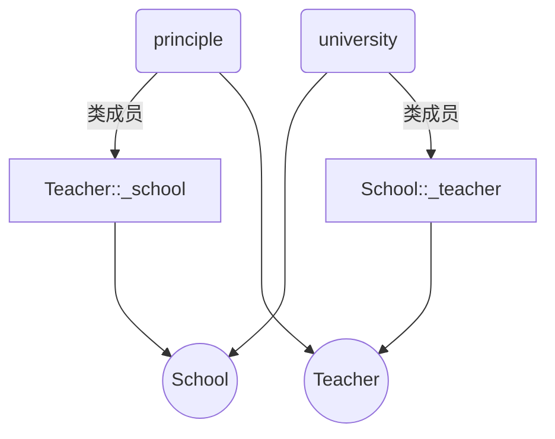
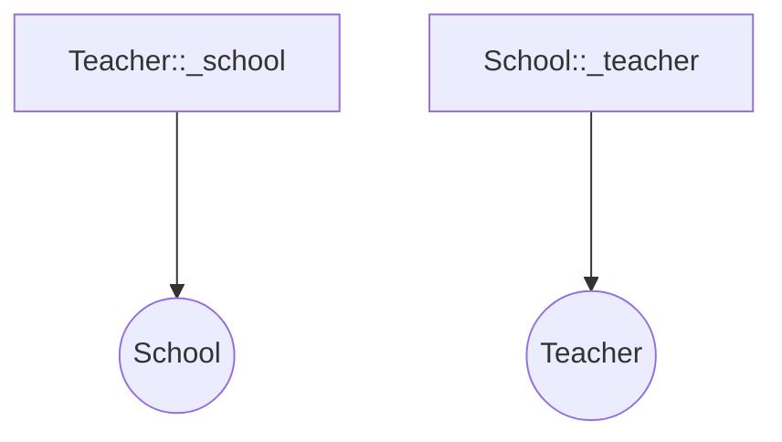

# Chapter9. Modern C++ 智能指针

> 本节所有内容均需包含头文件`<memory>`

- [Chapter9. Modern C++ 智能指针](#chapter9-modern-c-智能指针)
  - [9.1 独享指针 `std::unique_ptr`](#91-独享指针-stdunique_ptr)
    - [9.1.1 语法](#911-语法)
    - [9.1.2 更强的异常处理](#912-更强的异常处理)
    - [9.1.3 用法](#913-用法)
      - [获取裸指针](#获取裸指针)
      - [释放资源](#释放资源)
      - [解绑资源](#解绑资源)
    - [9.1.4 移动语义和独享指针](#914-移动语义和独享指针)
    - [9.1.5 自定义分配和释放内存函数](#915-自定义分配和释放内存函数)
    - [9.1.6 如何在函数间传递 `std::unique_ptr`](#916-如何在函数间传递-stdunique_ptr)
      - [用 `std::move` 转移 `std::unique_ptr` 的控制权](#用-stdmove-转移-stdunique_ptr-的控制权)
      - [函数返回 `std::unique_ptr`](#函数返回-stdunique_ptr)
  - [9.2 共享指针 `std::shared_ptr`](#92-共享指针-stdshared_ptr)
    - [9.2.1 语法](#921-语法)
    - [9.2.2 自动管理内存](#922-自动管理内存)
    - [9.2.3 引用计数](#923-引用计数)
    - [9.2.4 用法](#924-用法)
      - [获取裸指针](#获取裸指针-1)
      - [释放资源](#释放资源-1)
      - [自定义内存释放函数](#自定义内存释放函数)
      - [别名 Aliasing](#别名-aliasing)
    - [9.2.6 危险行为](#926-危险行为)
    - [9.2.7 额外性能开销](#927-额外性能开销)
    - [9.2.8 环形依赖](#928-环形依赖)
  - [9.3 弱指针 `std::weak_ptr`](#93-弱指针-stdweak_ptr)
    - [9.3.1 语法](#931-语法)
    - [9.3.2 用法](#932-用法)
    - [9.3.3 解决环形依赖](#933-解决环形依赖)
  - [9.4 `std::enable_shared_from_this`](#94-stdenable_shared_from_this)
  - [9.5 过时的、移除的 `auto_ptr`](#95-过时的移除的-auto_ptr)


## 9.1 独享指针 `std::unique_ptr`
`unique_ptr` 独享它指向的对象，也就是说，同时只有一个 `unique_ptr` 指向同一个对象，当这个`unique_ptr` 被销毁时，其指向的对象也随即被销毁

### 9.1.1 语法

> ```cpp
> std::unique_ptr<Type> up = std::make_unique<Type>(value);
> ```

**example**
```cpp
class A {
 public:
   A() { std::cout << "A constructor" << std::endl; }
   ~A() { std::cout << "A destructor" << std::endl; }
   void func() { std::cout << "function" <<std::endl;}
};

void test() {
   std::unique_ptr<A> up{std::make_unique<A>()};
   up->func();
   std::cout << "test end" << std::endl;
}

int main() {
   test();
   std::cout << "main end" <<std::endl;
}
```
**output**
```
A constructor
function
test end
A destructor
main end
```
可以看出，当`test()`函数执行完，`unique_ptr`指针被销毁，其绑定的A对象也会被自动释放，无需手动释放A对象

### 9.1.2 更强的异常处理

先看如下代码
```cpp
void func() {
  A* p = new A;
  p->foo();
  delete p;
}
```
上述代码中，虽然我们手动释放了`p`，但是如果`p->foo()`抛出异常，会导致下一行`delete`不会被执行，造成内存泄露

但是，如果我们将p改为智能指针，即使出现异常，也会正常释放内存

```cpp
auto p = std::make_unique<A>();
p->foo();
(*p).foo();
```

### 9.1.3 用法
`std::unique_ptr`的用法和裸指针类似，可以使用`*.`，`->`等操作

#### 获取裸指针

如果想通过智能指针获得其对应的裸指针，可以用成员函数`get()`获得，如某个函数只接受裸指针参数时
```cpp
A* p = up->get();
```

#### 释放资源

可以使用`reset()` 函数释放独享指针下的资源，或释放的同时指向另外一份资源
```cpp
up.reset();           // 释放up下的资源并置空
up.reset(new A);      // 释放up下的资源并重新指向A对象
```

将`std::unique`指针赋值为`nullptr`，也会释放对应资源
```cpp
up = nullptr;
```

#### 解绑资源

可以使用`release()` 使资源和智能指针解绑，同时返回资源的裸指针；此时你需要手动管理内存
```cpp
A* a = up.release();
delete a;
a = nullptr;
```

### 9.1.4 移动语义和独享指针

由于`std::unique` 独占一块内存的控制权，所以它不支持普通拷贝
```cpp
auto up1 = std::make_unique<int>(100);
std::unique_ptr up2(up1);   // error
up2 = up1;                  // error
```
以上代码编译时报错，因为我们不能复制控制权

但是我们可以转移控制权

```cpp
std::unique_ptr<int> up1 = std::make_unique<int>(100);
std::unique_ptr<int> up2(up1.release());
```

上述代码中，`up2`通过转移获得了对同一块内存的控制权，`up1`随即被销毁

当然，你也可以使用`std::move`来处理独享指针

```cpp
std::unique_ptr<Type> up1 = std::make_unique<Type>(value);
std::unique_ptr<Type> up2 = std::move(up1);
```

### 9.1.5 自定义分配和释放内存函数
在默认情况下，`std::unique_ptr`使用`new`和`delete`实现分配和释放内存

你也可以自定义分配和释放函数，通过将释放函数地址填入第二个模板参数中
s
```cpp
int* my_alloc(int v) {
  std::cout << "allocate" << std::endl;
  return new int(v);
}

void my_free(int *p){
  std::cout << "free" << std::endl;
  delete p;
}

int main() {
  std::unique_ptr<int, decltype(&my_free)> cup{my_alloc(100), my_free};
}
```

`std::unique_ptr`绑定分配和释放内存的函数在编译器进行，释放函数的类型变成它的一部分，避免运行时绑定的时间损耗，这也决定了`std::unique_ptr`的0额外开销的特性，让用户使用起来更简单

### 9.1.6 如何在函数间传递 `std::unique_ptr`

由于`std::unique_ptr`不能复制，所以值传递时会报错

```cpp
void pass_up(std::unique_ptr<int> up) {
   std::cout << "pass_up" << *p << std::endl;
}

int main() {
  auto up = std::make_unique<int>(123);
  pass_up(up);
}
```

**如果我们只想要访问`std::unique_ptr`指向的内容，我们不需要传递`std::unique_ptr`本身，我们只需要传递其对应的资源就可以了**

```cpp
void pass_up(int& p) {
   std::cout << "pass_up" << *p << std::endl;
}

int main() {
  auto up = std::make_unique<int>(123);
  pass_up(*up);
}
```

这种方法通过值传递资源避免独享指针的复制操作

我们也可以把`up.get()`作为参数传递，也能访问资源而避免复制

```cpp
void pass_up(int* p) {
   std::cout << "pass_up" << *p << std::endl;
}

int main() {
  auto up = std::make_unique<int>(123);
  pass_up(up.get());
}
```

以上情况只能让我们访问`std::unique_ptr`的资源，而非本身

如果我们想改变的是指针本身，那么我们就要将参数改为`std::unique_ptr`的引用

```cpp
void pass_up(std::unique_ptr<int>& up) {
   std::cout << "pass_up " << *up << std::endl;
   up.reset();
}

int main() {
  auto up = std::make_unique<int>(123);
  pass_up(up);
  if(up == nullptr) { std::cout << "up is reset" <<std::endl; }
}
```
**output**
```
pass_up 123
up is reset
```

因为传递参数为引用，所以操作函数中`up`时就是它本身，`up`在函数中被`reset`并置空，主函数中条件语句判断为真并输出

#### 用 `std::move` 转移 `std::unique_ptr` 的控制权

```cpp
void pass_up(std::unique<int> up) {
  std::cout << "pass_up " << *up << std::endl;
}

void main() {
  auto up = std::make_unique<int>(123);
  pass_up(std::move(up));
  if(up == nullptr) { std::cout << "up is moved" << std::endl; }
}
```

**output**
```
pass_up 123
up is moved
```
因为原`up`被`move`后置空，所以主函数中条件语句判断为真并输出

#### 函数返回 `std::unique_ptr`

```cpp
std::unique_ptr<int> return_uptr(int value) {
  std::unique_ptr<int> up = std::make_unique<int>(value);
  return up;
}

int main() {
  std::unique_ptr<int> up = return_uptr(321);
  std::cout << "up=" << *up << std::endl;
}
```
编译器会识别出不能使用拷贝构造，而使用`std::move`；当然，我们也可以自己写
```cpp
std::unique_ptr<int> return_uptr(int value) {
  std::unique_ptr<int> up = std::make_unique<int>(value);
  return std::move(up);
}

int main() {
  std::unique_ptr<int> up = return_uptr(321);
  std::cout << "up=" << *up << std::endl;
}
```

## 9.2 共享指针 `std::shared_ptr`

共享指针会记录有多少个共享指针指向同一个对象，当这个数字降到0时，程序就会自动释放这个对象

### 9.2.1 语法
>```cpp
>std::shared_ptr<Type> sp = std::make_shared<Type>(value);
>```

**example**
```cpp
std::shared_ptr<int> p{new int(100)};
std::shared_ptr<int> p2 = p;

*p2 = 321;
std::cout << *p <<std::endl;
```
**output**
```
321
```

多个指针指向同一对象的操作被称为 **共享**

### 9.2.2 自动管理内存

`use_count` 返回共享指针的数量，`reset` 使指针重置，不再指向原来的对象
```cpp
class A {
 public:
   A() { std::cout << "A constructor" << std::endl; }
   ~A() { std::cout << "A destructor" << std::endl; }
   void func() { std::cout << "function" <<std::endl;}
};

int main() {
   std::shared_ptr<A> p = std::make_shared<A>();
   std::cout << p.use_count() << std::endl;
   std::shared_ptr<A> p2 = p;
   std::cout << p2.use_count() << std::endl;
   std::shared_ptr<A> p3 = p;
   std::cout << p3.use_count() << std::endl;
   p.reset();
   p2.reset();
   p3.reset();
}
```

**output**

```
A constructor
1
2
3
A destructor
```

3个 `std::shared_ptr` 被重置后，所指向的对象被自动销毁

### 9.2.3 引用计数

每创建一个指向当前对象的 `std::shared_ptr`，引用计数加一；每销毁一个则引用计数减一

引用计数被减为0时，对象被自动销毁

### 9.2.4 用法

共享指针的用法同样和裸指针相同，可以发生拷贝，解引用等操作

#### 获取裸指针

如果想通过智能指针获得其对应的裸指针，可以用成员函数 `get()` 获得，如某个函数只接受裸指针参数时
```cpp
A* sp = p.get();
```
> **注意**  
> 
> 如果有一块资源同时有裸指针和共享指针指向它，那么当所有共享指针都被摧毁，但是裸指针仍存在时，该资源也会被自动销毁，裸指针变为野指针 
>    
> 所以，**避免将裸指针和共享指针混合使用**，以免非法访问

#### 释放资源

可以使用 `reset()` 函数释放独享指针下的资源，或释放的同时指向另外一份资源
```cpp
sp.reset();           // 释放sp下的资源并置空
sp.reset(new A);      // 释放sp下的资源并重新指向A对象
```

当执行第二行语句时，旧的 `A` 引用计数减一，`sp` 指向新的 `A`

#### 自定义内存释放函数

默认情况下，`std::shared_ptr` 使用 `delete` 来删除资源；我们也可以自定义内存释放函数

例如处理文件指针时，我们希望文件指针执行关闭文件操作，而不是删除堆区内存，可以这样操作
```cpp
void close_file(FILE* fp) {
  if(fp == nullptr) return;
  fclose(fp);
  std::cout << "File closed" << std::endl;
}

int main() {
  FILE* fp = fopen("data.txt", "w");
  std::shared_ptr<FILE> sfp{fp, close_file};
  if(sfp == nullptr) {
    cerr << "Error opening file" << std::endl;
  }
  else {
    cerr << "Error opening file" << std::endl;
  }
}
```
将内存释放函数作为第二个参数赋值给共享指针，可以实现替换`delete`的操作

#### 别名 Aliasing

shared_ptr支持所谓的别名。这允许一个shared_ptr与另一个shared_ptr共享一个指针（拥有的指针），但指向不同的对象（存储的指针）。例如，这可用于使用一个shared_ptr拥有一个对象本身的同时，指向该对象的成员，例如：

```cpp
class Foo {
 public:
   Foo(int value) : m_data{value} {}
   int m_data;
}

auto foo {std::make_shared<Foo>(42)};
auto aliasing {std::shared_ptr<int> {foo, &foo->m_data}};
```

当两个shared_ptr（foo和aliasing）都销毁时，才会销毁Foo对象。“拥有的指针”用于引用计数，对指针解引用或调用它的 `get()` 时，将返回“存储的指针”。

通常这个方法被用于**访问类成员**，我们希望访问类成员的时候，类对象不会被删除。所以我们通过别名**增加对类对象的控制权**，但是实际上访问的仍然是成员变量。

### 9.2.6 危险行为

```cpp
std::shared_ptr<int> p{new int(100)};
std::shared_ptr<int> p2 = p;

delete p.get();               // UB
std::cout << *p <<std::endl;
```

使用 `new` 创建了一个共享指针，仍然可以使用 `delete p.get()`，这可以通过编译但是会导致UB：其他的共享指针仍然可以访问到这个对象的内存，但是对象本身已经被销毁

**所以使用智能指针时尽量避免手动`delete`**

### 9.2.7 额外性能开销
由于`std::shared_ptr`使用引用计数，所以不可避免地会带来额外的性能开销，在一些性能要求极为苛刻的情况下尽量避免使用共享指针

### 9.2.8 环形依赖
先看代码
```cpp
struct School;

struct Teacher {
  std::string name;
  int age;
  std::shared_ptr<School> _school;
  ~Teacher() {
    std::cout << "Teacher Destructor" << std::endl;
  }
};

struct School {
  std::string name;
  std::shared_ptr<Teacher> _teacher;       
  ~School() {
    std::cout << "School Destructor" << std::endl;
  }
};

int main() {
  std::shared_ptr<Teacher> principle(new Teacher());
  std::shared_ptr<School> university(new School());
  
  principle->_school = university;
  university->_teacher = principle;
}
```
**output**
```

```
是的，控制台什么都没打印，这说明析构函数没有被执行，所以共享指针指向的内存没有被释放，发生内存泄漏

我们通过一张图看一下`std::shared_ptr` 的依赖情况



图中两个类的共享指针引用计数都为`2`，类被创建在堆区，类内指针维护堆区数据

程序运行结束后，栈区指针 `principle` 和 `university` 的生命周期结束，两个类的 `std::shared_ptr` 的引用计数仍然没有降为`0`，堆区指针互相引用，依赖变为下图



堆区数据不会被销毁，发生内存泄漏

## 9.3 弱指针 `std::weak_ptr`

为了解决共享指针的环形依赖的问题，我们引入弱指针 `std::weak_ptr`

### 9.3.1 语法
>```cpp
>std::weak_ptr<Type> p;
>```

### 9.3.2 用法

`std::weak_ptr`本身是依赖于 `std::shared_ptr` 存在的，当使用 `std::weak_ptr` 访问资源的时候，必须把它临时转化成`std::shared_ptr` ，用来建模临时管理权。`std::weak_ptr` 存储的只是对资源的引用，且为非拥有的引用，即不能删除对象本身（弱引用），只能作为观察者告诉我们资源是否存在。`std::weak_ptr` 指向的对象可以被其他 `std::shared_ptr` 删除。

如果想要使用 `std::weak_ptr` 来访问对象，需要用到 `lock` 方法，它会返回一个 `std::shared_ptr`。如果其指向的资源被释放，则会返回 `nullptr`。

**example**
```cpp
std::weak_ptr<int> wp;
std::shared_ptr<int> sp = std::make_shared<int>(100);
wp = sp; 

auto resource = wp.lock();
if(resource) {
  std::cout << "number is " << *resource << std::endl;
} else {
  std::cout << "wp is expired" << std::endl;
}
```
**output**
```
number is 100
```

我们来看cppreference上的一段代码

```cpp
std::weak_ptr<int> gw;

void observe() {
   std::cout << "use_count == " << gw.use_count() << ": ";
   if (auto spt = gw.lock()) {  // 使用之前必须复制到 shared_ptr
      std::cout << *spt << "\n";
   } else {
      std::cout << "gw is expired\n";
   }
}

int main() {
  auto sp = std::make_shared<int>(42);
  gw = sp;

  observe();
}
```
上述代码定义了一个`observe`函数，用来观察`sp`指向的对象有没有被销毁

**output**
```
use_count == 1: 42
use_count == 0: gw is expired
```

### 9.3.3 解决环形依赖
```cpp
struct School;

struct Teacher {
  std::string name;
  int age;
  std::weak_ptr<School> _school;                      // 将这里改为弱指针
  ~Teacher() {
    std::cout << "Teacher Destructor" << std::endl;
  }
};

struct School {
  std::string name;
  std::shared_ptr<Teacher> _teacher;       
  ~School() {
    std::cout << "School Destructor" << std::endl;
  }
};

int main() {
  std::shared_ptr<Teacher> principle(new Teacher());
  std::shared_ptr<School> university(new School());
  
  principle->_school = university;
  university->_teacher = principle;
}
```
**output**
```
Teacher Destructor
School Destructor
```

弱指针 `_school` 如果观察到 `university` 被销毁，则返回 `nullptr`，共享指针引用计数变为0，堆区数据被释放

## 9.4 `std::enable_shared_from_this`

`std::enable_shared_from_this` 派生的类允许对象调用方法，以安全地返回指向自己的shared_ptr或weak_ptr。如果没有这个基类，返回有效的shared_ptr或weak_ptr的一种方法是将weak_ptr作为成员添加到类中，并返回它的副本或返回由它构造的shared_ptr。enable_shared_from_this类给派生类添加了以下两个方法：

- `shared_from_this()` 返回一个shared_ptr，它共享对象的所有权。
- `weak_from_this()` 返回一个weak_ptr，它跟踪对象的所有权。

注意，仅当对象的指针已经存储在shared_ptr时，才能使用对象上的 `shared_from_this()` 。否则，将会抛出 `std::bad_weak_ptr` 异常（C++17起）。

`enable_shared_from_this` 提供安全的替用方案，以替代 `std::shared_ptr<T>(this)` 这样的表达式（这种不安全的表达式可能会导致 `this` 被多个互不知晓的所有者析构，见下方示例）。

```cpp
struct Good : std::enable_shared_from_this<Good> // 注：公开继承
{
  std::shared_ptr<Good> getptr() {
    return shared_from_this();
  }
};
 
struct Best : std::enable_shared_from_this<Best> // 注：公开继承
{
  std::shared_ptr<Best> getptr() {
    return shared_from_this();
  }
  // 无公开构造函数，仅工厂函数，故无法令 getptr 返回 nullptr 。
  [[nodiscard]] static std::shared_ptr<Best> create() {
    // 不使用 std::make_shared<Best> ，因为构造函数为私有。
    return std::shared_ptr<Best>(new Best());
  }
private:
  Best() = default;
};
 
struct Bad
{
  std::shared_ptr<Bad> getptr() {
    return std::shared_ptr<Bad>(this);
  }
  ~Bad() { std::cout << "Bad::~Bad() called\n"; }
};
 
void testGood()
{
  // ok：两个 shared_ptr 共享同一对象
  std::shared_ptr<Good> good0 = std::make_shared<Good>();
  std::shared_ptr<Good> good1 = good0->getptr();
  std::cout << "good1.use_count() = " << good1.use_count() << '\n';
}
 
void misuseGood()
{
  // bad：调用 shared_from_this 但没有 std::shared_ptr 占有调用者
  try {
    Good not_so_good;
    std::shared_ptr<Good> gp1 = not_so_good.getptr();
  } catch(std::bad_weak_ptr& e) {
    // 未定义行为（C++17 前）/抛出 std::bad_weak_ptr （C++17 起）
    std::cout << e.what() << '\n';    
  }
}
 
void testBest()
{
  std::shared_ptr<Best> best0 = Best::create();
  std::shared_ptr<Best> best1 = best0->getptr();
  std::cout << "best1.use_count() = " << best1.use_count() << '\n';
 
  // Best stackBest; // <- 不会通过编译，因为 Best::Best() 为私有。
}
 
void testBad()
{
  // Bad, each shared_ptr thinks it's the only owner of the object
  std::shared_ptr<Bad> bad0 = std::make_shared<Bad>();
  std::shared_ptr<Bad> bad1 = bad0->getptr();
  std::cout << "bad1.use_count() = " << bad1.use_count() << '\n';
} // UB： Bad 的二次删除

int main()
{
  testGood();
  misuseGood();
 
  testBest();
 
  testBad();
}
```

output

```
good1.use_count() = 2
bad_weak_ptr
best1.use_count() = 2
bad1.use_count() = 1
Bad::~Bad() called
Bad::~Bad() called
```

## 9.5 过时的、移除的 `auto_ptr`

在C++11之前，老的标准库包含了一个智能指针的简单实现，称为auto_ptr。遗憾的是，它存在一些严重缺陷。auto_ptr在C++11/14弃用，在C++17移除。

不要再使用旧的auto_ptr，而使用unique_ptr和shared_ptr！