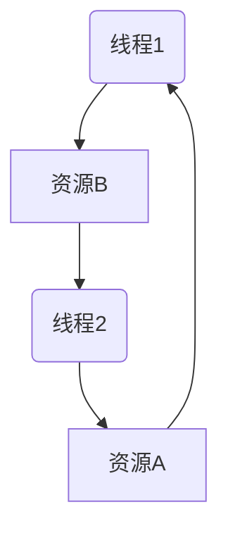

# Chapter22. Modern C++ 多线程

> 专业的C++程序员需要知道如何编写正确的多线程代码，以充分利用所有可用的处理器单元。C++11引入了标准线程库，使编写跨平台的多线程应用程序变得更容易了。还可使用其他第三方C++库，尽量编写平台独立的多线程程序，例如pthreads库和boost::thread库。

- [Chapter22. Modern C++ 多线程](#chapter22-modern-c-多线程)
  - [22.1 多线程编程概述](#221-多线程编程概述)
    - [22.1.1 争用条件](#2211-争用条件)
    - [22.1.2 撕裂](#2212-撕裂)
    - [22.1.3 死锁](#2213-死锁)
    - [22.1.4 伪共享](#2214-伪共享)
  - [22.2 线程](#222-线程)
    - [22.2.1 通过函数指针创建线程](#2221-通过函数指针创建线程)
    - [22.2.2 通过函数对象创建线程](#2222-通过函数对象创建线程)
    - [22.2.3 通过lambda创建线程](#2223-通过lambda创建线程)
    - [22.2.4 通过成员函数创建线程](#2224-通过成员函数创建线程)
    - [22.2.5 线程本地存储](#2225-线程本地存储)
    - [22.2.6 取消线程](#2226-取消线程)
    - [22.2.7 自动join线程](#2227-自动join线程)
    - [22.2.8 从线程中获得结果](#2228-从线程中获得结果)
    - [22.2.9 复制和重新抛出异常](#2229-复制和重新抛出异常)
  - [22.3 原子操作库](#223-原子操作库)
    - [22.3.1 原子操作](#2231-原子操作)
    - [22.3.2 原子智能指针](#2232-原子智能指针)
    - [22.3.3 原子引用](#2233-原子引用)
    - [22.3.4 使用原子类型](#2234-使用原子类型)
    - [22.3.5 等待原子变量](#2235-等待原子变量)

## 22.1 多线程编程概述

有两个原因促使我们应该开始编写多线程代码。首先，假设有一个计算问题，可将它分解为可相互独立运行的小块，那么在多处理器单元上运行可获得巨大的性能提升。其次，可在正交轴上对计算任务模块化；例如在线程中执行长时间的计算，而不会阻塞UI计算，这样在后台进行长时间计算时，用户界面仍然可以响应。

当然，并不能总将问题分解为可相互独立且并行执行的部分。但至少通常将问题部分并行化，从而提升性能。多线程编程中的一个难点是将算法并行化，这个过程和算法的类型高度相关。其他困难之处是防止争用条件、死锁、撕裂和伪共享等。这些都可以使用原子或显式的同步机制来解决。

### 22.1.1 争用条件

当线程要访问任何种类的共享资源时，可能发生争用条件。共享内存上下文的争用条件称为“数据争用”。当多个线程访问共享的内存，且至少有一个线程写入共享的内存时，就会发生数据争用。例如，假设有一个共享变量，一个线程递增该变量的值，而另一个线程递减其值。递增和递减这个值，意味着需要从内存中获取当前值，递增或递减后再将结果保存回内存。

下表展示了递增线程再递减线程开始之前结束的结果，假设初值是1。

| 线程1（递增）  | 线程2（递减    |
| -------------- | -------------- |
| 加载值（值=1） |                |
| 递增值（值=2） |                |
| 存储值（值=2） |                |
|                | 加载值（值=2） |
|                | 递减值（值=1） |
|                | 存储值（值=1） |

存储在内存中的最终值是1。当递减线程在递增线程开始之前完成时，最终值也是1，如下表所示：

| 线程1（递增）  | 线程2（递减    |
| -------------- | -------------- |
|                | 加载值（值=1） |
|                | 递减值（值=0） |
|                | 存储值（值=0） |
| 加载值（值=0） |                |
| 递增值（值=1） |                |
| 存储值（值=1） |                |

然而，当指令交错执行时，结果是不同的，如下表所示：

| 线程1（递增）  | 线程2（递减    |
| -------------- | -------------- |
| 加载值（值=1） |                |
| 递增值（值=2） |                |
|                | 加载值（值=1） |
|                | 递减值（值=0） |
| 存储值（值=2） |                |
|                | 存储值（值=0） |

这种情况下，最终结果是0。换句话说，递增操作的结果丢失了。这是一个争用条件。

### 22.1.2 撕裂

**撕裂(tearing)** 是数据争用的特例或结果。有两种撕裂类型：撕裂读或撕裂写。如果线程已将数据的一部分写入内存，但还有部分数据没有写入，此时读取数据的其他任何线程将看到不一致的数据，发生撕裂读。如果两个线程同时写入数据，其中一个线程可能写入数据的一部分，而另一个线程可能写入数据的另一部分，最终结果将不一致，发生撕裂写。

### 22.1.3 死锁

如果选择使用互斥等同步方法解决争用条件的问题，那么可能遇到多线程编程的另一个常见问题：死锁。死锁指的是两个线程因为等待访问另一个阻塞线程锁定的资源而造成无限阻塞，这也可扩展到超过两个线程的情形。例如，假设有两个线程想要访问某共享资源，它们必须拥有权限才能访问该资源。如果其中一个线程当前拥有访问该资源的权限，但由于一些原因为被无限阻塞，那么此时，试图获取同一资源权限的另一个线程也将无限阻塞。获得共享资源权限的一种机制是互斥对象。例如，假设有两个线程和两种资源（有两个互斥对象A和B保护）。这两个线程获取这两个资源的权限，但它们以不同的顺序获得权限。下表展示了这种现象：

| 线程1 | 线程2 |
| ----- | ----- |
| 获取A | 获取B |
| 获取B | 获取A |
| 计算  | 计算  |
| 释放B | 释放A |
| 释放A | 释放B |

现在设想两个线程中的代码按如下顺序执行：

- 线程1：获取A
- 线程2：获取B
- 线程1：获取B（等待/阻塞，因为B被线程2持有）
- 线程2：获取A（等待/阻塞，因为A被线程1持有）

现在两个线程都在无限期地等待，这就是死锁情形。下图是这种死锁情形的图形表示。线程1拥有资源A的访问权限，并正在等待获取资源B的访问权限。线程2拥有资源B的访问权限，并在等待获得资源A的访问权限。可以看到一个表示死锁情形的环，这两个线程将无限期地等待。



应该尝试避免任何可能的死锁情形。如果需要获得由多个互斥对象保护的多个资源的权限，而非单独获取每个资源的权限，推荐使用23.2描述的标准的 `std::lock()` 或 `std::try_lock()` 函数。这两个函数会通过一次调用获得或尝试获得多个资源的权限。

### 22.1.4 伪共享

大多数缓存都是用所谓的“缓存行(cache line)”。对于现代CPU而言，缓存行通常是64个字节。如果需要将一些内容写入缓存行，则需要锁定整行。如果代码结构设计不当，对于多线程代码而言，这回带来严重的性能问题。例如，假设有两个线程正在使用数据的两个不同部分，而那些数据共享一个缓存行，如果其中一个线程写入一些内容，那么将阻塞另一个线程，因为整个缓存行都被锁定。

可使用显式的 **内存对齐(memory alignment)** 方式优化数据结构，确保由多个线程处理的数据不共享任何缓存行。为了以便携的方式做到这一点，C++17引入了hardware_destructive_interference_size常量，该常量在 `<new>` 中定义，为避免共享缓存行，返回两个并发访问的对象之间的建议偏移量。可将这个值与aligns关键字结合使用，以合理地对齐数据。

## 22.2 线程

借助在 `<thread>` 中定义的C++线程库，启动新的线程将变得非常容易。可通过多种方式指定新线程中需要执行的内容。可让新线程执行全局函数，函数对象的operator()，lambda表达式甚至某个类实例的成员函数。

### 22.2.1 通过函数指针创建线程

标准C++的 `std::thread` 类使用的函数可以有任意数量的参数。

假设counter()函数接收两个整数：第一个表示ID，第二个表示这个函数要循环的迭代次数。函数体是一个循环，这个循环执行给定次数的迭代。在每次迭代中，输出一条消息：

```cpp
void counter(int id, int numIterations) {
  for (int i { 0 }; i < numIterations; ++i) {
    cout << "Counter " << id << " has value " << i << endl;
  }
}
```

可通过std::thread启动执行此函数的多个线程。可创建线程t1，使用参数1和6执行counter()：

```cpp
thread t1 { counter, 1, 6 };
```

thread类的构造函数是一个可变参数模板，也就是说，可以接收任意数目的参数。第一个参数是新线程要执行的函数名称。当线程开始时，将随后可变数目的参数传递给这个函数。

如果一个线程对象表示系统当前或过去的某个活动线程，则认为它是 **可结合的(joinable)** 。即使这个线程执行完毕，该线程对象也依然处于可结合状态。默认构造的线程对象是不可结合的。在销毁一个可结合的线程对象前，必须调用其join()或detach()方法。对join()的调用是阻塞调用，会一直等到线程完成工作为止。调用detach()时，会将线程对象与底层OS线程分离。此时，OS线程将继续独立运行。调用这两个方法时，都会导致线程变得不可结合。如果一个仍可结合的线程对象被销毁，析构函数会调用 `std::terminate()`，这会突然间终止所有线程以及应用程序本身。

下面的代码启动两个线程来执行counter()函数。启动线程后，main()调用这两个线程的join()方法。

```cpp
thread t1 { counter, 1, 6 };
thread t2 { counter, 2, 4 };
t1.join();
t2.join();
```

**output**

```
Counter 2 has value 0
Counter 1 has value 0
Counter 1 has value 1
Counter 1 has value 2
Counter 1 has value 3
Counter 1 has value 4
Counter 1 has value 5
Counter 2 has value 1
Counter 2 has value 2
Counter 2 has value 3
```

不同系统上的输出会有所不同，很可能每次运行的结果都不同。这是因为两个线程同时执行counter()函数，所以输出取决于系统中处理核心的数量以及操作系统的线程调度。

默认情况下，从不同线程访问cout是线程安全的，没有任何数据争用，除非在第一个输出或输入之前调用了 `cout.sync_with_stdio(false)`。然而，即使没有数据争用，来自不同线程的输出仍然可以交错。这意味着，前面示例的输出可能会混合在一起。

```
COunter Counter 2 has value 0
1 has value 0
Counter 1 has value 1
Counter 1 has value 2
...
```

这个问题可通过同步方法加以纠正。

> **注意**
>
> 线程函数的参数总是被复制到线程的某个内部存储中。通过 `<functional>` 中的 `std::ref()` 或 `std::cref()` 按引用传递参数。

### 22.2.2 通过函数对象创建线程

不使用函数指针，也可以使用函数对象在线程中执行。可向函数对象类添加成员变量，并可采用任何方式初始化和使用这些变量。下例首先定义Counter类，类中实现operator()，实现和counter()一样：

```cpp
class Counter {
public:
  Counter(int id, int numIterations) 
    : m_id { id }, m_numIterations { numIterations } {}
  
  void operator()() const {
    for (int i { 0 }; i < m_numIterations; ++i) {
      cout << "Counter " << m_id << " has value " << i << endl;
    }
  }
private:
  int m_id;
  int m_numIterations; 
};
```

下面的代码演示了通过函数对象初始化线程的两种方法。第一种方法使用了统一初始化语法。通过构造函数参数创建Counter类的实例，然后传递给thread类的构造函数。

第二种方法定义了Counter类的一个命名实例，并将它传递给thread类的构造函数。

```cpp
thread t1 { COunter{ 1, 20 } };

Counter c { 2, 12 };
thread t2 { c };

t1.join();
t2.join();
```

> **注意**
>
> 函数对象总是被复制到线程的某个内部存储中。通过 `<functional>` 中的 `std::ref()` 或 `std::cref()` 按引用传递参数。
>
> ```cpp
> Counter c { 2, 12 };
> std::thread t2 { std::ref(c) }; 
> ```

### 22.2.3 通过lambda创建线程

lambda表达式能很好地用于标准C++线程库。下例启动一个线程来执行给定的lambda表达式：

```cpp
int main() {
  int id { 1 };
  int numIterations { 5 };
  thread t1 { [id, numIterations] {
    for (int i { 0 }; i < numIterations; ++i) {
      cout << "Counter " << id << " has value " << i << endl;
    }
  } };
  t1.join();
}
```

### 22.2.4 通过成员函数创建线程

还可在线程中指定要执行的类的成员函数。下例定义了带有process()方法的基类Request。main()函数创建Request类的一个实例，并启动一个新的线程，这个线程执行Request实例req的process()成员函数：

```cpp
class Request {
public:
  Request(int id) : m_id { id } {}
  void process() { cout << "Processing request " << m_id << endl; }
private:
  int m_id;
};

int main() {
  Request req { 100 };
  thread t { &Request::process, &req };
  t.join();
}
```

通过这种技术，可在不同线程中执行某个对象中的方法。如果有其他线程访问同一个对象，那么需要确认这种访问是线程安全的，以避免争用条件。本章稍后讨论的互斥可用作实现线程安全的同步机制。

### 22.2.5 线程本地存储

C++标准支持线程本地存储的概念。通过关键字thread_local，可将任何变量标记为线程本地数据，即每个线程都有这个变量的独立副本，而且这个变量能在线程的整个声明周期中持续存在。对于每个线程，该变量正好初始化一次。例如，下面的代码定义了两个全局变量；每个线程都共享唯一的k副本，而且每个线程都有自己的n副本：

```cpp
int k;
thread_local int n;
```

下面的代码验证了这一点。threadFunction()将k和n的当前值输出，然后将它们都加1。main()函数启动第一个线程，等待它完成，然后启动第二个线程。

```cpp
void threadFunction(int id) {
  cout << format("Thread {}: k={}, n={}\n", id, k, n);
  ++n;
  ++k;
}

int main() {
  thread t1 { threadFunction, 1 }; t1.join();
  thread t2 { threadFunction, 2 }; t2.join();
}
```

从下面的输出可以看出，所有线程只共享一个k实例，而每个线程都有自己的n拷贝：

```
Thread 1: k=0, n=0 	
Thread 2: k=1, n=0
```

注意，如果thread_local变量在函数作用域内声明，那么这个变量的行为和声明为静态变量是一致的，只不过每个线程都有自己独立的副本，而且不论这个函数在线程中调用多少次，每个线程仅初始化这个变量一次。

### 22.2.6 取消线程

C++标准没有包含在一个线程中取消另一个一运行线程的任何机制。一种解决方案是使用C++20的jthread类，如果不能选择这个方案，那么实现这一目标的最好方法是提供两个线程都支持的某种通信机制。最简单的机制是提供一个共享变量，目标线程定期检查这个变量，判断是否应该终止。其他线程可设置这个共享变量，间接指示线程关闭。这里必须注意，因为是由多个线程访问这个共享变量，其中至少有一个线程向共享变量写入内容。建议使用本章后面讨论的原子变量或条件变量。

### 22.2.7 自动join线程

C++20引入了 `std::jthread`，同样在 `<thread>` 中定义。jthread实际上等同于thread，除了：

- 在析构函数中自动join。
- 支持所谓的协作式取消。

它被称为协作式取消，因为支持取消的线程需要定期检查它是否需要取消自己。在给出示例之前，需要引入两个关键类，它们都定义在 `<stop_token>` 中。

- `std::stop_token`: 支持主动检查取消的请求。一个可取消线程需要定期在stop_token上调用stop_requested()，以确定是否需要停止它的工作。stop_token可以和condition_variable_any一起使用，这样线程在需要停止时就可以被唤醒。
- `std::stop_source`: 用于请求线程取消执行。通过调用stop_source上的request_stop()方法来完成。如果stop_source被用于请求取消，那么该停止请求对所有相关的stop_source和stop_token都可见。stop_requested()方法可用来检查是否已经请求了停止。

下面的代码创建一个jthread来执行给定的lambda表达式。传递给jthread的可调用对象可以有stop_token()作为第一个参数。可调用对象的主题可以使用stop_token来确定它是否需要取消自己。

```cpp
jthread job { [](stop_token token) {
  while (!token.stop_requested()) {
    //...
  }
} };
```

在另一个线程中，可以请求这个线程取消自己，如下所示：

```cpp
job.request_stop();
```

要从jthread中直接访问stop_token和stop_source，可使用get_stop_token()和get_stop_source()方法。

### 22.2.8 从线程中获得结果

大多数情况下，你可能更感兴趣的是线程产生的结果。例如，如果一个线程执行了一些数学计算，你肯定想在执行结束时从这个线程获得计算结果。一种方法是想线程中传入指向结果变量的指针或引用，线程将结果保存在其中。另一种方法是将结果存储在函数对象的类成员变量中，线程执行结束后可获得返回值。使用 `std::ref()`，将函数对象按引用传递给thread构造函数时，这才能生效。

然而，还有一种更简单的方法可从线程中获得结果：future。通过future也能更方便地处理线程中发生的错误。

### 22.2.9 复制和重新抛出异常

每个线程都可抛出自己的异常，但他们必须在自己的线程内捕获异常。如果一个线程抛出的异常不能在另一个线程中捕获，C++将调用 `std::terminate()`，从而终止整个应用程序。从一个线程抛出的异常蹦年在另一个线程中捕获。当希望将异常处理机制和多线程编程结合在一起时，这回引入不少问题。

标准线程库通过以下和异常相关的函数解决了这个问题。这些函数不仅可用于 `std::exception`，还可以用于所有类型的异常：int、string、自定义异常等。

- `exception_ptr current_exception() noexcept;`  
  
  这个函数在catch块中调用，返回一个exception_ptr对象，这个对象引用目前正在处理的异常或其副本。如果没有处理异常，则返回空的exception_ptr对象。只要存在引用对象的exception_ptr类型的对象，引用的异常对象就是可用的。exception_ptr对象的类型是NullablePointer，这意味着这个变量很容易通过简单的if语句来检查，详见后面示例。

- `[[noreturn]] void rethrow_exception(exception_ptr p);`  
  
  这个函数重新抛出由exception_ptr参数引用的异常。未必在最开始生成引用异常的那个线程中重新抛出这个异常，因此这个特性特别适合于跨不同线程的异常处理。`[[noreturn]]` 表示这个函数绝对不会正常地返回。

- `template <class E> exception_ptr make_exception_ptr(E e) noexcept;`
  
  这个函数创建一个引用给定异常对象副本的exception_ptr对象。这实际上是以下代码的简写形式：

  ```cpp
  try { throw e; }
  catch (...) { return current_exception(); }
  ```

下面看一下如何通过这些函数实现不同线程间的异常处理。下面代码定义的函数最终将运行在一个独立的线程中：

```cpp
void doSomeWork() {
  for (int i { 0 }; i < 5; ++i) {
    cout << i << endl;
  }
  cout << "Thread throwing a runtime_error exception..." << endl;
  throw runtime_error { "Exception from thread" };
}
```

下面的threadFunc()函数将上述函数包装在一个try/catch块中，捕获doSomeWork()可能抛出的所有异常。为threadFunc()传入一个参数，其类型为 `exception_ptr&` 。一旦捕获到异常，就通过current_exception()函数获得正在处理的异常的引用，然后将引用赋值给exception_ptr参数。之后，线程正常退出：

```cpp
void threadFunc(exception_ptr& err) {
  try {
    doSomeWork();
  } catch (...) {
    cout << "Thread caught exception, returning exception..." << endl;
    err = current_exception(); 
  }
}
```

以下doWorkInThread()函数在主线程中调用，其职责是创建一个新的线程，并开始在这个线程中执行threadFunc()函数。对类型为exception_ptr的对象的引用被作为参数传入threadFunc()。一旦创建了线程，doWorkInThread()函数就使用join()方法等待线程执行完毕，之后检查error对象。由于exception_ptr的类型为NullablePointer，因此很容易通过if语句进行检查。如果是一个非空值，则在当前线程中重新抛出异常，在这个例子中，当前线程即主线程。在主线程中重新抛出异常，异常就从一个线程转移到另一个线程。

```cpp
void doWorkInThread() {
  exception_ptr error;
  // launch thread
  thread t { threadFunc, ref(error) };
  // wait for thread to finish
  t.join();
  // see if thread has thrown any exception
  if (error) {
    cout << "Main thread received exception, rethrow it..." << endl;
    rethrow_exception(error); 	
  } else {
    cout << "Main thread did not receive any exception." << endl;
  }
}
```

main()函数调用doWorkInThread()，将这个调用包装在一个try/catch块中，捕获由doWorkInThread()创建的任何线程抛出的异常：

```cpp
int main() {
  try {
    doWorkInThread();
  } catch (const exception& e) {
    cout << "Main function caught: '" << e.what() << "'" << endl;
  }
}
```

**output**

```
0
1
2
3
4
Thread throwing a runtime_error exception...
Thread caught exception, returning exception...
Main thread received exception, rethrow it...
Main function caught: 'Exception from thread'
```

main()函数通常使用join()阻塞主线程，并等待线程完成。在GUI应用程序中，阻塞线程意味着UI失去响应。此时，可使用消息传递范型在线程之间通信。例如，可让前面的threadFunc()函数给UI线程发送一条消息，消息的参数为current_exception()结果的一份副本。但即使如此，也需要确保在任何线程上调用join或detach()。

## 22.3 原子操作库

原子类型允许原子访问，这意味着不需要额外的同步机制就可以执行并发的读写操作。没有原子操作，递增变量就不是线程安全的，因为编译器首先将值从内存加载到寄存器中，递增后再把结果保存回内存。另一个线程可能在这个递增操作的执行过程中接触到内存，导致数据争用。例如，下面的代码不是线程安全的，包含数据争用条件：

```cpp
int counter { 0 };  // global variable
...
++counter;          // executed in multiple threads
```

为使这个线程安全且不显式地使用任何同步机制，可使用 `std::atomic` 类型。下面式使用原子整数的相同代码：

```cpp
std::atomic<int> counter { 0 };  // global variable
...
++counter;                       // executed in multiple threads
```

这些原子类型都定义在 `<atomic>` 中。C++标准为所有基本类型定义了命名的整型原子类型，如下表所示：

| 命名的原子类型 | 等效的 `std::atomic` 类型   |
| -------------- | --------------------------- |
| atomic_bool    | atomic\<bool>               |
| atomic_char    | atomic\<char>               |
| atomic_uchar   | atomic\<unsigned char>      |
| atomic_int     | atomic\<int>                |
| atomic_uint    | atomic\<unsigned int>       |
| atomic_long    | atomic\<long>               |
| atomic_ulong   | atomic\<unsigned long>      |
| atomic_llong   | atomic\<long long>          |
| atomic_ullong  | atomic\<unsigned long long> |
| atomic_wchar_t | atomic\<wchar_t>            |
| atomic_flag    | (none)                      |

可使用原子类型，而不显式使用任何同步机制。但在底层，某些类型的原子操作可能使用同步机制（如互斥对象）。如果目标硬件缺少以原子方式执行操作的指令，则可能发生这种情况。可在原子类型上使用is_lock_free()方法来查询它是否支持无锁操作；所谓无锁操作，是指在运行时，底层没有显式的同步机制。

可将std::atomic类模板与所有类型一起使用，并非仅限于整数类型。例如，可创建 `atomic<double>` 或 `atomic<MyType>` ，但这要求MyType具有is_trivially_copy()特点。底层可能需要显式的同步机制，具体取决于执行类型的大小。在下例中，Foo和Bar具有is_trivially_copy()特点，即 `std::is_trivially_copyable_v` 都等于true。但 `atomic<Foo>` 并非无锁操作，而 `atomic<Bar>` 是无锁操作。

```cpp
class Foo { private: int mArray[123]; };
class Bar { private: int mInt; };

int main() {
  atomic<Foo> f;
  // out: 1 0
  cout << is_trivially_copyable_v<Foo> << " " << f.is_lock_free() << endl;

  atomic<Bar> b;
  // out: 1 1 
  cout << is_trivially_copyable_v<Bar> << " " << b.is_lock_free() << endl;
}
```

在多线程访问一段数据时，原子也可解决内存排序、编译器优化等问题。基本上，不用原子或显式的同步机制，就不可能安全地在多线程中读写同一段数据。

> **注意**
>
> 内存序时访问内存的顺序。在没有任何原子和其他同步方法的情况下，只要不影响结果，编译器和硬件就可以重新对内存访问进行排序，这也称为as-if规则。在多线程环境这可能会造成问题。

atomic_flag是原子布尔值，C++标准保证了它总是无锁的。它与 `atomic<bool>` 的区别在于它不提供加载和存储值的方法。

### 22.3.1 原子操作

C++标准定义了一些原子操作。本节描述其中的一些操作。

下面是一个原子操作示例：

```cpp
bool atomic<T>::compare_exchange_strong(T& excepted, T desired);
```

这个操作以原子的方式实现了以下逻辑，伪代码如下：

```cpp
if (*this == excepted) {
  *this = desired;
  return true;
} else {
  excepted = *this;
  return false;
}
```

这个逻辑是编写无锁并发数据结构的关键组件。无锁并发数据结构允许不适用任何同步机制来操作数据。但实现此数据结构这里不做讨论。

另一个例子是 `atomic<T>::fetch_add()`。这个操作获取该原子类型的当前值，将给定的递增值添加到这个原子值，然后返回未递增的原始值。例如：

```cpp
atomic<int> value { 10 };
cout << "Value = " << value << endl;
int fetched { value.fetch_add(4) };
cout << "Fetched = " << fetched << endl;
cout << "Value = " << value << endl; 
```

如果没有其他线程操作fetched和value变量的内容，那么输出如下：

```cpp
Value = 10        
Fetched = 10     
Value = 14
```

整型原子类型支持以下原子操作：fetch_add(), fetch_sub(), fetch_and(), fetch_or(), and fetch_xor(), ++, --, +=, -=, &=, |=, ^=。原子指针类型支持fetch_add(), fetch_sub(), ++, --, +=, -=。

> **注意**
>
> 在C++20前，对浮点类型使用std::atomic，例如 `atomic<float>` 和 `atomic<double>` 提供了原子的读写操作，但没有提供原子的算数操作。C++20为浮点原子类型添加了fetch_add()和fetch_sub()的支持。

大部分原子可接收一个额外参数，用于指定想要的内存顺序。例如：

```cpp
T atomic<T>::fetch_add(T value, memory_order = memory_order_seq_cst);
```

可改变默认的memory_order。C++标准提供了memory_order_relaxed, memory_order_consume, memory_order_acquire, memory_order_release, memory_order_acq_rel, memory_order_seq_cst，这些都定义在std命名空间中。然而，很少有必要使用默认之外的顺序。尽管其他内存顺序可能比默认顺序性能好，但根据一些标准，使用稍有不当，就有可能会再次引入争用条件或其他和线程相关的难以跟踪的问题。

### 22.3.2 原子智能指针

C++20通过 `<memory>` 引入了对 `atomic<std::shared_ptr<T>>` 的支持。shared_ptr中存储引用计数的控制块一直是线程安全的，这保证所有对象只被删除一次。然而，shared_ptr中其他任何内容都不是线程安全的。如果在shared_ptr实例上调用非const方法（如reset()），那么在多个线程中同时使用同一个shared_ptr将会导致数据竞争。另一方面，当在多个线程中使用同一个 `atomic<shared_ptr<T>>` 实例时，即使调用非const的shared_ptr方法也是线程安全的。请注意，在shared_ptr所指的对象上调用非const方法仍然不是线程安全的，需要手动同步。

### 22.3.3 原子引用

C++20也引入了 `std::atomic_ref`。即使使用相同的接口，它基本上与 `std::atomic` 相同，但它使用的是引用，而atomic总是拷贝提供给它的值。atomic_ref实例本身的生命周期应该比它引用的对象短。atomic_ref是可拷贝的。可以创建任意个atomic_ref实例来引用同一个对象。如果atomic_ref实例引用某个对象，则不允许在没有通过其中一个atomic_ref实例的情况下接触该对象。 `atomic_ref<T>` 类模板可以与任何简单的可复制类型T一起使用。此外，标准库还提供了以下内容：

- 指针类型的偏特化，支持fetch_add()和fetch_sub()
- 整数类型的全特化，支持fetch_add(), fetch_sub(), fetch_or(), fetch_and()和fetch_xor()
- 浮点类型的全特化，支持fetch_add()和fetch_sub()

### 22.3.4 使用原子类型

本节解释为什么应该使用原子类型。假设下面有一个名为increment()的函数，它在一个循环中递增一个通过引用参数传入的整型值。这段代码使用 `std::this_thread::sleep_for()` 在每个循环中引入一小段延迟。sleep_for()的参数是 `std::chrono::duration`。

```cpp
void increment(int& counter) {
  using namespace std::chrono_literals;
  for (int i { 0 }; i < 100; ++i) {
    ++counter;
    std::this_thread::sleep_for(1ms);
  }
}
```

现在，想要并行运行多个线程，需要在共享变量counter上执行这个函数。如果不适用原子类型或任何线程同步机制，则会引入争用条件。下面的代码在加载了10个线程后，调用每个线程的join()，等待所有线程执行完毕。

```cpp
int main() {
  int counter{ 0 };
  std::vector<std::thread> threads;
  for (int i { 0 }; i < 10; ++i) {
    threads.push_back(std::thread{ increment, std::ref(counter) });
  }

  for (auto& t : threads) {
    t.join();
  }
  std::cout << "Result = " << counter << std::endl;
}
```

由于increment递增了这个整数100次，加载了10个线程，并且每个线程都在同一个共享变量counter上执行increment()，因此期待的解惑是1000。如果执行这个程序几次，可能会得到以下输出。但值不同。

```
Result = 982
Result = 984
Result = 977
```

这段代码清楚地表现了数据争用行为。在这个例子中，可以使用原子类型解决该问题：

```cpp
import <atomic>;

void increment(std::atomic<int>& counter) {
  using namespace std::chrono_literals;
  for (int i{ 0 }; i < 100; ++i) {
    ++counter;
    std::this_thread::sleep_for(1ms);
  }
}

int main() {
  std::atomic<int> counter{ 0 };
  std::vector<std::thread> threads;
  for (int i{ 0 }; i < 10; ++i) {
    threads.push_back(std::thread{ increment, std::ref(counter) });
  }

  for (auto& t : threads) {
    t.join();
  }
  std::cout << "Result = " << counter << std::endl;
}
```

为这段代码添加 `<atomic>` ，将共享计数器类型从int变为 `std::atomic<int>`。运行这个改进后的版本，将永远得到结果1000：

```
Result = 1000
Result = 1000
Result = 1000
```

不用在代码中显式地添加任何同步机制，就得到了线程安全且没有争用条件的程序。因为对原子类型执行 `++counter` 操作会在原子事务中加载值，递增值并保存值，这个过程不会被打断。

通过C++20的atomic_ref，可以像下面这样解决数据竞争问题：

```cpp
void increment(int& counter) {
  using namespace std::chrono_literals;
  std::atomic_ref<int> atomicCounter { counter };
  for (int i { 0 }; i < 100; ++i) {
    ++atomicCounter;
    std::this_thread::sleep_for(1ms);
  }
}

int main() {
  int counter { 0 };
  std::vector<std::thread> threads;
  for (int i { 0 }; i < 10; ++i) {
    threads.push_back(std::thread{ increment, std::ref(counter) });
  }

  for (auto& t : threads) {
    t.join();
  }
  std::cout << "Result = " << counter << std::endl;
}
```

但是，修改后的代码会引发一个新问题：性能问题。试着最小化同步次数，包括原子操作和显式同步，因为这会降低性能。对于这个示例，推荐的最佳解决方案是让increment()在一个本地变量中计算结果，并且在循环把它添加到counter引用后再计算。注意仍需要使用原子类型，因为仍要在多线程中写入counter：

```cpp
void increment(atomic<int>& counter) {
  using namespace std::chrono_literals;
  int result { 0 };
  for (int i { 0 }; i < 100; ++i) {
    ++result;
    std::this_thread::sleep_for(1ms);
  }
  counter += result;
}
```

### 22.3.5 等待原子变量

C++20在 `std::atomic` 和 `std::atomic_ref` 中添加了如下表所示的方法，用来有效地等待原子变量被修改。

| 方法             | 描述                                                                                             |
| ---------------- | ------------------------------------------------------------------------------------------------ |
| `wait(oldValue)` | 阻塞线程，直到另一个线程调用notify_one()或notify_all()并且原子变量的值已经改变，即不等于oldValue |
| `notify_one()`   | 唤醒一个阻塞在wait()调用上的线程                                                                 |
| `notify_all()`   | 唤醒所有阻塞在wait()调用上的线程。                                                               |

下面是这些用法的一个示例：

```cpp
using namespace std::chrono_literals;

std::atomic<int> value { 0 };

std::thread job { [&value] {
  std::cout << "Thread starts waiting." << std::endl;
  value.wait(0);
  std::cout << "Thread wakes up, value = " << value << std::endl;
} };

std::this_thread::sleep_for(2s);

std::cout << "Main thread is going to change value to 1." << std::endl;
value = 1;
value.notify_all();

job.join();
```

**output**

```
Thread starts waiting.
|> (after 2.0s)
Main thread is going to change value to 1. 
Thread wakes up, value = 1.0   
```