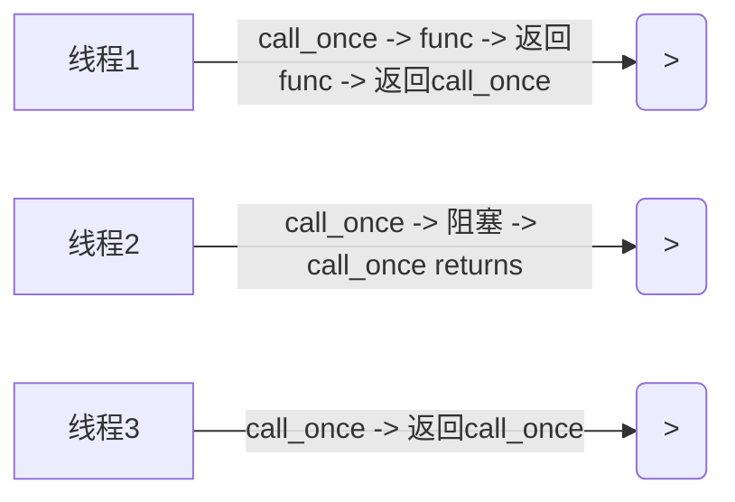

# Chapter23. Modern C++ 互斥

> 如果编写的是多线程应用程序，那么必须分外留意操作顺序。如果线程读写共享数据，就可能发生问题。如果不能避免数据共享，那么必须采用同步机制，使一次只有一个线程能更改数据。
>
> 布尔值和整数等标量经常使用上述原子操作来实现同步，当数据更复杂且必须在多个线程中使用这些数据时，就必须提供显式的同步机制。
>
> 标准库支持互斥的形式包括互斥体(mutex)类和锁类。这些类都可以用来实现线程之间的同步

- [Chapter23. Modern C++ 互斥](#chapter23-modern-c-互斥)
  - [23.1 互斥体类](#231-互斥体类)
    - [23.1.1 自旋锁](#2311-自旋锁)
    - [23.1.2 非定时的互斥体类](#2312-非定时的互斥体类)
    - [23.1.3 定时的互斥体类](#2313-定时的互斥体类)
  - [23.2 锁](#232-锁)
    - [23.2.1 lock\_guard](#2321-lock_guard)
    - [23.2.2 unique\_lock](#2322-unique_lock)
    - [23.2.3 shared\_lock](#2323-shared_lock)
    - [23.2.4 一次性获得多个锁](#2324-一次性获得多个锁)
    - [23.2.5 scoped\_lock](#2325-scoped_lock)
  - [23.3 `std::call_once`](#233-stdcall_once)
  - [23.4 互斥体对象的用法实例](#234-互斥体对象的用法实例)
    - [23.4.1 以线程安全方式写入流](#2341-以线程安全方式写入流)
      - [同步流](#同步流)
      - [使用锁](#使用锁)
    - [23.4.2 使用定时锁](#2342-使用定时锁)
    - [23.4.3 双重检查锁定](#2343-双重检查锁定)

## 23.1 互斥体类

互斥体(mutex, mutual exclusion)的基本使用机制如下：

- 希望与其他线程共享内存读写的一个线程试图锁定互斥体对象。如果另一个线程正在持有这个锁，希望获得访问的线程将被阻塞，直到锁被释放，或直到超时。
- 一旦线程获得锁，这个线程就可以随意使用共享的内存，因为这要假定希望使用共享数据的所有线程都正确获得了互斥体对象上的锁。
- 线程读写完共享的内存后，线程将锁释放，使其他线程有机会获得访问共享内存的锁。如果两个或多个线程正在等待锁，没有机制能保证哪个线程优先获得锁，并且继续访问数据。

C++标准提供了非定时的互斥体类和定时的互斥体类。有递归和非递归的两种风格。在讨论这些之前，先看看自旋锁的概念。

### 23.1.1 自旋锁

自旋锁是互斥锁的一种形式，其中线程使用忙碌循环（自旋）方式来尝试获取锁，执行工作，并释放锁。在旋转时，线程保持活跃，但不做任何有用的工作。即便如此，自旋锁在某些情况下还是有很多用，因为它们完全可以在自己的代码中实现，不需要对操作系统进行任何昂贵的调用，也不会造成线程切换的任何开销。如下面的代码所示，自旋锁可以使用单个原子类型实现：atomic_flag：

```cpp
std::atomic_flag spinlock = ATOMIC_FLAG_INIT; 	// Uniform initialization is not allowed
static const size_t NumberOfThreads { 50 };
static const size_t LoopsPerThread { 100 };

void doWork(size_t threadNumber, std::vector<size_t>& data) {
  for (size_t i{ 0 }; i < LoopsPerThread; ++i) {
    while (spinlock.test_and_set()) {}// spins until lock is acquired
    // save to handle shared data...
    data.push_back(threadNumber);
    spinlock.clear(); // release the acquired lock
  }
}

int main() {
  std::vector<size_t> data;
  std::vector<std::thread> threads;
  for (size_t i{ 0 }; i < NumberOfThreads; ++i) {
    threads.push_back(std::thread { doWork, i, std::ref(data) });
  }
  for (auto& t : threads) {
    t.join();
  }
  std::cout << std::format("data contains {} elements, excepted {}.\n", data.size(),
    NumberOfThreads * LoopsPerThread);
}
```

在这段代码中，每个线程都试图通过反复调用atomic_flag上的test_and_set()方法来获取一个锁，直到成功。这是忙碌循环。

> **警告**
>
> 由于自旋锁使用忙碌等待循环，因此只有在确定线程只会在短时间内锁定自旋锁时，才应该考虑这种方式。

### 23.1.2 非定时的互斥体类

标准库有3个非定时的互斥体类：`std::mutex`、`std::recursive_mutex`和`std::shared_mutex`。前两个类在 `<mutex>` 中定义，最后一个类在 `<shared_mutex>` 中定义。每个类都支持以下方法：

- `lock()`：调用线程将尝试获取锁，并阻塞直到获得锁。这个方法会无限期阻塞。如果希望设置线程阻塞最长时间，应该使用定时的互斥体类。
- `try_lock()`：调用线程将尝试获得锁。如果当前锁被其他线程持有，这个调用会立即返回。如果成功获得锁，try_lock()返回true，否则返回false。
- `unlock()`：释放由调用线程持有的锁，使另一个线程能获取这个锁。

`std::mutex` 使一个标准的具有独占所有权语义的互斥体类。只能有一个线程拥有互斥体。如果另一个线程想要获得互斥体的所有权，那么这个线程既可通过lock()阻塞，也可通过try_lock()尝试失败。已经拥有 `std::mutex` 所有权的线程不能在这个互斥体上再次调用lock()和try_lock()，否则可能导致死锁。

`std::recursive_mutes` 的行为几乎和 `std::mutex` 一致，区别在于已经获得递归互斥体的所有权的线程允许在同一个互斥体上调用lock()和try_lock()。调用线程调用unlock()方法的次数应该等于获得这个递归互斥体上锁的次数。

`std::shared_mutex` 支持“共享锁拥有权”的概念，这也称为readerswriters锁。线程可获取锁的独占所有权或共享所有权。独占所有权也成为写锁，仅当没有其他线程拥有独占或共享所有权时才能获得。共享所有权也称读锁，如果其他线程都没有独占所有权，则可获得，但允许其他线程获取共享所有权。shared_mutex类支持lock(), try_lock()和unlock()。这些方法获取和释放独占锁。另外，它们具有以下与共享所有权相关的方法：lock_shared(), try_lock_shared()。这些方法与其他方法集合的工作方式相似，但尝试获取或释放共享所有权。

不允许已经在shared_mutex上拥有锁的线程在互斥体上获取第二个锁，否则会产生死锁！

> **警告**
>
> 不要在任何互斥体类上手动调用上述锁定和解锁方法。互斥锁是资源，与所有资源一样，它们几乎总是应用RAII范型获得。C++标准定义了一些RAII锁类，这些类会在接下来讨论。使用它们对避免死锁很重要。锁对象离开作用域时，它们会自动释放锁体，所以不需要手动调用unlock()。

### 23.1.3 定时的互斥体类

当对任何互斥锁类调用lock()时，该调用会阻塞，直到获得锁为止。另一方面，在互斥锁类上调用try_lock()会尝试获取一个锁，但如果不成功就会立即返回。还有一些定时互斥类，可以尝试获得锁，但在一段时间后放弃。

标准库提供了3个定时的互斥体类：`std::timed_mutex` `std::recursive_timed_mutex` 和 `std::shared_timed_mutex`。前两个类在 `<mutex>` 中定义，最后一个在 `<shared_mutex>` 中定义。它们都支持lock(), try_lock()和unlock()方法。shared_timed_mutex也支持lock_shared(), try_lock_shared(), 和 unlock_shared()。这些方法的行为与前面描述的类似。此外，它们还支持以下方法：

- `try_lock_for(rel_time)`：调用线程尝试在给定的相对时间内获得这个锁。如果不能获得这个锁，这个调用失败并返回false。如果在超时之前获得这个锁，调用返回true。将超时时间指定为 `std::chrono::duration`。
- `try_lock_until(abs_time)`：调用线程尝试获得这个锁，直到系统时间等于或超过指定的绝对时间。如果不能获得这个锁，这个调用失败并返回false。如果在超时之前获得这个锁，调用返回true。将绝对时间指定为 `std::chrono::time_point`。

shared_timed_mutex还支持try_lock_shared_for()和try_lock_shared_until()。

已经拥有timed_mutex或shared_timed_mutex所有权的线程不允许再次获得这个互斥体上的锁，否则可能导致死锁！

recursive_timed_mutex的行为和recursive_mutex类型，允许一个线程多次获取锁。

## 23.2 锁

锁类是RAII类，可用于更方便地正确获得和释放互斥体上的锁；锁类的析构函数会自动释放所关联的互斥体。C++标准定义了4种类型的锁：`std::lock_guard`, `std::unique_lock`, `std::shared_lock` 和 `std::scoped_lock`。

### 23.2.1 lock_guard

`std::lock_guard` 在 `<mutex>` 中定义，有两个构造函数。

- `explicit lock_guard(mutex_type& m);`

  接收一个互斥体引用的构造函数，这个构造函数尝试获得互斥体上的锁，并阻塞直到获得锁。

- `lock_guard(mutex_type& m, adopt_lock_t);`

  接收一个互斥体引用和一个 `std::adopt_lock_t` 实例的构造函数。C++提供了一个预定义的adopt_lock_t实例，名为 `std::adopt_lock`。该锁假定调用线程已经获得引用的互斥体上的锁，管理该锁，在销毁锁体时自动释放锁体。

### 23.2.2 unique_lock

`std::unique_lock` 定义在 `<mutex>` 中，是一类更复杂的锁，允许将获得锁的时间延迟到计算需要时，远在声明之后。使用owns_lock()方法可以确定是否获得了锁。unique_lock也有bool转换运算符，可用于检查类型是否获得了锁。unique_lock有如下几个构造函数：

- `explicit unique_lock(mutex_type& m);` 
  
  接收一个互斥体引用的构造函数，这个构造函数尝试获得互斥体上的锁，并阻塞线程直到获得锁。

- `unique_lock(mutex_type& m, defer_lock_t) noexcept;`

  接收一个互斥体引用和一个 `std::defer_lock_t` 实例的构造函数。C++提供了一个预定义的defer_lock_t实例，名为 `std::defer_lock`。unique_lock存储互斥体的引用，但不立即尝试获得锁，所可以稍后获得。

- `unique_lock(mutex_type& m, try_to_lock_t);`

  接收一个互斥体引用和一个 `std::try_to_lock_t` 实例的构造函数。C++提供了一个预定义的try_to_lock_t实例，名为 `std::try_to_lock`。这个锁尝试获得引用的互斥体上的锁，但即便未能获得也不阻塞；此时，会在稍后获得锁。

- `unique_lock(mutex_type& m, adopt_lock_t);`

  接收一个互斥引用和一个 `std::adopt_lock_t` 实例（如 `std::adopt_lock`）的构造函数。这个锁假定调用线程已经获得引用的互斥体上的锁。锁管理互斥体，并在销毁锁时自动释放互斥体。

- `unique_lock(mutex_type& m, const chrono::time_point<Clock, Duration>& abs_time);`

  接收一个互斥体引用和一个绝对时间的构造函数。如果这个构造函数试图获取一个锁，直到系统时间超过给定的绝对时间。

- `unique_lock(mutex_type& m, const chrono::duration<Rep, Period>& rel_time);`

  接收一个互斥体引用和一个相对时间的构造函数。这个构造函数试图获得一个互斥体上的锁，直到到达给定的相对超过时间。

unique_lock类也有以下方法：lock(), try_lock(), try_lock_for(), try_lock_until()和unlock()。这些方法的行为类和前面介绍的定时的互斥体类中的方法一致。

### 23.2.3 shared_lock

shared_lock类在 `<shared_mutex>` 中定义，它的构造函数与方法unique_lock相同。区别是，shared_lock类在底层的共享互斥体上调用与共享所有权相关的方法。因此，shared_lock的方法为lock, try_lock()等，但在底层的共享互斥体上，它们是lock_shared(), try_lock_shared()等。因此，shared_lock和unique_lock有相同的接口，但获得的是共享锁而不是独占锁。

### 23.2.4 一次性获得多个锁

C++有两个泛型锁函数，可用于同时获得多个互斥体对象上的锁，而不会出现死锁。这两个范型锁函数都早std命名空间中定义，都是可变参数模板。

第一个lock()函数不按指定顺序锁定所有给定的互斥体对象，没有出现死锁的风险。如果其中一个互斥锁调用抛出异常，则在已经获得的所有锁上调用unlock()。原型如下：

```cpp
template <class L1, class L2, class... L3> void lock(L1&, L2&, L3&...);
```

try_lock()函数具有类似的原型，但它通过顺序调用每个给定互斥体对象的try_lock()，试图获得所有互斥体对象上的锁。如果所有try_lock()调用都成功，那么这个函数返回-1。如果任何try_lock()调用失败，那么对所有已经获得的锁调用unlock()，返回值是在其上调用try_lock()失败的互斥体的参数索引（从0开始）。

下例演示如何使用泛型函数lock()。process()函数首先创建两个锁，每个互斥体一个锁，然后将一个 `std::defer_lock_t` 实例作为第二个参数传入，告诉unique_lock不要在构造期间获得锁。然后调用 `std::lock()` 获得这两个锁，而不会出现死锁：

```cpp
std::mutex mut1;
std::mutex mut2;

void process() {
  std::unique_lock lock1 { mut1, std::defer_lock };
  std::unique_lock lock2 { mut2, std::defer_lock };
  std::lock(lock1, lock2);
  // locks acquired
} // locks automatically released
```

### 23.2.5 scoped_lock

`std::scoped_lock` 在 `<mutex>` 中定义，与lock_guard类似，指示接收数量可变的互斥体。这样，就可极方便地获取多个锁。例如，可使用scoped_lock，编写上一个示例：

```cpp
std::mutex t1;
std::mutex t2;

void process() {
  std::scoped_lock locks { mut1, mut2 };
  // locks acquired
} // locks automatically released
```

> **注意**
>
> scoped_lock不仅简化了获取多个锁的过程，因为不需要担心需要以正确的顺序获取它们，而且它的性能也比手动获取的要好。

## 23.3 `std::call_once`

结合使用 `std::call_once()` 和 `std::once_flag` 可确保某个函数或方法正好只调用一次，不论有多少个线程试图调用call_once()（在同一once_flag上）都同样如此。只有一个call_once()调用能真正调用给定的函数或方法。如果给定的函数不抛出任何异常，则这个调用称为有效的call_once()调用。如果给定的函数抛出异常，异常将传回调用者，选择另一个调用者来执行此函数。某个特定的Once_flag实例的有效调用在对同一个once_flag实例的其他所有call_once()调用之前完成。在同一个once_flag实例上调用call_once()的其他线程都会阻塞，直到有效调用结束。下图通过3个线程演示了这一点。线程1执行有效的call_once()调用，线程2阻塞，直到这个有效调用完成，线程3不会阻塞，因为线程1的有效调用已经完成了。



下例演示了call_once()的使用。这个例子运行使用某个共享资源的processingFunction()，启动了3个线程。这些线程应调用initializeSharedResources()一次。为此，每个线程用全局的once_flag调用call_once()，结果是只有一个线程执行initializeSharedResources()，且只执行一次。在调用call_once()的过程中，其他线程被阻塞，直到initializeSharedResources()返回：

```cpp
std::once_flag g_onceFlag;

void initializeSharedResources() {
  // ... Initialize shared resources to be used bt multiple threads.
  std::cout << "Shared resources initialized.\n";
}

void processingFunction() {
  // Make sure the shard resources are initialized.
  std::call_once(g_onceFlag, initializeSharedResources);

  // ... Do some work, including using the shared resources
  std::cout << "Processing\n";
}

int main() {
  // Launch 3 threads.
  std::vector<std::thread> threads{ 3 };
  for (auto& t : threads) {
    t = std::thread { processingFunction };
  }
  // Join on all threads
  for (auto& t : threads) {
    t.join();
  }
}
```

**output**

```
Shared resources initialized.
Processing
Processing
Processing
```

## 23.4 互斥体对象的用法实例

下面举几个例子，演示如何使用互斥体对象同步多个线程。

### 23.4.1 以线程安全方式写入流

C++的流是不会出现争用条件的，但来自不同线程的输出仍会出错。这里有两个解决这个问题的方案：

- 使用C++20同步流。
- 使用互斥对象以确保每次只有一个线程对流对象进行读写。

#### 同步流

C++20引入了 `std::basic_osyncstream` ，并分别为char流和wchar_t流预定义了类型别名osyncstream和wosyncstream，它们都在 `<syncstream>` 中定义。这些类名中的O表示输出。这些类保证所有通过它们完成的输出都将在同步流被销毁的那一刻出现在最终的输出流中。保证输出不会和其他线程的其他输出交错。

前面的Counter类的函数调用运算符可以使用osyncstream来实现，以防止交错输出：

```cpp
class Counter {
public:
  Counter(int id, int numIterations)
    : m_id { id }, m_numIterations { numIterations } {}

  void operation()() const {
    for (int i { 0 }; i < m_numIterations; ++i) {
      std::osyncstream { cout } << "Counter "
        << m_id << " has value " << i << std::endl;
    }
  }
private:
  int m_id;
  int m_numIterations;
};
```

或：

```cpp
void operator()() const {
  for (int i { 0 }; i < m_numIterations; ++i) {
    std::osyncstream syncedCout { cout };
    syncedCout << "Counter "
      << m_id << " has value " << i << std::endl;
  }
}
```

#### 使用锁

可以使用以下代码所示的互斥锁来同步Counter类中对cout的所有访问，为此添加一个静态互斥对象。它应该是静态的，因为类的所有实例都应该使用同一个互斥对象实例。lock_guard拥有在写入cout之前获取互斥锁。

```cpp
class Counter {
public:
  Counter(int id, int numIterations)
    : m_id { id }, m_numIterations { numIterations } {}

  void operation()() const {
    for (int i { 0 }; i < m_numIterations; ++i) {
      std::lock_guard lock { ms_mutex };
      std::cout << "Counter " << m_id << " has value " << i << std::endl;
    }
  }
private:
  int m_id;
  int m_numIterations;
  inline static std::mutex ms_mutex;
};
```

这段代码在for循环的每次迭代中创建了一个lock_guard实例。建议尽可能限制拥有锁的时间，否则阻塞其他线程的时间就会过长。例如，如果lock_guard实例在for循环之前创建一次，就基本上丢失了这段代码中所有多线程特性，因为一个线程在其for循环的整个执行期间都有锁，所有其他线程都会等待这个锁被释放。

### 23.4.2 使用定时锁

这一次结合unique_lock使用timed_mutex。将200ms的相对时间传给unique_lock构造函数，试图在200ms内获得一个锁。如果不能在这个时间间隔内获得这个锁，构造函数返回。之后，可检查这个锁是否已经获得，使用if执行检查，因为unique_lock类定义了bool转换运算符。

```cpp
class Counter {
public:
  Counter(int id, int numIterations)
    : m_id { id }, m_numIterations { numIterations } {}

  void operation()() const {
    for (int i { 0 }; i < m_numIterations; ++i) {
      std::unique_lock lock { ms_timedMutex, 200ms };
      if (lock) {
        std::cout << "Counter " << m_id << " has value " << i << std::endl;
      } else {
        // lock not acquired in 200ms, skip output
      }
    }
  }
private:
  int m_id;
  int m_numIterations;
  inline static std::timed_mutex ms_timedMutex;
};
```

### 23.4.3 双重检查锁定

**双重检查锁定(double-checked locking)** 实际上是一种反模式，因避免使用！你可能在现有的代码库中遇到它。双重检查锁定模式旨在尝试避免使用互斥体对象。这是编写比使用互斥体对象更有效代码的一种半途而废的尝试。如果在后续实例中想要提高熟读，真的可能处所。该模式容易出现争用条件，很难更正。实际上，使用call_once()更快，使用magic static速度更快。将函数的本地静态实例称为magic static，C++保证这样的局部静态实例以线程安全的方式初始化，因此不需要进行任何的手动的线程同步。

> **警告**
>
> 在新的代码中避免使用双重检查锁定模式，而是用其他机制，如简单锁、原子变量、call_once和magic static等。

例如，双重检查锁定可用于确保资源正好初始化一次。之所以称为双重检查锁定算法，是因为它检查g_initialized变量的值两次，一次在获得锁前，另一次在获得锁后。第一次检查是为了防止获得不需要的锁。第二次检查用于确保没有其他线程在第一次检查和获得锁之间执行初始化。

```cpp
void initializeSharedResources() {
  // ... Initialize shared resources to be used bt multiple threads.
  std::cout << "Shared resources initialized.\n";
}

std::atomic<bool> g_initialized { false };
std::mutex g_mutex;

void processingFunction() {
  if (!g_initialized) {
    std::unique_lock lock { g_mutex };
    if (!g_initialized) {
      initializedSharedResources();
      g_initialized = true;
    }
  }
  std::cout << "OK" << std::endl;
}

int main() {
  std::vector<std::thread> threads;
  for (int i { 0 }; i < 5; ++i) {
    threads.push_back(std::thread { processingFunction });
  }
  for (auto& t : threads) {
    t.join();
  }
}
```

输出清楚地表明，只有一个线程初始化了共享资源：

```cpp
Shared resources initialized.
OK
OK
OK
OK
OK
```

> **注意**
>
> 对于这个例子，建议使用call_once()而不是双重检查锁定。