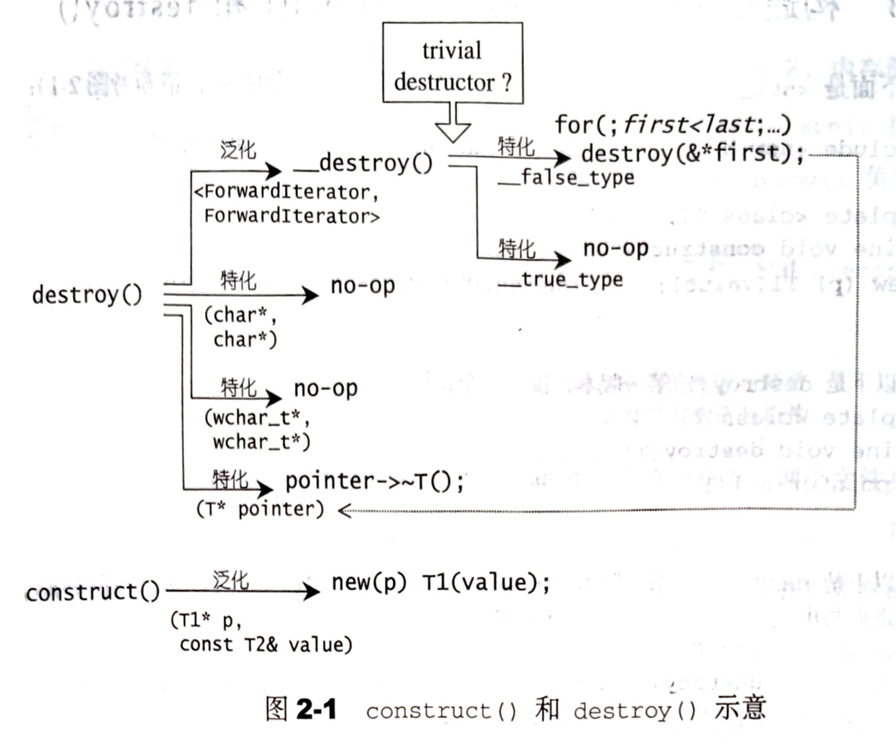

# 2.2 具备次层配置能力的 SGI 空间配置器

SGI STL 的配置器名称是 `alloc` 而非 `allocator`，而且不接受任何参数。如果要在程序中使用 SGI 配置器，则不能采用标准写法：

```cpp
std::vector<int, std::allocator<int>> iv; // in VC or VB
```

必须这么写：

```cpp
std::vector<int, std::alloc> iv; // in GCC
```

SGI STL 的每一个容器都已经指定其缺省的空间配置器为 `alloc`。例如：

```cpp
template <class T, class Alloc = alloc>
class vector {...};
```

## 2.2.1 SGI 标准的空间配置器 `std::allocator`

SGI 定义有一个符合部分标准、名为 allocator 的配置器，但 SGI 自己从未使用标准空间配置器，也不推荐使用，主要原因是性能不佳。

## 2.2.2 SGI 特殊空间配置器 `std::alloc`

一般而言，我们所习惯的 C++内存配置操作和释放操作是这样的：

```cpp
class Foo {...};
Foo* ptr = new Foo;
delete ptr;
```

`new` 包含两部操作：

1. 调用 `::operator new` 配置内存
2.  调用 `Foo::Foo()` 构造对象

`delete` 包含两部操作：

1. 调用 `::operator delete` 释放内存
2.  调用 `Foo::~Foo()` 析构对象

为了精密分工，STL allocator 将这两部操作区分开来。内存配置操作由 `alloc::allocate()` 负责，内存释放操作由 `alloc::deallocate()` 负责；
对象构造操作由 `::construct()` 负责，对象析构操作由 `::destroy()` 负责。

配置器定义于 `<memory>` 之中，SGI `<memory>` 中包含两个文件：

```cpp
#include <stl_alloc.h>
#include <std_construct.h>
```

内存空间分配和释放与对象的构造和析构分别着落在这两个文件身上。

## 2.2.2 构造和析构基本工具 `construct()` 和 `destroy()`

下面是 `<stl_construct.h>` 的部分内容：

```cpp
#include <new> // placement new

template <class T1, class T2>
inline void construct(T1* p, const T2& value) {
  new(p) T1(value);
}

// destroy 的第一个版本，接受一个指针
template <class T>
inline void destroy(T* pointer) {
  pointer->~T();
}

// destroy 的第二个版本，接受两个迭代器。
// 此函数设法找出元素的数值类型，利用__type_traits<>求取最适当措施
template <class ForwardIterator>
inline void destroy(ForwardIterator first, ForwardIterator last) {
  __destroy(first, last, value_type(first));
}

// 判断元素的值类型是否具有 trivial destructor
template <class ForwardIterator, class T>
inline void __destroy(ForwardIterator first, ForwardIterator last, T*) {
  typedef typename __type_traits<T>::has_trivial_destructor trivial_destructor;
  __destroy_aux(first, last, trivial_destructor());
}

// 如果元素的值类型有 non-trivial destructor
template <class ForwardIterator>
inline void 
__destroy_aux(ForwardIterator first, ForwardIterator last, __false_type) {
  for (; first < last; ++first)
    destroy(&*first);
}

// 如果元素的值类型有 trivial destructor
template <class ForwardIterator>
inline void 
__destroy_aux(ForwardIterator, ForwardIterator, __true_type) {}

// destroy 第二版本针对迭代器为 char* 和 wchar_t* 的特化版
inline void destroy(char*, char*) {}
inline void destroy(wchar_t*, wchar_t*) {}
```



STL 规范中，负责构造和析构函数需要被设计为全局函数；此外，配置器必须拥有名为 `construct()` 和 `destroy()` 的两个成员函数。然而 SGI STL 中的 `std::alloc` 并未遵守这一规则。

`construct()` 接收一个指针 p 和一个初值 value，利用 C++的 placement new 可以在指针 p 指向的内存中执行构造函数并赋初值 value。

`destroy()` 有两个版本。第一个版本接受一个指针，将其指向的对象析构掉。第二个版本接收 first 和 last 两个迭代器，将 `[first, last)` 范围内的所有对象全部析构。由于我们不知道该范围大小，所以需要考虑对象的析构函数是否为平凡析构 (trivial destructor)。频繁调用平凡析构会降低效率因此，先用 `value_type` 获取迭代器所指对象的类型，在利用 `__type_traits<T>` 判断该类型受否有平凡析构。若是，则什么都不做，否则才循环调用每一个对象的第一个版本的 `destroy()`。

## 2.2.4 空间的配置与释放 `std::alloc`

对象构造前的空间配置和对象析构后的空间释放，由 `<stl_alloc.h>` 负责，SGI 的设计哲学如下：

- 向堆要求空间
- 考虑多线程
- 考虑内存不足时的应对措施
- 考虑过多小型区块可能造成的内存碎片问题

以下的讨论以及所摘录的代码，皆排除多线程状态的处理。

SGI 以 C 的 `malloc()` 和 `free()` 完成内存的配置和释放。

考虑到小型区块可能造成的内存碎片问题，SGI 设计了双层级配置器，第一级配置器直接使用 `malloc()` 和 `free()`，第二级配置器则视情况采用不同的策略：当配置区块超过 128B 时，视为“足够大”，调用第一级配置器；当配置区块小于 128B 时，视为“过小”，采用内存池整理方式，不再使用第一级配置器。

```cpp
#ifdef __USE_MALLOC
...
typedef __malloc_alloc _template<0> malloc_alloc;
typedef malloc_alloc alloc;   // 令 alloc 为第一级配置器
#else
...
// 令 alloc 为第二级配置器
typedef __default_alloc_template<__NONE_ALLOCATOR_THREADS, 0> alloc;
#endif /* !__USE_MALLOC */
```

其中 `__malloc_alloc_template` 是第一级配置器，`__default_alloc_template` 是第二级配置器。

无论 `alloc` 被定义为第一级或第二级配置器，SGI 还为它再包装一个接口，使配置器的接口能够符合 STL 技术规格：

```cpp
template<class T, class Alloc>
class simple_alloc {
public:
  static T* allocate(size_t n) 
    { return 0 == n? 0 : (T*)Alloc::allocate(n * sizeof(T)); }
  static T* allocate(void) 
    { return (T*)Alloc::allocate(sizeof(T)); }
  static void deallocate(T* p, size_t n) 
    { if (0!= n) Alloc::deallocate(p, n * sizeof(T)); }
  static void deallocate(T* p) 
    { Alloc::deallocate(p, sizeof(T)); }
};
```

这个接口使配置器的配置单位从 Bytes 转为 sizeof(T)。SGI STL 容器全都使用这个 `simple_alloc` 接口，例如：

```cpp
template <class T, class Alloc = alloc>
class vector {
  typedef simple_alloc<value_type, Alloc> data_allocator;

  void deallocate() {
    if (...)
      data_allocator::deallocate(data, end_of_storage - start);
  }
  ...
};
```

### SGI STL 第一级配置器
```cpp
template <int inst>
class __malloc_alloc_template {...};
```

其中：

- `allocate()` 直接使用 `malloc()`，`deallocate()` 直接使用 `free()`。
- 模拟 C++的 `set_new_handler()` 以处理内存不足的情况。

### SGI STL 第二级配置器

```cpp
template <bool threads, int inst>
class __default_alloc_template {...};
```

其中：

- 维护 16 个自由链表，负责 16 种小型区块的次配置能力。内存池以 `malloc()` 配置而得。如果内存不足，转调用第一级配置器处理异常。
- 如果需求区块大于 128B，就转调用第一级配置器。

## 2.2.5 第一级配置器 `__malloc_alloc_template` 剖析

```cpp
#if 0
#  include <new>
#  define __THROW_BAD_ALLOC throw bad_alloc
#elif !defined(__THROW_BAD_ALLOC)
#  include <iostream.h>
#  define __THROW_BAD_ALLOC cerr << "out of memory" << endl; exit(1)
#endif

// malloc-based allocator. 通常比烧糊介绍得 default alloc 速度慢
// 一般而言是 thread-safe，并且对于空间得运用比较高效
// 以下是第一级配置器
// 注意，非类型模板形参 inst 完全没有派上用场
template <int inst>
class __malloc_alloc_template {
private:
// 以下函数将用来处理内存不足的情况
// oom abbr. out of memory
static void *oom_malloc(size_t);
static void *oom_realloc(void *, size_t);
static void (* __malloc_alloc_oom_handler)();

public:

static void* allocate(size_t n) {
  void* result = malloc(n);   // 第一级配置器直接用 malloc()
  // 以下无法满足要求时，改用 oom_malloc()
  if (0 == result) result = oom_malloc(n);
  return result;
}

static void deallocate(void* p, size_t /* n */) {
  free(p);    // 第一级配置器直接用 free()
}

static void* reallocate(void* p, size_t /* old_sz */, size_t new_sz) {
  void* result = realloc(p, new_sz);    // 第一级配置器直接用 realloc
  // 以下无法满足要求时，改用 oom_realloc()
  if (0 == result) result = oom_realloc(p, new_sz);
  return result;
}

// 以下是模拟 C++的 set_new_handler()
// 你可以通过它指定你自己的 oom handler
static void (* set_malloc_handler(void (*f)()))() {
  void (* old)() = __malloc_alloc_oom_handler;
  __malloc_alloc_oom_handler = f;
  return old;
}
};

// malloc_alloc oom handling
// 初值为 0，需要用户设定
template <int inst>
void (* __malloc_alloc_template<inst>::_malloc_alloc_oom_handler)() = 0;

template <int inst>
void *__malloc_alloc_template<inst>::oom_malloc(size_t n) {
  void (* my_malloc_handler)();
  void *result;

  for (;;) {    // 不断尝试释放、配置、再释放、再配置
    my_malloc_handler = _malloc_alloc_oom_handler;
    if (0 == my_malloc_handler) { __THROW_BAD_ALLOC; }
    (*my_malloc_handler)();    // 调用处理程序，企图释放内存
    result = malloc(n);        // 再次尝试分配内存
    if (result) return result;
  }
}

template <int inst>
void *__malloc_alloc_template<inst>::oom_realloc(void *p, size_t n) {
  void (* my_malloc_handler)();
  void *result;

  for (;;) {    // 不断尝试释放、配置、再释放、再配置
    my_malloc_handler = _malloc_alloc_oom_handler;
    if (0 == my_malloc_handler) { __THROW_BAD_ALLOC; }
    (*my_malloc_handler)();    // 调用处理程序，企图释放内存
    result = realloc(p, n);    // 再次尝试分配内存
    if (result) return result;
  }
}

// 注意，以下直接将参数 inst 指定为 0
typedef __malloc_alloc_template<0> malloc_alloc;
```

第一级配置器以 `malloc()` `free()` `realloc()` 等 C 函数执行内存分配、释放、重新配置，并实现类似 C++的 new handler 机制。它不能直接运行 new handler，因为它并非使用 `::operator new` 来分配内存。

请注意，SGI 第一级配置器的 `allocate()` 和 `reallocate()` 都是在调用 `malloc()` 和 `realloc()` 不成功后，改调用 `oom_malloc()` 和 `oom_realloc()` 。后两者都有内循环，不断调用“内存不足处理程序”，期望在某次调用之后，获得足够的内存而源码完成任务。但如果“内存不足处理程序”并未被用户设定，便会抛出异常，或利用 `exit(1)` 终止程序。

**记住，设计“内存不足处理程序”是用户的责任。**

## 2.2.6 第二级配置器 `__default_alloc_template` 剖析

SGI 第二级配置器的做法是，如果区块大于 128B，就移交第一级配置器处理。当区块小于 128B 时，则以内存池管理，这种方法又称次层配置 (sub-allocation)：每次配置一大块内存，并维护对应的自由链表。下次若再有相同大小的内存需求，就直接从自由链表种拨出。如果释放小额区块，就由配置器回收到自由链表中。为了方便管理，SGI 第二级配置器会主动将任何小额区块的内存需求量上调至 8 的倍数，并维护 16 个自由链表。自由链表的结点结构如下：

```cpp
union obj {
  union obj* free_list_link;
  char client_data[1];    // the client sees this.
}
```

第一字段可看出， obj 可视为一个指针，指向相同形式的另一个 obj；第二字段可以看出，obj 可视为一个指针，指向实际区块。一物二用的结果是，不会为了维护链表所必须的指针而造成内存的另一种浪费。

下面是第二级配置器的部分实现内容：

```cpp
enum {__ALIGN = 8};   // 小型区块的上调边界
enum {__MAX_BYTES = 128};   // 小型区块的上限
enum {__NFREELISTS = __MAX_BYTES/__ALIGN};  // free-lists 个数

// 以下是第二级配置器
// 注意，无类型模板形参，且第二参数完全没派上用场
// 第一参数用于多线程环境下，本书不讨论多线程环境
template <bool threads, int inst>
class __default_alloc_template {

private:
  // ROUND_UP() 将 bytes 上调至 8 的倍数
  static size_t ROUND_UP(size_t bytes) {
    return (((bytes) + __ALIGN-1) & ~(__ALIGN - 1));
  }
private:
  union obj {   // free-lists 的节点构造
    union obj* free_list_link;
    char client_data[1];
  };
private:
  // 16 个 free-lists
  static obj * volatile free_list_link[__NFREELISTS];
  // 以下函数根据区块大小，决定使用第 n 号 free-list。n 从 0 起算
  static size_t FREELIST_INDEX(size_t bytes) {
    return (((bytes) + __ALIGN-1)/__ALIGN - 1);
  }

  // 返回一个大小为 n 的对象，并可能加入大小为 n 的其他区块到 free-list
  static void* refill(size_t n);
  // 配置一大块空间，可容纳 nobjs 个大小为 size 的区块
  // 如果配置 nobjs 个区块有所不便，nobjs 可能会降低
  static char* chunk_alloc(size_t size,  int& nobjs);

  // Chunk allocation state
  static char *start_free;   // 内存池起始位置 只在 chunk_alloc() 中变化
  static char *end_free;     // 内存池结束位置 只在 chunk_alloc() 中变化
  static size_t heap_size;   

public:
  static void * allocate(size_t n) {...}
  static void deallocate(void* p, size_t n) {...}
  static void * reallocate(void* p, size_t old_sz, size_t new_sz);
};

// 以下是 static data member 的定义与初值设定
template <bool threads, int inst>
char *__default_alloc_template<threads, inst>::start_free = 0;
template <bool threads, int inst>
char *__default_alloc_template<threads, inst>::end_free = 0;
template <bool threads, int inst>
size_t __default_alloc_template<threads, inst>::heap_size = 0;

template <bool threads, int inst>
__default_alloc_template<threads, inst>::obj * volatile
__default_alloc_template<threads, inst>::free_list_link[__NFREELISTS] = 
{0, 0, 0, 0, 0, 0, 0, 0, 0, 0, 0, 0, 0, 0, 0, 0, };
```

## 2.2.7 空间配置函数 `allocate()`

`__default_alloc_template` 拥有配置器的标准接口函数 `allocate()`。此函数首先判断区块大小，如果大于 128B 就调用第一级配置器。小于 128B 就检查对应的 free list。如果 free list 之内有可用的区块，就直接拿来用，如果没有可用的区块，就将区块大小上调至 8 倍数边界，然后调用 `refill()`，准备为 free list 重新填充空间。

```cpp
// n must be > 0
static void * allocate(size_t n) {
  obj * volatile * my_free_list;
  obj * result;

  // 大于 128B 就调用第一级配置器
  if (n > (size_t) __MAX_BYTES) {
    return (malloc_alloc::allocate(n));
  }
  // 寻找 16 个 free lists 中适当的一个
  my_free_list = free_list + FREELIST_INDEX(n);
  result = *my_free_list;
  if (result == 0) {
    // 没有找到可用的 free list，准备重新填充 free list
    void* r = refill(ROUND_UP(n));
    return r;
  }
  // 调整 free list
  *my_free_list = result->free_list_link;
  return (result);
};
```

## 2.2.8 空间释放函数 `deallocate()`

`__default_alloc_template` 拥有配置器的标准接口函数 `deallocate()`。此函数首先判断区块大小，如果大于 128B 就调用第一级配置器。小于 128B 就找出对应的 free list，将区块回收。

```cpp
// p 不可以是 0
static void deallocate(void *p, size_t n) {
  obj* q = (boj*) p;
  obj* volatile * my_free_list;

  // 大于 128 就调用第一级配置器
  if (n > (size_t)__MAX_BYTES) {
    malloc_alloc::deallocate(p, n);
    return;
  }
  // 寻找对应的 free list
  my_free_list = free_list + FREELIST_INDEX(n);
  // 调整 free list，回收区块
  q -> free_list_link = *my_free_list;
  *my_free_list = q;
};
```

## 2.2.9 重新填充 free lists

当 `allocate()` 发现 free list 中没有可用区块时，就调用 `refill()` ，准备为 free list 重新填充空间。新的空间将取自内存池（经由 `chunk_alloc()` 来完成）。缺省取得 20 个新节点（区块），但万一内存池空间不足，获得的节点（区块）数可能小于 20。

```cpp
// 返回一个大小为 n 的对象，并且有时候会为适当的 free list 增加节点
// 假设 n 已经适当上调至 8 的倍数
template <bool threads, int inst>
void* __default_alloc_template<threads, inst>::refill(size_t n) {
  int nobjs = 20;
  // 调用 chunk_alloc()，尝试取得 nobjs 个区块作为 free list 的新节点
  // 注意 nobjs 是引用传递
  char* chunk = chunk_alloc(n, nobjs);
  obj* volatile * my_free_list;
  obj* result;
  obj* current_obj, *next_obj;
  int i;

  // 如果只获得一个区块，这个区块就分配给调用者用，free list 无新节点
  if (1 == nobjs) return (chunk);
  // 否则准备调整 free list，纳入新节点
  my_free_list = free_list + FREELIST_INDEX(n);
  
  // 以下在 chunk 空间内建立 free list
  result = (obj*)chunk;   // 这一块准备返回给用户
  // 以下导引 free list 指向新配置的空间（取自内存池）
  *my_free_list = next_obj = (obj*)(chunk + n);
  // 以下将 free list 的各节点串接起来
  for (i = 1; ; ++i) {  // 从 1 开始，因为第 0 个将返回给用户
    current_obj = next_obj;
    next_obj = (obj*)((char*)next_obj + n);
    if (nobjs - 1 == i) {
      current_obj -> free_list_link = 0;
      break;
    } else {
      current_obj -> free_list_link = next_obj;
    }
  }
  return (result);
}
```

## 2.2.10 内存池

从内存池中取空间给 free list 用，是 `chunk_alloc()` 的工作。

```cpp
// 假设 size 已经上调至 8 的倍数
// 注意参数 nobjs 是引用传递 
template <bool threads, int inst>
char*
__default_alloc_template<threads, inst>::
chunk_alloc(size_t size, int& nobjs) {
  char* result;
  size_t total_bytes = size * nobjs;
  size_t bytes_left = end_free - start_free;    // 内存池剩余空间

  if (bytes_left >= total_bytes) {
    // 内存池剩余空间完全满足需求量
    result = start_free;
    start_free += total_bytes;
    return (result);
  } else if (bytes_left >= size) {
    // 内存池剩余空间不能完全满足需求量，但足够供应一个（含）以上的区块
    nobjs = bytes_left/size;
    total_bytes = size * nobjs;
    result = start_free;
    start_free += total_bytes;
    return (result);
  } else {
    // 内存池剩余空间连一个区块的大小都无法提供
    size_t bytes_to_get = 2 * total_bytes + ROUND_UP(heap_size >> 4);
    // 以下试着让内存池中的残余零头还有利用价值
    if (bytes_left > 0) {
      // 内存池中还有一些零头，先配给适当的 free list
      // 首先寻找适当的 free list
      obj * volatile * my_free_list = 
          free_list + FREELIST_INDEX(bytes_left);
      // 调整 free list，将内存池中的残余空间编入
      ((obj*)start_free) -> free_list_link = *my_free_list;
      *my_free_list = (obj*)start_free;
    }

    // 配置 heap 空间，用来补充内存池
    start_free = (char*)malloc(bytes_to_get);
    if (0 == start_free) {
      // heap 空间不足，malloc() 失败
      int i;
      obj * volatile * my_free_list, *p;
      // 试着检视我们拥有的东西，这不会造成伤害。我们不打算尝试配置
      // 较小的区块，因为那在多线程机器上容易导致灾难
      // 以下搜寻适当的 free list
      // 所谓适当是指“尚有未用区块，且足够大”的 free list
      for (i = size; i <= __MAX_BYTES; i += __ALIGN) {
        my_free_list = free_list + FREELIST_INDEX(i);
        p = *my_free_list;
        if (0!= p) {  // free list 中尚有未用区块
          // 调整 free list，将内存池中的未用区块释放
          *my_free_list = p -> free_list_link;
          start_free = (char*)p;
          end_free = start_free + i;
          // 递归调用自己，为了修正 nobjs
          return (chunk_alloc(size, nobjs));
          // 注意，任何参与零头终将被编入适当的 free list 中备用
        }
      }
      end_free = 0;   // 如果出现意外（无内存可用）
      // 调用第一级配置器，看看 oom 机制是否能尽点力
      start_free = (char*)malloc_alloc::allocate(bytes_to_get);
      // 这会导致抛出异常，或内存不足情况获得改善
    }
    heap_size += bytes_to_get;
    end_free = start_free + bytes_to_get;
    // 递归调用自己，为了修正 nobjs
    return (chunk_alloc(size, nobjs)); 
  }
}
```

`chunk_alloc()` 函数以 `end_free - start_free` 来判断内存池中的水量。如果水量充足，就直接调出 20 个区块返回给 free list。如果水量不足以提供 20 个区块，但还足够供应一个以上的区块，就拨出去这不足 20 个区块的空间出去。此时 nobjs 参数将被修改为实际能够供应的区块数。如果内存池连一个区块空间都无法供应，此时便需利用 `malloc()` 从 heap 中配置内存。新水量的大小为需求量的两倍，再加上一个随着配置次数增加而越来越大的附加量。


SGI 容器通常以这种方式来使用配置器

```cpp
template <class T, class Alloc = alloc>
class vector {
public:
  typedef T value_type;
  ...
protected:
  // 专属空间配置器，每次配置一个元素大小
  typedef simple_alloc<value_type, Alloc> data_allocator;
  ...
};
```

其中第二个模板参数所接受的缺省参数 `alloc`，可以是第一级配置器，也可以是第二级配置器。不过，SGI STL 已经把它设为第二级配置器。