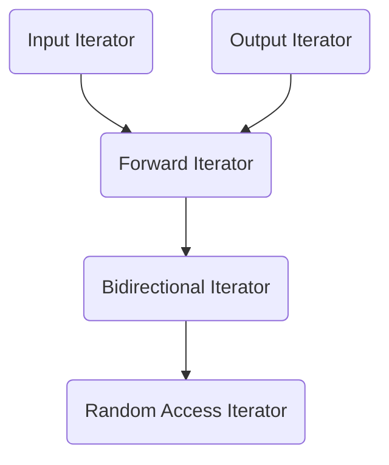

# 3.4 Traits 编程技法——STL 源码门钥

迭代器所指对象的类型，称为迭代器的值类型 (value type)。如果值类型必须用于函数的返回值，就没有办法了，毕竟函数的模板参数推导不能推导返回值类型。

我们需要其他方法。声明内嵌类型似乎是个好主意：

```cpp
template <class T>
struct MyIter {
  typedef T value_type;
  T* ptr;
  MyIter(T* p = 0) : ptr(p) {}
  T& operator*() const { return *ptr; }
  //...
};

template <class I>
typename I::value_type  // 这一整行是 func 的返回值类型
func(I ite) {
  return *ite;
}

//...
MyIter<int> ite(new int(8));
std::cout << func(ite);   // out: 8
```

注意，`func()` 的返回值类型必须加上关键词 `typename`，因为 T 是一个模板参数，在它被编译期实例化之前，编译期对 T 一无所知。加上 `typename` 告诉编译器这是个类型，才能正确编译。

看起来不错，但是有个隐晦的陷阱：并不是所有迭代器是类类型。如果不是类类型，就无法为它定义内嵌类型。但 STL 绝对必须接受原生指针作为一种迭代器，所以上面这样还不够。有没有办法可以针对特定情况做特殊处理呢？

是的，模板偏特化可以做到。

> **偏特化的意义**
>
> 如果模板类拥有一个以上的模板参数，我们可以针对其中某个模板参数进行特化。

假设有一个模板类如下：

```cpp
template <typename T>
class C {...};    // 这个泛化版本接受 T 为任何类型
```

我们可以让它有如下的偏特化：

```cpp
template <typename T>
class C<T*> {...};    // 这个特化版本仅适用于 T 为原生指针的情况
```

现在，我们可以针对迭代器的模板参数为指针设计特化的迭代器了。

下面这个模板类专门用来萃取迭代器的特性，而值类型正是迭代器的特性之一：

```cpp
template <class I>
struct iterator_traits {  // traits: 特性
  typedef typename I::value_type value_type;
};
```

这个 traits 的意思是：如果 I 定义有自己的值类型，那么通过这个 traits 的作用，萃取出来的 `value_type` 就是 `I::value_type`。

如果 I 定义有自己的值类型，先前那个 `func()` 可以改写成这样：

```cpp
template <class I>
typename iterator_traits<I>::value_type  // 这一整行是 func 的返回
func(I ite) {
  return *ite;
}
```

traits 可以拥有特化版本。现在，我们令 `iterator_traits` 拥有一个偏特化版本如下：

```cpp
template <class T>
struct iterator_traits<T*> {  // 偏特化版：迭代器是原生指针
  typedef T value_type;
}
```

于是，原生指针虽然不是一种类类型，也可以通过 traits 取出值类型。

但是，针对常量指针，下面这个式子得到的是什么结果：

```cpp
iterator_traits<const int*>::value_type
```

获得的是 `const int` 而不是 int。这导致我们声明了一个 const 变量无法赋值。因此，如果迭代器是个常量指针，我们应该令其值类型为一个非常量类型。只要另外设计一个特化版本，就能解决这个问题：

```cpp
template <class T>
struct iterator_traits<const T*> {  // 偏特化版：迭代器是常量指针
  typedef T value_type;
};
````

现在，不论是迭代器或是原生指针或是常量指针，我们都可以通过 traits 取出正确的值类型。

最常用到的迭代器相应类型有五种：value type, difference type, pointer type, reference type, iterator category。“类型萃取机”traits 会将类型萃取出来：

```cpp
template <class I>
struct iterator_traits {
  typedef typename I::iterator_category iterator_category;
  typedef typename I::value_type value_type;
  typedef typename I::difference_type difference_type;
  typedef typename I::pointer pointer;
  typedef typename I::reference reference;
};
```

`iterator_traits` 必须针对传入类型为指针及指针常量设计特化版本。

## 3.4.1 迭代器相应类型之一：value type

value type 是指迭代器所指对象的类型。任何一个打算与 STL 算法有完美搭配的类，都应该定义自己的 value type 内嵌类型，做法就像上节所述。

## 3.4.2 迭代器相应类型之二：difference type

difference type 是指两个迭代器之间的距离，因此它也可以用来表示一个容器的最大容量。对于连续空间的容器而言，头尾之间的距离就是其最大容量。如 STL 的 `count()` ，其返回值就必须使用这个迭代器的 difference type。

```cpp
template <class I, class T>
typename iterator_traits<I>::difference_type  // 这一整行是函数返回值类型
count(I first, I last, const T& value) {
  typename iterator_traits<I>::difference_type n = 0;
  for ( ; first != last; ++first)
    if (*first == value) ++n;
  return n;
}
```

针对相应类型 difference type，traits 的如下两个针对原生指针的特化版本，以 C++的 `ptrdiff_t` 类型作为原生指针的 difference type：

```cpp
template <class I>
struct iterator_traits {
  ...
  typedef typename I::difference_type difference_type;
};

// 原生指针的偏特化版
template <class T>
struct iterator<T*> {
  ...
  typedef ptrdiff_t difference_type;
};

// 原生常量指针的偏特化版
template <class T>
struct iterator<const T*> {
  ...
  typedef ptrdiff_t difference_type;
};
```

现在，任何时候当我们需要任何迭代器 I 的 difference type，可以这样写：

```cpp
typename iterator_traits<I>::difference_type n =...;
```

## 3.4.3 迭代器相应类型之三：reference type

在 C++中，函数如果要返回左值，都是以引用的方式进行。当 p 是 mutable iterator 时，其 value type 是 T，那么 `*p`应该是 `T&`；如果 p 是 constant iterator 时，其 value type 是 T，那么 `*p`应该是 `const T&`。这里讨论的 `*p` 的类型，即 reference type。

## 3.4.4 迭代器相应类型之四：pointer type

我们可以返回一个 pointer，指向迭代器所指的对象。

```cpp
Item& operator*() const { return *ptr; }
Item* operator->() const { return ptr; }
```

`Item&` 是 ListIter 的 reference type，而 `Item*` 是 ListIter 的 pointer type。

现在我们把两个相应类型分别加入 traits 内：

```cpp
template <class I>
struct iterator_traits {
  ...
  typedef typename I::pointer pointer;
  typedef typename I::reference reference;
};

// 原生指针的偏特化版
template <class T>
struct iterator_traits<T*> {
  ...
  typedef T* pointer;
  typedef T& reference;
};

// 原生常量指针的偏特化版
template <class T>
struct iterator_traits<const T*> {
  ...
  typedef const T* pointer;
  typedef const T& reference;
};
```

## 3.4.5 迭代器相应类型之五：iterator_category

根据移动特性与实施操作，迭代器被分为五类：

- input iterator: 只读迭代器
- output iterator: 只写迭代器
- forward iterator: 允许写入算法进行读写操作
- bidirectional iterator: 可双向迭代器
- random access iterator: 随机访问迭代器。涵盖所有指针运算操作。

这些迭代器的分类与从属关系如图（concept 和 refinement 关系）



设计算法时，我们尽量针对图中某种迭代器提供一个明确定义，并针对更强化的某种迭代器提供另一种定义，这样才能在不同情况下提供最大效率。

### 以 `advance()` 为例

该函数有两个参数，迭代器 p 和数值 n；函数内部将 p 累进 n 次。下面有三个定义，一个针对`input_iterator`，一个针对 output_iterator，一个针对 bidirectional_iterator，一个针对 random_access_iterator。没有针对 forward_iterator 的定义，因为它和 input_iterator 相同。

```cpp
template <class InputIterator, class Distance>
void advance_II(InputIterator& i, Distance n) {
  // 单向 逐一前进
  while (n--) ++i;
}

template <class BidirectionalIterator, class Distance>
void advance_BI(BidirectionalIterator& i, Distance n) {
  // 双向 逐一前进
  while (n--) ++i;
  while (n--) --i;
}

template <class RandomAccessIterator, class Distance>
void advance_RAI(RandomAccessIterator& i, Distance n) {
  // 双向，跳跃前进
  i += n;
}
```

我们将三者合一，实现 `advance()`：

```cpp
template <class InputIterator, class Distance>
void advance(InputIterator& i, Distance n) {
  if (is_random_access_iterator(i))     // 函数待设计
    advance_RAI(i, n);
  else if (if_bidirectional_iterator(i))// 函数待设计
    advance_BI(i, n);
  else
   advance_II(i, n);
}
```

但是这样在运行期才决定使用哪个版本，会影响程序效率。最好能在编译期就选择正确版本。重载函数机制可以做到。

为了形成重载函数，我们必须加上一个类型已知的函数参数，使函数重载机制可以运作起来。

如果 traits 有能力萃取出迭代器的种类，我们便可以利用这个迭代器类型作为 `advance()` 的第三个参数。这个类型必须要是一个类类型，因为编译器需要靠它进行重载决议。下面定义五个 class，代表五种迭代器类型：

```cpp
struct input_iterator_tag {};
struct output_iterator_tag {};
struct forward_iterator_tag : public input_iterator_tag {};
struct bidirectional_iterator_tag : public forward_iterator_tag {};
struct random_access_iterator_tag : public bidirectional_iterator_tag {};
```

这些 class 只做标记用，所以不需要任何成员。现在重新设计 `__advance()`，并加上第三参数，使它们形成重载：

```cpp
template <class InputIterator, class Distance>
inline void __advance(InputIterator& i, Distance n, input_iterator_tag) {
  // 单向，逐一前进
  while (n--) ++i;
}

// 单纯的传递调用函数。稍后讨论如何去除它。
template <class ForwardIterator, class Distance>
inline void __advance(ForwardIterator& i, Distance n,
                      input_iterator_tag) {
  // 单纯地传递调用
  __advance(i, n, input_iterator_tag());
}

template <class BidirectionalIterator, class Distance>
inline void __advance(BidirectionalIterator& i, Distance n,
                      bidirectional_iterator_tag) {
  // 双向，逐一前进
  if (n >= 0)
    while (n--) ++i;
  else 
    while (n++) --i;
}

template <class RandomAccessIterator, class Distance>
inline void __advance(RandomAccessIterator& i, Distance n,
                      bidirectional_iterator_tag) {
  // 双向，跳跃前进
  i += n;
}
```

还需要一个对外开放的上层控制接口，调用上述各个重载的 `__advance()`。这一接口只需两个参数，当它准备将工作转给上述的 `__advance()` 时，才自行加上第三参数：迭代器类型。因此，这个上层函数必须有呢能力从它获得的迭代器推导出类型，这份工作交给 traits 机制。

```cpp
template <class InputIterator, class Distance>
inline void advance(InputIterator& i, Distance n) {
  __advance(i, n,
            iterator_traits<InputIterator>::iterator_category());
}
```

根据 `iterator_traits<InputIterator>::iterator_category()` 产生的临时对象，编译器决定调用哪个 `__advance()`。

因此，为了满足上述行为，traits 必须再增加一个相应类型：

```cpp
template <class I>
struct iterator_traits {
  ...
  typedef typename I::iterator_category iterator_category;
};

// 针对原生指针的偏特化版
template <class T>
struct iterator_traits<T*> {
  ...
  // 注意原生指针是一种 random access iterator
  typedef random_access_iterator_tag iterator_category;
};

// 针对原生常量指针的偏特化版
template <class T>
struct iterator_traits<const T*> {
  ...
  typedef random_access_iterator_tag iterator_category;
};
```

注意 `advance()` 的模板参数命名：

```cpp
template <class InputIterator, class Distance>
inline void advance(InputIterator& i, Distance n);
```

按理说 `advance()` 既然可以接受各种类型的迭代器，就不应将其类型参数命名为 `InputIterator`，而应将其命名为 `Iterator`。这其实是 STL 算法的命名规则：用算法能接受的最低级迭代器类型作为其迭代器类型参数名。

### 消除“单纯传递调用的函数”

通过继承，我们可以不必再写“单纯只做传递调用”的函数。可以通过继承关系向上转型实现传递调用。

### 以 `distance()` 为例

`distance()` 用来计算两个迭代器之间的距离。针对不同的迭代器类型，它有不同的计算方式， 带来不同的效率。整个设计模式和之前的 `advance()` 如出一辙：

```cpp
template <class InputIterator>
inline iterator_traits<InputIterator>::difference_type
__distance(InputIterator first, InputIterator last, input_iterator_tag) {
  iterator_traits<InputIterator>::difference_type n = 0;
  // 逐一累计距离
  while (first!= last) {
    ++first;
    ++n;
  }
  return n;
}

template <class RandomAccessIterator>
inline iterator_traits<RandomAccessIterator>::difference_type
__distance(RandomAccessIterator first, RandomAccessIterator last,
           random_access_iterator_tag) {
  // 直接计算差距
  return last - first;
}

template <class InputIterator>
inline iterator_traits<InputIterator>::difference_type
distance(InputIterator first, InputIterator last) {
  typedef typename iterator_traits<InputIterator>::iterator_category category;
  return __distance(first, last, category());
}
```

`distance()` 可以接受任何类型的迭代器。由于迭代器类型之间存在继承关系，传递调用的行为模式自然存在。当调用 `distance()` 并使用 Forward Iterator 或 Bidirectional Iterator 时，都会传递调用 Input Iterator 版本的 `__distance()`。
