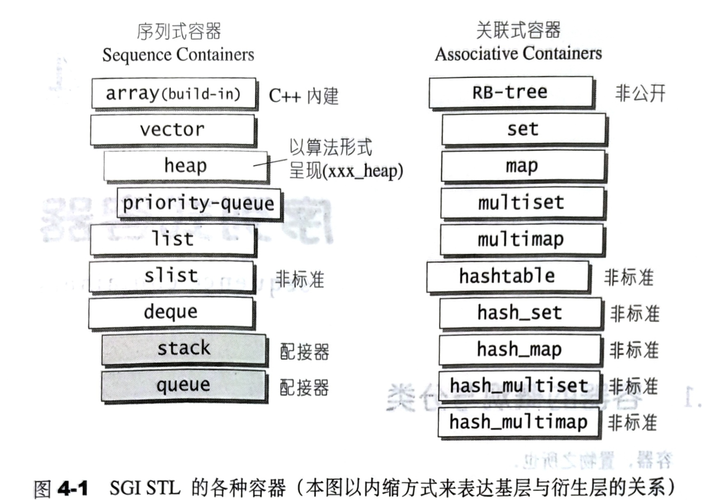

# 4.1 容器的概观与分类

众所周知，常用的数据结构不外乎 array（数组）、list（链表）、set（集合）、map（映射表）、hash、tree（树）、hash table（哈希表）等等。根据数据在容器中的排列特性，这些数据结构分为**序列式 (sequence)**、**关联式 (associative)** 两种。本章探讨序列式容器，下一章探讨关联式容器。

所谓衍生，并非派生关系，而是内含关系。如 heap 内含 vector，priority_queue 内含 heap、stack 和 queue 都含 deque，set/multiset/multimap 都内含 RB-tree，hast_x 都内涵 hash table。

## 4.1.1 序列式容器 (sequence containers)

所谓序列式容器，其中的元素都**可序 (ordered) **但未必**有序 (sorted)**。STL 提供 vector, list, deque, stack, queue, priority_queue 等序列式容器。其中 stack 和 queue 是将 deque 改头换面而成，技术上被归类为一种**配接器 (adapter)**，但仍在本章讨论。

本章将带你剖析各种序列式容器的关键实现细节。