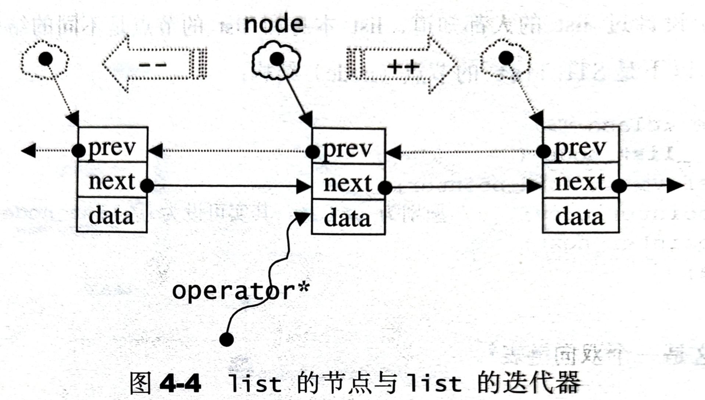
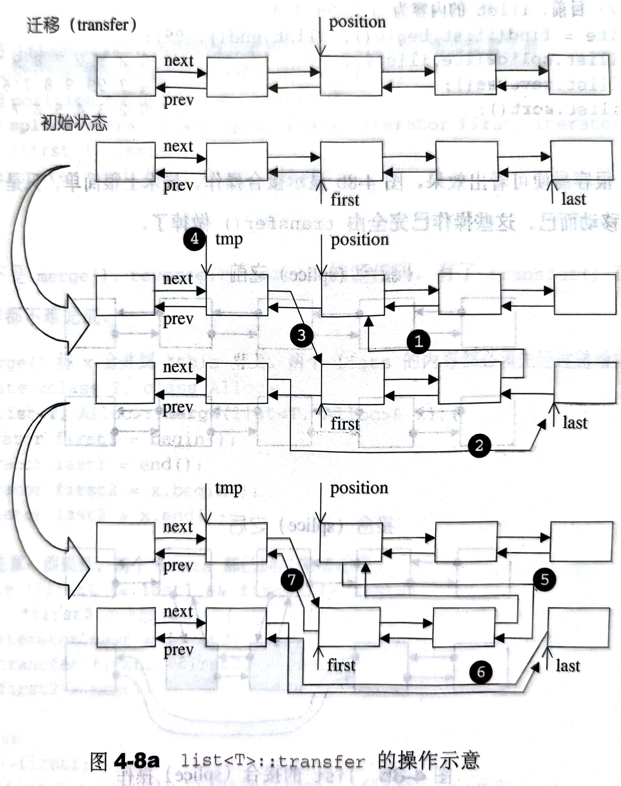
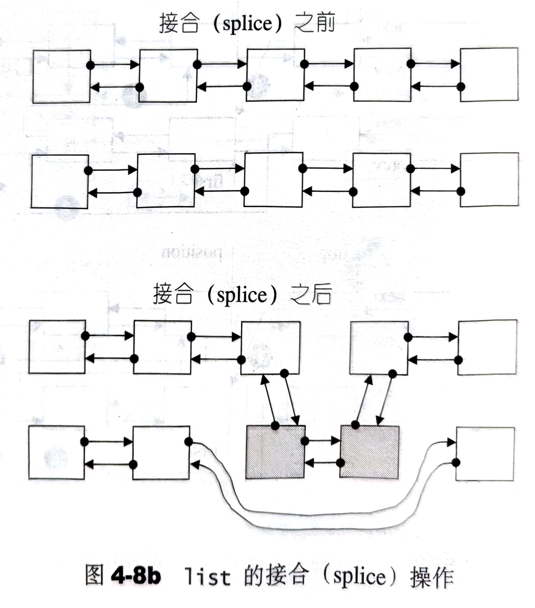

# 4.3 list

## 4.3.1 list 概述

list 每次插入或删除一个元素，就配置或释放一个元素空间。因此，list 对于空间的运用有绝对的精准，一点也不浪费。而且，对于任何位置的元素插入或元素移除，list 永远是常数时间。

## 4.3.2 list 的节点 (node)

以下是 STL list 的节点 (node) 结构：

```cpp
template <class T>
struct __list_node {
  typedef void* void_pointer;
  typedef __list_node<T>* link_type;
  link_type next;     // void* ，其实可设为__list_node<T>*
  link_type prev;
  T data;
};
```

显然这是一个双向链表。

## 4.3.3 list 的迭代器

list 不再能够像 vector 一样以普通指针作为迭代器，因为其节点不保证再存储空间中连续存在。

由于 list 是一个双向链表，迭代器必须具备前移、后移的能力，所有 list 提供的是 Bidirectional Iterators。

list 的插入操作和接合操作都不会造成 list 原有的迭代器失效。甚至 list 的元素删除操作，也只有指向被删除元素的那个迭代器失效。其他迭代器不受任何影响。



以下是 list 迭代器的设计：

```cpp
template <class T, class Ref, class Ptr>
struct __list_iterator {
  typedef __list_iterator<T, T&, T*>             iterator;
  typedef __list_iterator<T, Ref, Ptr>           self;

  typedef bidirectional_iterator_tag  iterator_category;
  typedef T                           value_type;
  typedef Ptr                         pointer;
  typedef Ref                         reference;
  typedef __list_node<T>*             link_type;
  typedef size_t                      size_type;
  typedef ptrdiff_t                   difference_type;

  link_type node;       // 迭代器内部有一个普通指针，指向 list 的节点

  // constructor
  __list_iterator(link_type x) : node(x) {}
  __list_iterator() {}
  __list_iterator(const iterator& x) : node(x.node) {}

  bool operator==(const self& x) const { return node == x.node; }
  bool operator!=(const self& x) const { return node!= x.node; }
  // 对迭代器解引用，取节点数据值
  reference operator*() const { return (*node).data; }

  // 对迭代器成员访问运算符的标准做法
  pointer operator->() const { return &(operator*()); }

  // 对迭代器的前向迭代器
  self& operator++() {
    node = (link_type)((*node).next);
    return *this;
  }

  // 对迭代器的后向迭代器
  self operator++(int) {
    self tmp = *this;
    ++*this;
    return tmp;
  }

  // 对迭代器的后向迭代器
  self& operator++() {
    node = (link_type)((*node).next);
    return *this;
  }
  self operator++(int) {
    self tmp = *this;
    node = (link_type)((*node).next);
    return tmp;
  }

  // 对迭代器的前向迭代器
  self& operator--() {
    node = (link_type)((*node).prev);
    return *this
  }
  self operator--(int) {
    self temp = *this;
    --*this;
    return tmp;
  }
};
```

## 4.3.4 list 的数据结构

SGI list 不仅是一个双向链表，而且还是一个环状双向链表，所以它只需要一个指针，便可以遍历整个链表。

```cpp
template <class T, class Alloc = alloc>
class list {
protected:
  typedef __list_node<T> list_node;
public:
  typedef list_node* link_type;   // 只要一个指针便可遍历整个环状双向链表
...
};
```

如果让指针 node 指向位于尾端的一个空白节点，node 便能符合 STL“前闭后开”区间的要求，成为 last 迭代器。这样一来，以下几个函数遍都可以轻松完成：

```cpp
iterator begin() { return (link_type)((*node).next); }
iterator end() { return node; }

bool empty() { return node->next == node; }
size_type size() {
  size_type result = 0;
  distance(begin(), end(), result);   // 见第 3 章
  return result;
}
// 头节点 data
reference front() { return *begin(); }
// 尾节点 data
reference back() { return *(--end()); }
```


## 4.3.5 list 的构造与内存管理：constructor, push_back, insert

list 缺省使用 alloc 作为空间配置器，并据此另外定义了一个 `list_node_allocator`，为的是更方便地以节点大小为配置单位：

```cpp
template <class T, class Alloc = alloc>
class list {
public:
  typedef list_node* link_type;
  ...
  // 专属空间配置器，每次配置一个节点大小
  typedef simple_alloc<list_node, list_node_allocator> list_node_allocator;
};
```

`list_node_allocator(n)` 表示配置 n 个节点的空间。以下四个函数，分别用来配置、释放、构造、销毁一个节点：

```cpp
protected:
  // 配置一个节点并返回
  link_type get_node() { return list_node_allocator::allocate(); }
  // 释放一个节点
  void put_node(link_type p) { list_node_allocator::deallocate(p); }

  // 配置并构造一个节点，并带有元素值
  link_type create_node(const value_type& x) {
    link_type p = get_node();
    construct(&p->data, x); 
    return p;
  }
  // 析构并释放一个节点
  void destroy_node(link_type p) {
    destroy(&p->data);
    put_node(p);
  }
```

list 提供有许多 ctors，其中一个是 default ctor，允许我们不指定任何参数构造一个 list：

```cpp
public:
  list() { empty_initialize(); }   // 产生一个空链表

protected:
  void empty_initialize() {
    node = get_node();  // 配置一个头节点，令 node 指向它
    node->next = node;  // 将 node 头尾都指向自己，不设元素值
    node->prev = node;   
  }
```

当我们以 `push_back()` 将新元素插入于 list 尾端时，此函数内部调用 `insert()`：

```cpp
void push_back(const T& x) { insert(end(), x); }
```

`insert()` 是一个重载函数，有多种形式。其中最简单的一种如下，首先配置并构造一个节点，然后在尾端进行适当的指针操作，将新节点插入进去：

```cpp
// 在迭代器 position 所知位置插入一个节点，内容为 x
iterator insert(iterator position, const T& x) {
  link_type tmp = create_node(x);   // 产生一个节点，设内容为 x
  // 调整双向指针，使 tmp 插入进去
  tmp->next = position.node;
  tmp->prev = position.node->prev;
  (link_type(position.node->prev))->next = tmp;
  position.node->prev = tmp;
  return tmp;
}
```

插入完成后，新节点将位于 position 迭代器所指节点的前方。


## 4.3.6 list 的元素操作：push_front, push_back, pop_front, pop_back, clear, remove, unique, splice, merge, reverse, sort

我们先来看看其他插入操作和移除操作。

```cpp
// 插入一个节点，作为头节点
void push_front(const T& x) { insert(begin(), x); }
// 插入一个节点，作为尾节点
void push_back(const T& x) { insert(end(), x); }

// 移除迭代器 position 所指节点
iterator erase(iterator position) {
  link_type next_node = link_type(position.node->next);
  link_type prev_node = link_type(position.node->prev);
  prev_node->next = next_node;
  next_node->prev = prev_node;
  destroy_node(position.node);
  return iterator(next_node);
};

// 移除头节点
void pop_front() { erase(begin()); }
// 移除尾节点
void pop_back() { 
  iterator tmp = end();
  erase(--tmp);
}

// 清除所有节点
template <class T, class Alloc>
void list<T, Alloc>::clear() {
  link_type cur = header->next;
  while (cur != header) {   // 遍历每个节点
    link_type tmp = cur;
    cur = cur->next;
    destroy_node(tmp);      // 销毁一个节点
  }
  // 恢复 node 初始状态
  header->next = header;
  header->prev = header;
}

// 将数值为 value 的元素移除
template <class T, class Alloc>
void list<T, Alloc>::remove(const T& value) {
  iterator first = begin();
  iterator last = end();
  while (first!= last) {
    iterator next = first;
    ++next;
    if (*first == value)
      erase(first);   // 找到就移除
    first = next;
  }
}

// 移除数值相同的连续元素。只有：相同而连续的元素：才会被移除剩一个
template <class T, class Alloc>
void list<T, Alloc>::unique() {
  iterator first = begin();
  iterator last = end();
  if (first == last) return;  // 空链表，什么都不做
  iterator next = first;
  while (++next != last) {    // 遍历每个节点
    if (*first == *next)      // 如果有相同元素
      erase(next);            // 移除
    else
      first = next;           // 调整指针
    next = first;             // 修正范围
  }
}
```

list 内部提供一个迁移操作 (transfer)，将某连续范围的元素迁移到某个特定位置之前。技术上很简单，节点间的指针移动而已。这个操作为其他复杂操作如 splice, sort, merge 等奠定基础。下面是 transfer 的源码：

```cpp
protected:
  // 将 [first, last) 内的所有元素移动到 position 之前
  void transfer(iterator position, iterator first, iterator last) {
    if (position != last) {
      (*(link_type((*last.node).prev))).next = position.node;   // (1)
      (*(link_type((*first.node).prev))).next = last.node;      // (2)
      (*(link_type((*position.node).prev))).next = first.node;  // (3)
      link_type tmp = link_type((*position.node).prev);         // (4)
      (*position.node).prev = (*last.node).prev;                // (5)
      (*last.node).prev = (*first.node).prev;                   // (6)
      (*first.node).prev = tmp;                                 // (7)
    }
  }
```

以上步骤见下图：



上述的 transfer 并非公开接口，list 提供的是接合操作 (splice)：将某连续范围的元素从以一个 list 移动到另一个（或同一个）list 的某个定点。

下图显示接合操作。



下面是 splice 的源码：

```cpp
public:
  // 将 x 接合于 position 之前。x 必须不同于* this
  void splice(iterator position, list& x) {
    if (!x.empty())
      transfer(position, x.begin(), x.end());
  }

  // 将 [first, last) 内的所有元素接合于 position 之前
  // position 和 [first, last) 可能指向同一个 list
  // 但 position 不可能位于 [first, last) 之间
  void splice(iterator position, list& x, iterator first, iterator last) {
    if (first != last)
      transfer(position, first, last);
  }
```

以下是 `merge()`，`reverse()`，`sort()` 的源码：

```cpp
// merge() 将 x 合并到* this 身上，两个 list 的内容都必须先经过递增排序
template <class T, class Alloc>
void list<T, Alloc>::merge(list<T, Alloc>& x) {
  iterator first1 = begin();
  iterator last1 = end();
  iterator first2 = x.begin();
  iterator last2 = x.end();

  // 注意，前提是两个 list 都经过递增排序
  while (first1!= last1 && first2!= last2) {
    if (*first2 < *first1) {
      iterator next = first2;
      transfer(first1, first2, ++next);
      first2 = next;
    } else
      ++first1;
  }
  if (first2!= last2)
    transfer(last1, first2, last2);
}

// reverse() 将 list 的内容逆置
template <class T, class Alloc>
void list<T, Alloc>::reverse() {
  // 如果是空链表或只有一个元素，就不进行任何操作
  if (node->next == node || link_type((*node->next).prev) == node)
    return;
  iterator first = begin();
  ++first;
  while (first!= end()) {
    iterator old = first;
    ++first;
    transfer(begin(), old, first);
  }
}

// list 不能使用 STL 算法 sort()，必须使用自己的 sort() member function
// 因为 STL sort() 只接受 RandomAccessIterator
// quick sort
template <class T, class Alloc>
void list<T, Alloc>::sort() {
  // 如果是空链表或只有一个元素，就不进行任何操作
  if (node->next == node || link_type((*node->next).prev) == node)
    return;

  // 一些新的 list，作为中介数据存放区
  list<T, Alloc> carry;
  list<T, Alloc> counter[64];
  int fill = 0;
  while (!empty()) {
    carry.splice(carry.begin(), *this, begin());
    int i = 0;
    while(i < fill && !counter[i].empty()) {
      counter[i].merge(carry);
      carry.swap(counter[i++]);
    }
    carry.swap(counter[i]);
    if (i == fill)
      ++fill;
  }

  for (int i = 1; i < fill; ++i)
    counter[i].merge(counter[i-1]);
  swap(counter[fill-1]);
}
```