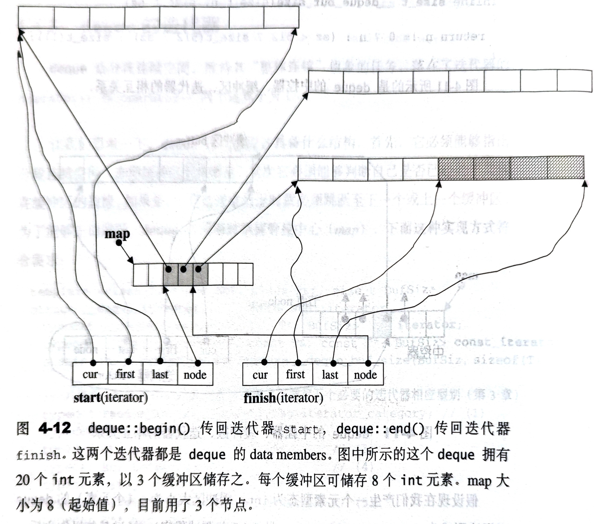

# 4.4 deque

## 4.4.1 deque概述

vector是单向开口的连续空间，deque则是一种双向开口的连续线性内存空间。所谓双向开口，意思是可以在头尾两端分别做元素的插入和删除操作。vector技术上当然也可以在头尾两端进行操作，但是其头部操作效率极低，无法被接受。

deque没有容量(capacity)概念，因为它是动态地以分段连续空间组合而成，随时可以增加一段新的空间并链接起来。因此，deque没有必要提供空间保留(reserve)功能。

deque提供RandomAccessIterator，但它地迭代器不是普通指针。因此，除非必要，我们应尽可能使用vector而非deque。对deque进行排序操作，为了提高效率，可将deque复制到一的vector上，将deque排序后，再复制回deque。

## 4.4.2 deque的中控器

deque由一段一段定量的连续空间构成，一旦有必要在deque的前端或尾端增加新空间，便配置一段连续定量空间，串接在整个deque的头端或尾端。

分段连续线性空间必须由中央控制，而为了维持整体连续的假象，数据结构的设计及迭代器前进后退等操作都颇为繁琐。

deque采用一块map（注意，并非STL容器map）作为主控。这里map是一小块连续空间，其中每个元素（此处成为一个节点node）都是指针，指向另一段连续线性空间，称为缓冲区。缓冲区才是deque的储存空间主体。SGI STL允许我们指定缓冲区大小，默认值0表示将使用512B缓冲区。

```cpp
template <class T, class Alloc = alloc, size_t BufSiz = 0>
class deque {
public:                           // Basic types
  typedef T value_type;
  typedef value_type* pointer;
  ...
protected:                        // Internal typedef
  // 元素的指针的指针
  typedef pointer* map_pointer;

protected:                       // Data members  
  map_pointer map;               // map指针，map是块连续空间，
                                 //其内的每个元素都是一个指针，指向一块缓冲区
  size_t map_size;               // map的大小
  ...
};
```

整理一下，我们便可发现，map其实是一个 `T**`。如图所示。


## 4.4.3 deque的迭代器

deque是分段连续空间。维持其“整体连续”假象的任务落在了迭代器的 `operator++` 和 `operator--` 上。

deque迭代器必须能够指出分段连续空间（缓冲区）在哪里，其次必须能够判断自己是否已经处于其所在缓冲区的边缘，如果是，一旦前进或后退时就必须跳跃至下一个或上一个缓冲区，为了能够正确跳跃，deque必须随时掌握管控中心（map）。下面这种实现方式符合需求：

```cpp
template <class T, class Ref, class Ptr, size_t BufSiz>
struct __deque_iterator {     // 未继承std::iterator
  typedef __deque_iterator<T, T&, T*, BufSiz> iterator;
  typedef __deque_iterator<T, const T&, const T*, BufSiz> const_iterator;
  static size_t buffer_size() { return __deque_buf_size(BufSiz, sizeof(T)); }

  // 未继承std::iterator，所以必须自行撰写五个必要的迭代器相应类型
  typedef random_access_iterator_tag iterator_category; // (1)
  typedef T value_type;                                 // (2)
  typedef Ptr pointer;                                  // (3)
  typedef Ref reference;                                // (4)
  typedef size_t size_type;                              
  typedef ptrdiff_t difference_type;                    // (5)
  typedef T** map_pointer;

  typedef __deque_iterator self;

  //保持与容器的联结
  T* cur;    // 指向缓冲区现行(current)元素
  T* first;  // 指向缓冲区的头
  T* last;   // 指向缓冲区的尾（含备用空间）
  map_pointer node; // 指向管控中心
...
};
```

其中用来决定缓冲区大小的函数 `buffer_size()`，调用 `__deque_buf_size()`，后者是一个全局函数，定义如下：

```cpp
// 如果n不为0，返回n，表示buffer size由用户自定义
// 如果n为0，表示buffer size使用默认值，那么
//   如果sz（元素大小，sizeof(value_type)）小于512，返回521/sz
//   如果sz（元素大小，sizeof(value_type)）不小于512，返回1
inline size_t __deque_buf_size(size_t n, size_t sz) {
  return n != 0 ? n : (sz < 512? size_t(512 / sz) : size_t(1));
}
```

下图所示的是deque的中控器、缓冲区、迭代器的相互关系。


假设现在我们产生一个元素类型为int，缓冲区大小为8个元素的deque。经过某些操作后，deque拥有20个元素。其迭代器如图：



下面是deque迭代器的几个关键行为。迭代器内对各种指针运算都进行了重载，其中最关键的是：一旦进行时遇到缓冲区边缘，要特别当心，视前进或后退而定，可能需要调用 `set_node()` 跳一个缓冲区。

```cpp
void set_node(map_pointer new_node) {
  node = new_node;
  first = *new_node;
  last = first + difference_type(buffer_size());
}

// 以下重载运算符是__deque_iterator<>成功运作的关键

reference operator*() const { return *cur; }
pointer operator->() const { return &(operator*()); }

difference_type operator-(const self& x) const {
  return difference_type(buffer_size()) * (node - x.node - 1) +
    (cur - first) + (x.last - x.cur);
}

self& operator++() {
  ++cur;                   // 切换至下一个元素
  if (cur == last) {       // 如果已达到缓冲区尾
    set_node(node + 1);    // 切换至下一个缓冲区
    cur = first;           // 的第一个元素
  }
  return *this;
}
self operator++(int) {
  self tmp = *this;
  ++*this;
  return tmp;
}

self& operator--() {
  if (cur == first) {     // 如果已达到缓冲区头
    set_node(node - 1);   // 切换至前一个缓冲区
    cur = last;           // 的最后一个元素
  }
  --cur;                  // 切换至上一个元素
  return *this;
}
self operator--(int) {
  self tmp = *this;
  --*this;
  return tmp;
}

// 以下实现随机存取。迭代器可以直接跳跃n个距离
self& operator+=(difference_type n) {
  difference_type offset = n + (cur - first);
  if (offset >= 0 && offset < difference_type(buffer_size()))
    // 目标位置在同一缓冲区内
    cur += n;
  else {                                                    
    // 目标超出缓冲区范围
    difference_type node_offset =
      offset > 0? offset / difference_type(buffer_size())
                 : -difference_type((-offset - 1) / buffer_size()) - 1;
    // 切换至正确节点
    set_node(node + node_offset);
    // 切换至正确元素
    cur = first + (offset - node_offset * difference_type(buffer_size()));
  }
  return *this;
}

self operator+(difference_type n) const {
  self tmp = *this;
  return tmp += n;      // 调用operator+=
}

self& operator-=(difference_type n) {
  return *this += -n;   // 调用operator+=
}

self operator-(difference_type n) const {
  self tmp = *this;
  return tmp -= n;      // 调用operator-=
}

// 实现随机存取，迭代器可以直接跳跃n个距离
reference operator[](difference_type n) const { return *(*this + n); }

bool operator==(const self& x) const { return cur == x.cur; }
bool operator!=(const self& x) const { return!(*this == x); }
bool operator<(const self& x) const {
  return (node == x.node) ? (cur < x.cur) : (node < x.node);
}
```

## 4.4.4 deque的数据结构

deque除了维护指向map的指针外，也维护start，finish两个迭代器，分别指向第一缓冲区的第一个元素和最后缓冲区的最后一个元素的下一个位置）。此外，它当然也必须记住目前的map大小。因为一旦map的节点不足，就必须重新配置更大的一块map。

```cpp
// 见 __deque_buf_size()
template <class T, class Alloc = alloc , size_t BufSiz = 0>
class deque {
public:                 // Basic types
  typedef T value_type;
  typedef value_type* pointer;
  typedef size_t size_type;

public:                 // Iterators
  typedef __deque_iterator<T, T&, T*> iterator;

protected:              // Internal typedef
  typedef pointer* map_pointer;

protected:              // Data members
  iterator start;         // Beginning of the deque
  iterator finish;        // End of the deque

  map_pointer map;        // Map area
  size_type map_size;     // Size of map
...
};
```

有了上述结构，以下几个功能便可轻易完成。

```cpp
public:                     // Basic accessors
  iterator begin() { return start; }
  iterator end() { return finish; }

  reference operator[](size_type n) {
    return start[difference_type(n)];   // __deque_iterator<>::operator[]
  }

  reference front() { return *start; }  // __deque_iterator<>::operator*
  reference back() {
    iterator tmp = finish;
    --tmp;          // __deque_iterator<>::operator--
    return *tmp;    // __deque_iterator<>::operator*
    // 不可以写 return *(finish-1);
    // 因为__deque_iterator<>没有为(finish-1)定义运算符
  }

  // 下面有两个 ";" 但符合语法
  size_type size() const { return finish - start;; }  // iterator::operator-
  size_type max_size() const { return size_type(-1); }
  bool empty() { return finish == start; }
```

## 4.4.5 deque的构造与内存管理 ctor, push_back, push_front

deque的缓冲区扩充相当繁琐复杂，以下将分解操作一步步进行图解说明。

deque自定义了两个专属的空间配置器：

```cpp
protected:        // Internal typedef
  // 专属空间配置器，每次配置一个元素大小
  typedef simple_alloc<value_type, Alloc> data_allocator;
  // 专属空间配置器，每次配置一个指针大小
  typedef simple_alloc<pointer, Alloc> map_allocator;
```

并提供有一个constructor如下：

```cpp
deque(int n, const value_type& value) 
  : start(), finish(), map(0), map_size(0) {
  fill_initialize(n, value);
}
```

其内调用的 `fill_initialize()` 负责产生并安排好deque的结构，并将元素初始化。

```cpp
template <class T, class Alloc, size_t BufSize>
void deque<T, Alloc, BufSize>::fill_initialize(size_type n, 
                                    const value_type& value) {
  create_map_and_nodes(n);    // 把deque的结构都产生并安排好
  map_pointer cur;
  __STL_TRY { 
    // 为每个节点的缓冲区设置初值
    for (cur = start.node; cur < finish.node; ++cur)
      uninitialized_fill(*cur, *cur + buffer_size(), value);
    // 最后一个节点的设定稍有不同（因为尾端可能有备用空间，不必初始化）
    uninitialized_fill(finish.first, finish.cur, value);
  }
  catch (...) {
    ...
  }
}
```

其中 `create_map_and_nodes()` 负责产生并安排好deque的结构：

```cpp
template <class T, class Alloc, size_t BufSize>
void deque<T, Alloc, BufSize>::create_map_and_nodes(size_type num_elements) {
  // 需要节点数=(元素个数/每个缓冲区可容纳的元素个数)+1
  // 如果刚好整除，会多分配一个节点
  size_type num_nodes = num_elements / buffer_size() + 1;
  
  // 一个map要管理最少几个节点。最少8个，最多是“所需节点数+2”
  // 前后个预留一个，扩充时可用
  map_size = max(initial_map_size(), num_nodes + 2);
  map = map_allocator::allocate(map_size);
  // 以上配置出 “具有map_size” 个节点的map
  
  // 令nstart和nfinish指向map所以拥有的全部节点的最中央区段
  // 保持在最中央，可使头尾两端的扩容量一样大。每个节点可对应一个缓冲区
  map_pointer nstart = map + (map_size - num_nodes) / 2;
  map_pointer nfinish = nstart + num_nodes - 1;
  
  map_pointer cur;
  __STL_TRY {
    // 为map内的每个现用节点配置缓冲区。所有缓冲区加起来就是deque的
    // 可用空间（最后一个缓冲区可能留有一些空余）
    for (cur = nstart; cur <= nfinish; ++cur) 
      *cur = allocate_node();
  }
  catch(...) {
    // "commit or rollback" semantics
    ...
  }

  // 为deque内的两个迭代器start和end设定正确内容
  start.set_node(nstart);
  finish.set_node(nfinish);
  start.cur = start.first;    // first, cur 都是public
  finish.cur = finish.first + num_elements % buffer_size();
  // 如果刚好整除，会多分配一个节点
  // 此时令cur指向这多分配的节点的起始处
}
```

以下是 `push_back()` 函数内容：

```cpp
public:
  void push_back(const value_type& x) {
    if (finish.cur != finish.last - 1) {
      // 最后缓冲区尚有2个（含）以上元素备用空间
      construct(finish.cur, x);   // 直接在备用空间上构造元素
      ++finish.cur;               // 将cur指向下一个元素
    }
    else {    // 最后缓冲区只剩一个元素备用空间
      push_back_aux(x);
    }
  }
```

当尾端只剩一个元素备用空间，于是 `push_back()` 调用 `push_back_aux()`，先配置一整块新的缓冲区，再设置新元素内容，然后更改迭代器finish的状态。

```cpp
// 只有当finish.cur == finish.last - 1时，才会调用push_back_aux()
template <class T, class Alloc, size_t BufSize>
void deque<T, Alloc, BufSize>::push_back_aux(const value_type& t) {
  value_type t_copy = t;
  reverse_mao_at_back();    // 若符合某种条件则必须重换一个map
  *(finish.node + 1) = allocate_node();   // 配置一个新节点（缓冲区）
  __STL_TRY {
    construct(finish.cur, t_copy);    // 针对目标元素设值
    finish.set_node(finish.node + 1); // 改变finish，指向新节点
    finish.cur = finish.first;        // 设定finish的状态
  }
  __STL_UNWIND(deallocate_node(*(finish.node + 1)));
}
```

现在，deque的状态如图所示：


`push_front()` 函数的内容如下：

```cpp
public:
  void push_front(const value_type& x) {
    if (start.cut != start.first) {   // 第一缓冲区还有备用空间
      construct(start.cur, x);   // 在备用空间上构造
      --start.cur;               // 调整第一缓冲区的使用状态
    }
    else  // 第一缓冲区已无备用空间
      push_front_aux(x);
  }
```

若第一缓冲区无备用空间，所以调用 `push_front_aux()`：

```cpp
// 只有当start.cur == start.first时，才会调用
template <class T, class Alloc, size_t BufSize>
void deque<T, Alloc, BufSize>::push_front_aux(const value_type& t) {
  value_type t_copy = t;
  reverse_map_at_front();   // 若符合某种条件则必须重换一个map
  *(start.node - 1) = allocate_node(); // 配置一个新节点（缓冲区）
  __STL_TRY {
    start.set_node(start.node - 1); // 改变start，指向新节
    start.cur = start.last - 1;     // 设定start的状态
    construct(start.cur, t_copy);   // 针对目标元素设值
  }
  catch(...) {
    // "commit or rollback" semantics
    start.set_node(start.node + 1);
    start.cur = start.first;
    deallocate_node(*(start.node + 1));
    throw;
  }
}
```

现在，deque的状态如图所示：


什么时候map需要重换？这个问题的判断由 `reverse_map_at_back()` 和 `reverse_map_at_front()` 函数决定，实际操作则由 `reallocate_map()` 执行：

```cpp
void reverse_map_at_back(size_type node_to_add = 1) {
  if (node_to_add + 1 > map_size - (finish.node - map)) 
    // 如果map尾端的节点备用空间不足
    // 符合上述条件必须要重换一个map（配置更大的，拷贝原来的，释放原来的）
    reallocate_map(node_to_add, true);
}

void reverse_map_at_front(size_type node_to_add = 1) {
  if (node_to_add > start.node - map)
  // 如果map前端的节点备用空间不足
  // 符合以上条件则必须重换一个map（配置更大的，拷贝原来的，释放原来的）
  reallocate_map(node_to_add, true);
}

template <class T, class Alloc, size_t BufSize>
void deque<T, Alloc, BufSize>::reallocate_map(size_type node_to_add, 
                                              bool add_at_front) {
  size_type old_num_nodes = finish.node - start.node + 1;
  size_type new_num_nodes = old_num_nodes + node_to_add;

  map_pointer new_nstart;
  if (map_size > 2 * new_num_nodes) {
    new_nstart = map + (map_size - new_num_nodes) / 2
                  + (add_at_front? node_to_add : 0);
    if (new_start < start.node)
      copy(start.node, finish.node + 1, new_nstart);
    else  
      copy_backward(start.node, finish.node + 1, new_nstart + old_num_nodes);
  }
  else {
    size_type new_map_size = map_size + max(map_size, node_to_add) + 2;
    // 配置一块新空间，准备给新map用
    map_pointer new_map = map_allocator::allocate(new_map_size);
    new_nstart = new_map + (new_map_size - new_num_nodes) / 2
                    + (add_at_front? node_to_add : 0);
    // 把原map内容拷贝过来                
    copy(start.node, finish.node + 1, new_nstart);
    // 释放原map
    map_allocator::deallocate(map, map_size);
    // 设定新map的起始地址与大小
    map = new_map;
    map_size = new_map_size;
  }

  // 把新的start和finish设定为新的map的起始地址
  start.set_node(new_nstart);
  finish.set_node(new_nstart + old_num_nodes - 1);
}
```

## 4.4.6 deque的元素操作 pop_back, pop_front, clear, erase, insert

现在以 `pop_back()` 和 `pop_front()` 为例。无论从deque的最前端还是最尾端取元素，都需要考虑在某种条件下，将缓冲区释放掉：

```cpp
void pop_back() {
  if (finish.cur != finish.first) {
    // 最后缓冲区有一个或更多元素
    --finish.cur;         // 调整指针，相当于排除了最后的元素
    destroy(finish.cur);  // 将最后的元素析构
  }
  else 
    // 最后缓冲区没有元素
    pop_back_aux();       // 将在这里进行缓冲区释放操作
}

// 只有当finish.cur == finish.first时才会调用
template <class T, class Alloc, size_t BufSize>
void deque<T, Alloc, BufSize>::pop_back_aux() {
  deallocate_node(finish.first);    // 释放最后一个缓冲区
  finish.set_node(finish.node - 1); // 指向前一个缓冲区
  finish.cur = finish.last - 1;     // 指向最后一个元素
  destroy(finish.cur);              // 将最后一个元素析构
}

void pop_front() {
  if (start.cur != start.last - 1) {
    // 第一缓冲区有两个（或更多）元素
    destroy(start.cur);          // 将第一个元素析构
    ++start.cur;                  // 调整指针，相当于排除了第一个元素
  }
  else 
    // 第一缓冲区没有元素
    pop_front_aux();              // 将在这里进行缓冲区释放操作
}

// 以下是只有当start.cur == start.last - 1时才会调用
template <class T, class Alloc, size_t BufSize>
void deque<T, Alloc, BufSize>::pop_front_aux() {
  destroy(start.cur);              // 将第一个元素析构
  deallocate_node(start.first);    // 释放第一个缓冲区
  start.set_node(start.node + 1);  // 指向后一个缓冲区
  start.cur = start.first;         // 指向第一个元素
}
```

`clear()` 用于清除整个deque。请注意，deque的最初状态保留有一个缓冲区，因此，`clear()` 完成之后恢复初始状态，也一样要保留一个缓冲区：

```cpp
// 注意，最终要保留一个缓冲区
template <class T, class Alloc, size_t BufSize>
void deque<T, Alloc, BufSize>::clear() {
  // 针对头尾以外的每一个缓冲区（它们一定是饱和的）
  for (map_pointer node = start.node + 1; node < finish.node; ++node) {
    // 将缓冲区的所有元素析构，调用destroy()的第二版本
    destroy(*node, *node + buffer_size());
    // 释放缓冲区内存
    data_allocator::deallocate(*node, buffer_size());
  }

  if (start.node!= finish.node) {     // 至少有头尾两个缓冲区
    destroy(start.cur, start.last);   // 将头缓冲区析构
    destroy(finish.first, finish.cur);// 将尾缓冲区析构
    // 释放尾缓冲区内存，注意头缓冲区保留
    data_allocator::deallocate(finish.first, buffer_size());
  } 
  else                                  // 只有一个缓冲区
    destroy(start.cut, finish.cur);     // 将此缓冲区所有元素析构
    // 注意，并不释放缓冲区内存。此缓冲区将保留

  finish = start;   // 调整状态
}
```

下面是 `erase()` 用来清除某个元素

```cpp
// 清除pos所指元素，pos为清除点
iterator erase(iterator pos) {
  iterator next = pos;
  ++next;
  difference_type index = pos - start;    // 清除点之前的元素个数
  if (index < (size() >> 1)) {            // 清除点之前的元素比较少
    copy_backward(start, pos, next);      // 移动pos之前的元素
    pop_front();         // 移动完毕，最前一个元素冗余，删除
  }
  else {                      // 清除点之后的元素比较少
    copy(next, finish, pos);  // 移动pos之后的元素
    pop_back();               // 移动完毕，最后一个元素冗余，删除
  }
  return start + index;
}
```

下面这个例子是 `erase()` 用来清除 `[first, last)` 的元素

```cpp
template <class T, class Alloc, size_t BufSize>
deque<T, Alloc, BufSize>::iterator
deque<T, Alloc, BufSize>::erase(iterator first, iterator last) {
  if (first == start && last == finish) {   // 如果清除区间就是整个deque
    clear();                                // 清除所有元素
    return finish;
  }
  else {
    difference_type index = first - start;    // 清除区间的长度
    difference_type len = last - first;       // 清除区间前方的元素个数
    if (index < (size() >> 1)) {              // 清除区间前方的元素比较少
      copy_backward(start, first, last);      // 移动区间前方的元素
      iterator new_start = start + len;       // 标记deque的新起点
      destroy(start, new_start);              // 将冗余元素析构
      // 以下将冗余缓冲区释放掉
      for (map_pointer cur = start.node; cur < new_start.node; ++cur)
        data_allocator::deallocate(*cur, buffer_size());
      start = new_start;    // 设定deque的新起点
    }
    else {                                    // 清除区间后方的元素比较少
      copy(last, finish, first);              // 向后移动前方元素
      iterator new_finish = finish - len;     // 标记deque的新终点
      destroy(new_finish, finish);            // 将冗余元素析构
      // 以下将冗余缓冲区释放掉
      for (map_pointer cur = new_finish.node + 1; cur <= finish.node; ++cur)
        data_allocator::deallocate(*cur, buffer_size());
      finish = new_finish;    // 设定deque的新终点
    }
    return start + index;
  }
}
```

最后一个例子是 `insert()` 。最基础最重要的是以下版本，允许在某个点（之前）插入一个元素，并设定其值。

```cpp
// 在position处插入一个元素，其值为x
iterator insert(iterator position, const value_type& x) {
  if (position.cur == start.cur) {  // 如果插入点是deque的最前端
    push_front(x);                  // 调用push_front()
    return start;                   // 返回插入点
  }
  else if (position.cur == finish.cur) { // 如果插入点是deque的最后端
    push_back(x);                        // 调用push_back()
    iterator tmp = finish;               // 设定新的deque的终点
    --tmp;                               // 将终点减一
    return tmp;                          // 返回终点
  }
  else {           // 如果插入点不是deque的最前端或最后端
    return insert_aux(position, x);      // 调用insert_aux()
  }
}

template <class T, class Alloc, size_t BufSize>
typename deque<T, Alloc, BufSize>::iterator
deque<T, Alloc, BufSize>::insert_aux(iterator pos, const value_type& x) {
  difference_type index = pos - start;   // 插入点之前的元素个数
  value_type x_copy = x;                 
  if (index < size() / 2) {              // 如果插入点之前的元素个数比较少
    push_front(front());                 // 在最前端加入与第一元素相同的元素
    iterator front1 = start;             // 设定新的deque的第一元素
    ++front1;
    iterator front2 = front1;            // 设定新的deque的第二元素
    ++front2;
    pos = start + index;                 // 设定新的deque的插入点
    iterator pos1 = pos;                 // 设定新的deque的插入点
    ++pos1;
    copy(front, pos1, front1);           // 元素移动
  }
  else {                  // 如果插入点之前的元素个数比较多
    push_back(back());                  // 在最后端加入与最后一元素相同的元素
    iterator back1 = finish;            // 设定新的deque的最后一元素
    --back1;
    iterator back2 = back1;             // 设定新的deque的最后二元素
    --back2;
    pos = start + index;                 // 设定新的deque的插入点
    copy_backward(pos, back2, back1);    // 元素移动
  }
  *pos = x_copy;                         // 将x_copy插入到pos
  return pos;
}
```
