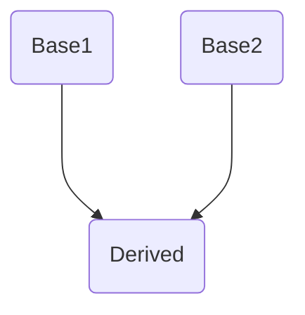
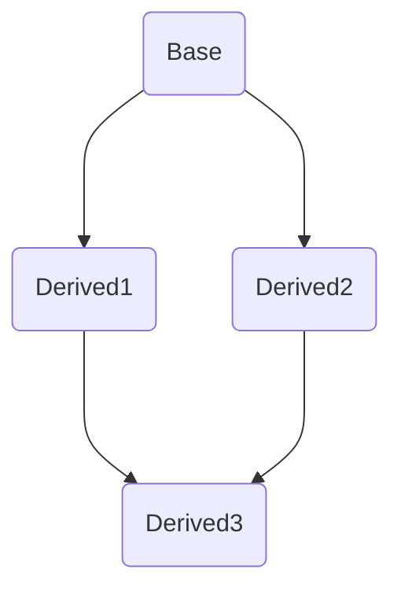
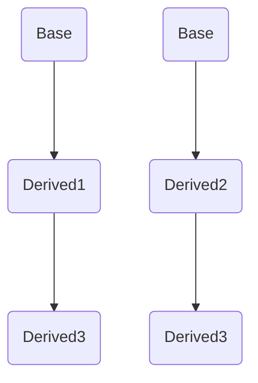
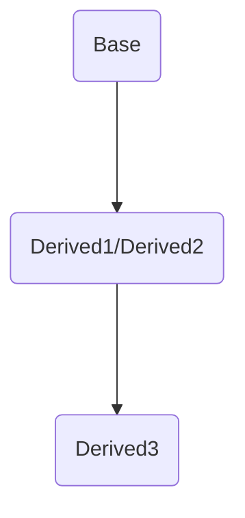

# Lesson13 类：继承

---
- [Lesson13 类：继承](#lesson13-类继承)
  - [1. 继承](#1-继承)
    - [继承方式](#继承方式)
    - [名字遮蔽](#名字遮蔽)
    - [继承的对象模型](#继承的对象模型)
    - [如何构造基类](#如何构造基类)
    - [派生类和基类之间的特殊关系](#派生类和基类之间的特殊关系)
    - [多继承](#多继承)
    - [菱形继承](#菱形继承)
    - [虚继承](#虚继承)
  - [2. 继承构造函数 *(inherit constructor)*](#2-继承构造函数-inherit-constructor)
    - [继承构造函数冲突的处理办法](#继承构造函数冲突的处理办法)


---

## 1. 继承

继承的目的是提高代码复用性

语法
>```cpp
>class Derived : access_specifier Base { statement };
>```
继承的类叫做子类（派生类），被继承的类叫做父类（基类），`:`后是继承方式

不同的继承方式会让派生类获得基类不同访问权限的成员

```cpp
class Base {
  public:
   int _B_1;
   int _B_2;
};

class Derived : public Base {
  public:
   int _D_1;
};
```
继承后派生类内实际成员如下
```cpp
int _B_1;
int _B_2;
int _D_1;
```

</br>

### 继承方式

成员访问权限
| 访问权限    |                    类内                     |                    子类                     |                    类外                     |
| ----------- | :-----------------------------------------: | :-----------------------------------------: | :-----------------------------------------: |
| `public`    | <span style="color: lightgreen;">yes</span> | <span style="color: lightgreen;">yes</span> | <span style="color: lightgreen;">yes</span> |
| `protected` | <span style="color: lightgreen;">yes</span> | <span style="color: lightgreen;">yes</span> |     <span style="color: red;">no</span>     |
| `private`   | <span style="color: lightgreen;">yes</span> |     <span style="color: red;">no</span>     |     <span style="color: red;">no</span>     |

继承后成员在派生类中的访问权限
| 基类访问权限/派生类继承方式 |  `public`   | `protected` | `private` |
| --------------------------- | :---------: | :---------: | :-------: |
| `public`                    |  `public`   | `protected` | `private` |
| `protected`                 | `protected` | `protected` | `private` |

***注意***
* 一般不用`protected`和`private`继承；
* 使用`public`继承时，基类的`private`成员可以通过派生类中继承的`public`和`private`成员访问到。

**一个派生类继承了所有的基类成员函数，但下列情况除外：**

* 基类的构造函数、析构函数和拷贝构造函数。
* 基类的重载运算符。
* 基类的友元函数。

**使用 `using` 关键字可以改变基类成员在派生类中的访问权限**
***注意*** ：`using`只能改变基类中`public`和`protected`成员的访问权限，不能改变`private`成员的访问权限，因为基类中的`private`成员在派生类中是不可见的，根本不能使用。

```cpp

class Base {       
 public:
   int m_a = 10;
 protected:
   int m_b = 20;
 private:
   int m_c = 30;
};

class Derived : public Base {
 public:
   using A::m_b;         // 把m_b的权限修改为公有的
 private:
   using A::m_a;         // 把m_a的权限修改为私有的
};

int main() {
  B b;   
  // b.m_a = 11;
  b.m_b = 21;
  //b.m_c = 21;
}
```

</br>

### 名字遮蔽
* 一个类被看作是一个作用域
* 如果成员在派生类的作用域中已经找到，就不会在基类作用域中继续查找；否则继续在基类作用域中查找
```cpp
class Base {
  public:
   int _a = 1;
};

class Derived : public Base {
  public:
   int _a = 2;
};

int main() {
  Derived d;
  std::cout << d._a << std::endl;     // 2
}
```

</br>

### 继承的对象模型

* **使用vs工具**

在开始菜单中依次找到：Visual Studio Tools -> x64 Native Tools Command Prompt for VS 2022 -> 打开，会进入 CMD 界面，然后切换到你的代码目录，比如我的代码在 D:\code\C++\test 目录下，使用 cd 命令切换：
```
cd D:\code\C++\test
```
使用 dir 命令可以查看该目录下的所有文件，此目录下，我们有一个 test.cpp 文件，代码如下：
```cpp
class Base {
  public:
   Base() {
      std::cout << "Base constructor" << std::endl;
   }
   ~Base() {
      std::cout << "Base destructor" << std::endl;
   }
};

class Derived : public Base {
  public:
   Derived() {
      std::cout << "Derived constructor" << std::endl;
   }
   ~Derived() {
      std::cout << "Derived destructor" << std::endl;
   }
};

int main() {
   Derived d;
}
```

我们输入命令：
```
cl /d1 reportSingleClassLayoutXXX [filename]
```
其中 XXX 是类名，[filename] 是文件名，实例如下，比如类名是 Derived，文件是 test.cpp ：
```
cl /d1 reportSingleClassLayoutDerived test.cpp
```
**output**
```
test.cpp

class Derived   size(1):
        +---
 0      | +--- (base class Base)
        | +---
        +---
```

* **构造与析构**
```cpp
class Base {
  public:
   Base() {
    std::cout << "Base constructor" << std::endl;
   }
   ~Base() {
    std::cout << "Base destructor" << std::endl;
   }
};

class Derived : public Base {
  public:
   Derived() {
    std::cout << "Derived constructor" << std::endl;
   }
   ~Derived() {
    std::cout << "Derived destructor" << std::endl;
   }
};

int main() {
   Derived d;
}
```
构造析构顺序如下：
**output**
```
Base constructor
Derived constructor
Derived destructor
Base destructor
```
1. 创建派生类对象时，先调用基类的构造函数，再调用派生类的构造函数。
2. 销毁派生类对象时，先调用派生类的析构函数，再调用基类的析构函数。如果手动调用派生类的析构函数，也会调用基类的析构函数。


* **内存**
```cpp
// 重载new运算符
void* operator new(size_t size) {
   void* ptr = malloc(size);  // 申请内存
   std::cout << "申请到的内存的地址是：" << ptr << "，大小是：" << size << std::endl;
   return ptr;
}

// 重载delete运算符
void operator delete(void* ptr) {
   if (ptr == 0)
      return;  // 对空指针delete是安全的
   free(ptr);  // 释放内存
   std::cout << "释放了内存" << std::endl;
}

// 基类
class A {
  public:
   int m_a = 10;

  protected:
   int m_b = 20;

  private:
   int m_c = 30;

  public:
   A() {
      std::cout << "A this: " << this << std::endl;
      std::cout << "A m_a address: " << &m_a << std::endl;
      std::cout << "A m_b address: " << &m_b << std::endl;
      std::cout << "A m_c address: " << &m_c << std::endl;
   }
   void func() { std::cout << "m_a=" << m_a << ",m_b=" << m_b << ",m_c=" << m_c << std::endl; }
};

// 派生类
class B : public A {
  public:
   int m_d = 40;
   B() {
      std::cout << "B this: " << this << std::endl;
      std::cout << "B m_a address: " << &m_a << std::endl;
      std::cout << "B m_b address: " << &m_b << std::endl;
      // std::cout << "B m_c address: " << &m_c << std::endl;
      std::cout << "B m_d address: " << &m_d << std::endl;
   }
   void func1() { std::cout << "m_d=" << m_d << std::endl; }
};

int main() {
   std::cout << "sizeof Base: " << sizeof(A) << std::endl;
   std::cout << "sizeof Derived: " << sizeof(B) << std::endl;

   B* p = new B;
   p->func();
   p->func1();
   *((int*)p + 2) = 31;  // 把基类私有成员m_c的值修改成31
   p->func();
   p->func1();
   delete p;
}
```

**output**
```
sizeof Base: 12
sizeof Derived: 16
申请到的内存的地址是：0x1b5bc3013f0，大小是：16
A this: 0x1b5bc3013f0
A m_a address: 0x1b5bc3013f0
A m_b address: 0x1b5bc3013f4
A m_c address: 0x1b5bc3013f8
B this: 0x1b5bc3013f0
B m_a address: 0x1b5bc3013f0
B m_b address: 0x1b5bc3013f4
B m_d address: 0x1b5bc3013fc
m_a=10,m_b=20,m_c=30
m_d=40
m_a=10,m_b=20,m_c=31
m_d=40
释放了内存
```

B类的内存模型
```
class B size(16):
        +---
 0      | +--- (base class A)
 0      | | m_a
 4      | | m_b
 8      | | m_c
        | +---
12      | m_d
        +---
```

1. 创建派生类对象时只会申请一次内存，派生类对象包含了基类对象的内存空间，this指针相同的。
2. 创建派生类对象时，先初始化基类对象，再初始化派生类对象。
3. 对派生类对象用`sizeof`得到的是基类所有成员（包括私有成员）+派生类对象所有成员的大小。
4. 在C++中，不同继承方式的访问权限只是语法上的处理。
5. 用指针可以访问到基类中的私有成员（内存对齐）
   
</br>

### 如何构造基类
派生类构造函数的要点如下： 
1. 创建派生类对象时，程序首先调用基类构造函数，然后再调用派生类构造函数。
2. 如果没以指定基类构造函数，将使用基类的默认构造函数。
3. 可以用初始化列表指明要使用的基类构造函数。
4. 基类构造函数负责初始化被继承的数据成员；派生类构造函数主要用于初始化新增的数据成员。
5. 派生类的构造函数总是调用一个基类构造函数，包括拷贝构造函数。
```cpp
// 基类
class A {
  public:
   int m_a;

  private:
   int m_b;

  public:
   // 基类的默认构造函数
   A()
       : m_a(0), m_b(0) {
      std::cout << "调用了基类的默认构造函数A()" << std::endl;
   }
   // 基类有两个参数的构造函数
   A(int a, int b)
       : m_a(a), m_b(b) {
      std::cout << "调用了基类的构造函数A(int a,int b)" << std::endl;
   }
   // 基类的拷贝构造函数
   A(const A& a)
       : m_a(a.m_a + 1), m_b(a.m_b + 1) {
      std::cout << "调用了基类的拷贝构造函数A(const A &a)" << std::endl;
   }

   void showA() { std::cout << "m_a=" << m_a << ",m_b=" << m_b << std::endl; }
};

// 派生类
class B : public A {
  public:
   int m_c;
   // 派生类的默认构造函数，指明用基类的默认构造函数（不指明也无所谓）
   B()
       : m_c(0), A() {
      std::cout << "调用了派生类的默认构造函数B()。\n";
   }
   // 指明用基类的有两个参数的构造函数
   B(int a, int b, int c)
       : A(a, b), m_c(c) {
      std::cout << "调用了派生类的构造函数B(int a,int b,int c)。\n";
   }
   // 指明用基类的拷贝构造函数
   B(const A& a, int c)
       : A(a), m_c(c) {
      std::cout << "调用了派生类的构造函数B(const A &a,int c) 。\n";
   }

   void showB() { std::cout << "m_c=" << m_c << std::endl; }
};

int main() {
   B b1;  // 将调用基类默认的构造函数
   b1.showA();
   b1.showB();

   B b2(1, 2, 3);  // 将调用基类有两个参数的构造函数
   b2.showA();
   b2.showB();

   A a(10, 20);  // 创建基类对象
   B b3(a, 30);  // 将调用基类的拷贝造函数
   b3.showA();
   b3.showB();
}
```
**output**
```
调用了基类的默认构造函数A()
调用了派生类的默认构造函数B()
m_a=0,m_b=0
m_c=0
调用了基类的构造函数A(int a,int b)
调用了派生类的构造函数B(int a,int b,int c)
m_a=1,m_b=2
m_c=3
调用了基类的构造函数A(int a,int b)
调用了基类的拷贝构造函数A(const A &a)
调用了派生类的构造函数B(const A &a,int c)
m_a=11,m_b=21
m_c=30
```

</br>

### 派生类和基类之间的特殊关系
```cpp
// 基类
class A {
  public:
   int m_a = 0;

  private:
   int m_b = 0;

  public:
   void show() { std::cout << "A::show() m_a=" << m_a << ",m_b=" << m_b << std::endl; }
   void setb(int b) { m_b = b; }
};

// 派生类
class B : public A {
  public:
   int m_c = 0;
   void show() { std::cout << "B::show() m_a=" << m_a << "m_c=" << m_c << std::endl; }
};

int main() {
   B b;
   A* a = &b;

   b.m_a = 10;
   b.setb(20);  // 设置成员m_b的值
   b.m_c = 30;
   b.show();  // 调用的是B类的show()函数

   a->m_a = 11;
   a->setb(22);  // 设置成员m_b的值
   // a->m_c = 30;

   a->show();  // 调用的是A类的show()函数
}
```
1. 可以把派生类对象赋值给基类对象（包括私有成员），但是，会舍弃非基类的成员
```cpp
B b;
A a = b;
```
2. 基类指针或引用可以在不进行显式转换的情况下指向或引用派生类对象
```cpp
B b;
A* a = &b;
```
```cpp
B b;
A& a = b;
```
***注意***：
1. 基类指针或引用只能调用基类的方法，不能调用派生类的方法。
2. 可以用派生类构造基类。
3. 如果函数的形参是基类，实参可以用派生类。
4. C++要求指针和引用类型与赋给的类型匹配，这一规则对继承来说是例外。但是，这种例外只是单向的，不可以将基类对象和地址赋给派生类引用和指针（没有价值，没有讨论的必要）


</br>

### 多继承
如图所示

一个派生类同时继承多个基类，多个继承方式继承对象间加`,`
```cpp
class Base1 {
  public:
   int _B_1;
};

class Base2 {
  public:
   int _B_2;
};

class Derived : public Base1, public Base2 {
  public:
   int _D_1;
};
```
`Derived`拥有的成员
```cpp
int _B_1;
int _B_2;
int _D_1;
```

* 如果遇到同名元素，则需要添加作用域
```cpp
class Base1 {
  public:
   int _B_1 = 1;
};

class Base2 {
  public:
   int _B_1 = 2;
};

class Derived : public Base1, public Base2 {
  public:
   int _D_1;
   Derived() {
      _D_1 = Base1::_B_1 + Base2::_B_1;
   }
};
```

</br>

### 菱形继承
如图所示

发生菱形继承时，基类Base的同一个属性会同时派生给派生类Derived1和Derived2，同名数据变成了两份

当执行如下代码时
```cpp
class Base {
  public:
   int _B = 0;
};

class Derived1 : public Base {
  public:
   Derived1() {
     _B = 1;
   }
};

class Derived2 : public Base {
  public:
   Derived1() {
     _B = 2;
   }
};

class Derived3 : public Derived1, public Derived2 {
  public:
   Derived3() {
    _D = _B;
   }
   int _D;
};
```
此时产生了两条继承路径，发生冲突


为了告诉编译器应该以哪条路径继承`_B`的值，需要在`Derived3`中确定`_B`的作用域
```cpp
class Derived3 : public Derived1, public Derived2 {
  public:
   Derived3() {
    _D = Derived2::_B;  // 2
   }
   int _D;
};
```

</br>

### 虚继承

为了防止由多继承和菱形继承引起的命名冲突，可以使用虚继承，使得在派生类中只保留一份间接基类成员

**在派生类的继承方式前添加 `virtual` 关键字变为虚继承**

```cpp
class Base {
  public:
   int _B = 0;
};

class Derived1 : virtual public Base {
  public:
   Derived1() {
     _B = 1;
   }
};

class Derived2 : virtual public Base {
  public:
   Derived1() {
     _B = 2;
   }
};

class Derived3 : public Derived1, public Derived2 {
  public:
   Derived3() {
    _D = _B;
   }
   int _D;
};
```
上述代码将`Derived1`，`Derived2` 变为虚继承，两个子类共享同一份数据，`Base` 被称为虚基类


当然，如果派生类中存在与基类重名的成员，依然会发生名字遮蔽

---

## 2. 继承构造函数 *(inherit constructor)*
在C++98中，如果基类存在有参构造且无默认构造，则派生类的构造函数中必须定义对基类的有参构造
```cpp
struct A {
	A(int i) {
		std::cout << "A construction" << std::endl;
	}
};

struct D : A {
	D(int i) : A(i) {
		std::cout << "D construction" << std::endl;
	}
};

void main() {
	D d(1);
}
```

C++11中，引入继承构造函数，通过`using A::A` 声明，隐式声明基类构造函数
```cpp
struct A {
	A(int i) {
		std::cout << "A construction" << std::endl;
	}
};

struct D : A {
	using A::A;
};

void main() {
	D d(1);
}
```
***注意***  
对于继承构造函数来说，参数的默认值是不会被继承的，并且，默认值会导致基类产生多个构造函数版本号（即參数从后一直往前面减。直到包括无參构造函数，当然假设是默认复制构造函数也包括在内），这些函数版本号都会被派生类继承

### 继承构造函数冲突的处理办法
继承构造函数是要求有唯一性的，**以下代码报错**
```cpp
struct A {
	A(int i) {
		std::cout << "A construction" << std::endl;
	};
};

struct B {
	B(int i) {
		std::cout << "B construction" << std::endl;
	};
};

struct D : A, B {
	using A::A;
	using B::B;
};

void main() {
	D d(1);
}
```
报错原因是继承了A的构造就不能再继承B的构造，会发生重定义

可以通过添加显示声明解决问题
```cpp
struct D : A, B {
   using A::A;
   using B::B;
   D(int i)
       : A(i), B(i) {}
};
```
显然，这样的写法中，`using`是没有什么意义的

---

**edit** Serein
