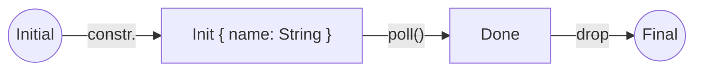

# Async Rust 01: Why `.await` ?

让我们从最简单的异步函数开始，它不执行任何异步操作，只是输出一句话：

```rust
use tokio;

#[tokio::main]
async fn main() {
    hello("world").await;
}

async fn hello(name: &'static str) {
    println!("hello, {name}!");
}
```

输出结果符合预期

```text
hello, world!
```

这里如果去掉 `.await` ，则什么都不会发生。为了理解这个问题，我们来手动实现一个类似的future，即实现 `std::future::Future` trait。

> [!NOTE]
> **什么是Future？**
>
> Future表示一个异步操作的结果，你可以持有它直到操作完成。一旦操作完成，Future会提供访问结果的方式。Future是你提供给异步运行时的一个承诺（Promise）。你通过 `.await` 来等待这个Promise的实现，然后运行时会将这个结果返回给你。

## 最简单的Future

Future的实现基本上是一个状态机，状态机由异步运行时驱动其状态。

我们至少需要两个状态，分别为Init和Done。Init表示Future的开始状态，Done 表示Future的完成状态。

因此，我们将Future建模为一个 `enum` 。在Init状态下，我们需要保留传递给异步函数的参数：

```rust
enum Hello {
    Init { name: &'static str },
    Done,
}
```

状态机的状态转换如下：



为了让它能被等待，我们需要实现Future trait。

> [!NOTE]
> 
> `std::future::Future` trait的简单部分如下：
>
> ```rust
> pub trait Future {
>
>     type Output;
>
>     fn poll(self: Pin<&mut Self>, cx: &mut Context<'_>) -> Poll<Self::Output>;
> }
>
> 我们需要实现 `Future::poll` 方法，我们暂时不需要理解pining的概念，所以把它当作 `&mut self` 来处理。我们现在暂时也不需要上下文。
>
> `poll` 方法返回 `std::task::Poll` enum。如果异步操作仍然有工作要做，该方法返回Pending（返回Pending时还需要其他东西，但现在可以先忽略）
>
> 当Future有值要返回时，它返回 `Ready(T)`。这里 `T`  是Future关联类型 `Output`。我们也不需要返回值，所以也可以先忽略。

## 实现 `poll`

```rust
use std::{
    future::Future,
    pin::Pin,
    task::{Context, Poll},
};

impl Future for Hello {
    type Output = ();

    fn poll(mut self: Pin<&mut Self>, _cx: &mut Context<'_>) -> std::task::Poll<Self::Output> {
        match *self {
            Hello::Init { name } => println!("hello, {name}!"),
            Hello::Done => panic!("Please stop polling me!"),
        };

        *self = Hello::Done;

        Poll::Ready(())
    }
}
```

如果我们处于Init状态，则打印出 `hello, {name}!` ，然后将状态转换为Done。如果我们处于Done状态，则panic。

在模式匹配后，将状态设置为Done。

最后，返回 `Poll::Ready(())` ，表示Future已经完成。

不过，我们还有一些事情需要讨论：`Poll::Pending` 是什么意思？还有 `panic!` 是怎么回事？

### Pending Future

如果在第一次轮询（poll）时，Future还没有完成，我们需要返回 `Poll::Pending` 。

### Future Panics

一个Future是一次性的，一旦它返回了 `Ready(T)` ，就不应该再次被调用。不过该trait并不强制要求Future发生panic，但这是一个好习惯，它有助于你发现逻辑错误。

## 使用 Future

让我们将其包装在一个函数中：

```rust
fn hello(name: &'static str) -> impl Future<Output = ()> {
    Hello::Init { name }
}
```
 
这个函数并没有执行什么操作，仅仅创建一个Future对象并返回。

所以，让我们调用我们的Future。我们不能直接调用 `poll()` ，因为我们没有上下文（Context）可以传递给它。

不过，我们可以使用 `await`  关键字来等待我们的Future：

```rust
#[tokio::main]
async fn main() {
    hello("world").await;
}
```

它和一开始的异步 `hello` 函数完全相同。

现在，我们知道了，一个Future在 `await` 之前不会执行任何内容，因为它仅仅是一个对象。

## 时序图

这是 `Hello` Future的时序图：


看起来异步 `main()` 函数直接调用 `poll()` 方法似乎不太对劲。

但请记住，`main()` 本身也在被 `poll()` 调用！

所以它具备了在 `Hello` 上调用 `poll()` 方法所需的一切条件。
