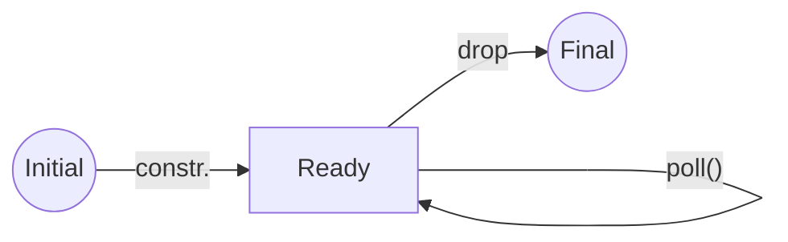
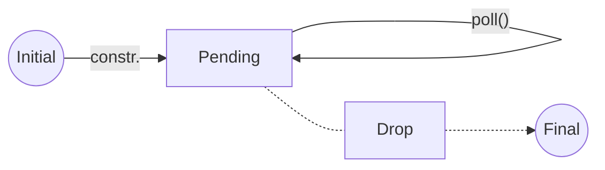
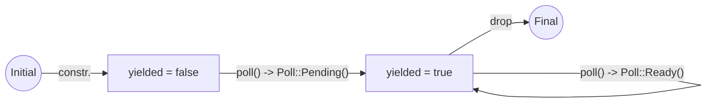

# Async Rust 02: How a Pending Future is Woken?

首先让我们回顾一下当Future被轮询时会发生什么。

我们可以创建一个更简单的Future。

## Ready Future

这个Future除了返回 `Poll::Ready` 之外什么都不做。我们甚至不需要定义任何成员。

所以我们从一个单元结构体开始，为它实现Future：

```rust
struct Ready;

impl Future for Ready {
    type Output = ();

    fn poll(self: Pin<&mut Self>, _cx: &mut Context<'_>) -> Poll<Self::Output> {
        println!("Ready: poll()");
        Poll::Ready(())
    }
}
```

现在，让我们看一下状态机：




现在让我们将其放入一个函数中：

```rust
fn ready() -> Ready {
    Ready {}
}
```

因为 `Ready` 实现了 `Future` trait，我们可以将其 `await`：

```rust
#[tokio::main]
async fn main() {
    println!("Before ready().await");
    ready().await;
    println!("After ready().await");
}
```

输出结果如下：

```text
Before ready().await
Ready: poll()
After ready().await
```

在 `.await` 语法背后，实际上是调用了 `poll()` 函数。

因为它返回了 `Poll::Ready` ，所以结果直接传递回调用者。

下面是 `Ready` Future的时序图：


> [!TIP]
> 
> 如果你想要一个总是返回就绪的Future，在futures crate中有一个通用版本：`futures::future::ready` 。

## Pending Future

让我们创建一个与 `Ready` 相反的Future，即总是返回 `Poll::Pending` 的Future。

```rust
struct Pending;

impl Future for Pending {
    type Output = ();

    fn poll(self: Pin<&mut Self>, _cx: &mut Context<'_>) -> Poll<Self::Output> {
        println!("Pending: poll()");
        Poll::Pending
    }
}
```

当一个Future返回 `Poll::Pending` 时，返回值还没有准备好。

我们将其放入一个函数中：

```rust
fn pending() -> Pending {
    Pending {}
}
```

无论我们使用哪种返回声明（无论是 `Pending` 还是 `impl Future<Output = ()>` ），我们都可以将其 `await` ：

```rust
#[tokio::main]
async fn main() {
    println!("Before pending().await");
    pending().await;
    println!("After pending().await");
}
```

输出结果如下：

```text
Before pending().await
Pending: poll()

```

这个程序不会结束，它永远处于挂起状态。它不会占用很多CPU资源，也不会阻塞线程，但它不会执行。而且，`poll()` 方法只被调用了一次！

我们的Future在返回 `Poll::Pending` 之后，再也不会被轮询。

> [!TIP]
> 
> 如果你想要一个总是返回Pending的Future，在futures crate中有一个通用版本：`futures::future::pending` 。

下面是 `Pending` Future状态机：



我们用虚线表示通往Finial的路径，表示这个对象永远不会被Drop。


为什么我们的程序不继续执行呢？

我们看到我们的Future将 `Poll::Pending` 返回给了 `async main()`，但是我们并没有看到随后的 `println!` 调用。

这实际上是个谎言，我们需要深入一点来理解这个问题。

## 解构 `async main()`

这个谎言的一部分是 `async main()` 的工作方式，即 `#[tokio::main]` 宏做了什么。

另一部分是 `await` 在底层做了什么。

让我们先看看 `#[tokio::main]` 宏做了什么。

```rust
fn main() {
    let body = async {
        println!("Before pending().await");
        pending().await;
        println!("After pending().await");
    };

    return tokio::runtime::Builder::new_multi_thread()
        .enable_all()
        .build()
        .except("Failed building the Runtime")
        .block_on(body);
}
```

现在，我们可以看到我们的 `async main()` 函数主题实际上被放在了一个 `async` 块当中。然后创建了一个新的runtime并给它这个 `async` 块来运行。

一个 `async` 块也是一个Future！

让我们更新时序图：


现在，我们可以看到实际上是异步运行时在调用Future的 `poll()` ，这驱动了main函数的执行。main Future等待我们的Pending Future。注意，当一个Future等待某个子Future返回 `Poll::Pending` 时，它会返回 `Poll::Pending` 给它的调用者。在这种情况下，它会返回异步运行时。当被轮询的任务返回 `Poll::Pending` 时，任务本身会进入休眠。然后异步运行时会选择另一个任务轮询。为了让我们的任务再次被轮询，它需要被唤醒。但也许没有任务被安排轮询（被安排轮询意味着处于唤醒状态）。

在这种情况下，异步运行时会挂起线程直到一个任务被唤醒。

一个任务需要waker将其唤醒。

waker是什么？在哪里可以找到？

## Waker

Waker指的是 `std::task::Waker` 。它是标准库中的一个结构体。

Waker是一个句柄，通过同志其执行器它已经准备好来唤醒一个任务。

你为任务调用 `wake()` 或 `wake_by_ref()` ，然后任务醒来并再次轮询Future。

但我们从哪得到一个任务的Waker呢？

## Context

上下文就像给异步任务传递信息的信使。我们这里说的是 `std::task::Context`

上下文用来给我们一个 `&Waker` ，这个 `&Waker` 可以唤醒当前的任务。

实际上，上下文只有两个方法：

第一个方法 `from_waker` ，它用一个waker的引用来创建一个上下文。

第二个方法 `waker` ，它接收一个上下文的引用，然后返回一个waker的引用。

现在我们知道了Waker是什么，也知道怎么获取它。让我们来写一个永远不会阻塞的异步任务Future！

## Pending but not forever

我们想编写一个返回 `Poll::Pending` 的Future，但是它不会永远挂起。

我们需要对 `Pending` Future做出两个更改：

更改1是只返回 `Poll::Pending` 一次。`poll()` 的第二次调用，我们返回 `Poll::Ready`。

但这些还不够。`poll()` 在任务被唤醒前不会再次被调用。

所以更改2是唤醒我们的任务。我们可以在返回 `Poll::Pending` 前做到它。我们将这个Future称为 `YieldNow` 。

我们还需要一些状态：

```rust
struct YieldNow {
    yielded: bool,
}

impl Future for YieldNow {
    type Output = ();

    fn poll(mut self: Pin<&mut Self>, cx: &mut Context<'_>) -> std::task::Poll<Self::Output> {
        println!("YieldNow: poll()");
        if self.yielded == true {
            return Poll::Ready(());
        }
        self.yielded = true;
        cx.waker().wake_by_ref();
        Poll::Pending
    }
}
```

我们的 `YieldNow` 结构体中只有一个字段，这个字段告诉我们是否已经交还控制权。交还控制权意味着把控制权还给异步运行时，等待进一步操作。

所以，当我们说“交还控制权”，实际上返回了一个 `Poll::Pending` 。

如果我们已经交还过一次控制权，就直接返回 `Poll::Ready` 。

如果我们还没有交还过控制权，我们将 `yielded` 设置为 `true` ，然后唤醒任务。

最后返回 `Poll::Pending` 。

现在，我们可以将其放入一个函数中：

```rust
fn yield_now() -> YieldNow {
    YieldNow { yielded: false }
}
``` 

现在我们可以尝试调用它：

```rust
fn main() {
    let body = async {
        println!("Before yield_now().await");
        yield_now().await;
        println!("After yield_now().await");
    };

    return tokio::runtime::Builder::new_multi_thread()
        .enable_all()
        .build()
        .expect("Failed building the Runtime")
        .block_on(body);
}
```

输出结果如下：

```text
Before yield_now().await
YieldNow: poll()
YieldNow: poll()
After yield_now().await
```

不再挂起！

## Yield Now

我们称之为返回控制权给运行时。这是在每个返回待定的await点发生的事情。我们的 `yield_now()` 函数是自愿将控制权转移给运行时，因为任务实际上没有在等待任何东西。

在Tokio中有一个函数可以做到这一点：`tokio::task::yield_now()` 。

让我们看看 `YieldNow` 的状态机：



更有趣的部分是时序图：


`YieldNow` Future与 `Pending` Future非常相似，直到在Waker上调用了 `wake_by_ref()`。然后Waker告诉异步运行时来安排当前任务。

现在任务已经被安排好了，所以当任务返回 `Poll::Pending` 回到运行时，现在有一个任务就绪，等待轮询，所以它不会挂起线程，而会立即轮询任务。

这次，我们的 `YieldNow` Future返回 `Poll::Ready` ，我们 `block_on` 调用的任务已经完成了，运行时把控制权还给了 `main()`，并从我们的Future返回了值。

现在，我们明白了，一个Pending Future是如何被唤醒的！